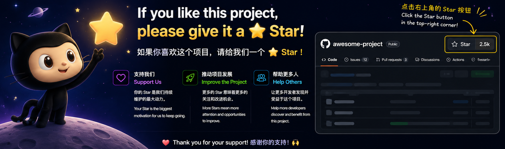

<a name="top"></a>

# ai-draw-skill

[English](#english) | 中文（当前）

<a href="https://github.com/stone-yu/ai-draw-skill">
  
</a>

跨平台 Agent Skill（Claude Code / Copilot CLI / Gemini CLI / Codex 等），无需提示词，直接描述文字、文章全文、链接地址、图片、pdf等任意需求格式，即可生成html格式渲染图或PPT，多种主题可选择，效果惊艳，且HTML方便修改和调整，效果示例可参考下方各个主题对应的示例图。**两大模式**，按需选择：


| 模式 | 用途 | 触发关键词 |
|---|---|---|
| ▤ **PPT模式** | 多页 HTML 演讲稿，含演讲者模式 | 演讲 / 分享 / PPT / deck / 周报 / 课件 / 小红书图文 / `--mode ppt` |
| ◈ **画图模式** | 单页或多页架构图 / 流程图等 | 画 / 画图 / 架构图 / 流程图 / 时序图 / `--mode single` / `--mode site` |

请求模糊时，`/ai-draw` 会询问你想用哪种模式，不会静默猜测。

---

## 快速开始

**无需提示词——直接描述需求即可。**

```
/ai-draw <需求（文字 | 图片 | 文章 | 链接 | PDF 等）>
```

**使用示例**

```
/ai-draw 帮我画一个三层电商架构（接入层/服务层/数据层），内部技术分享用
```

→ 推荐 3 种画图主题，询问单图还是多页站点，生成 `./ai-draw-out/三层电商架构-tech-dark/index.html` 并自动打开。

```
/ai-draw 做一份产品发布会 PPT，介绍我们的新功能
```

→ 询问（1）受众 + 页数，（2）推荐 3 种 PPT 主题，（3）推荐 `product-launch` 全套模板，生成演讲稿并写入逐字稿，自动打开。

```
/ai-draw docs/system-overview.md
```

→ 读取 Markdown 标题树和内容概括，生成 `index.html`（顶层架构）+ 每个 H2 对应一个子页，组件可点击 `↗` 钻取，所有页面主题通过 localStorage 同步。

**强制指定模式：**

```
/ai-draw --mode ppt 我想做一份周报
/ai-draw --mode single 简单画一个时序图
/ai-draw --mode site docs/<file>.md
```

> 不想记命令参数？直接 `/ai-draw <需求>` 即可，skill 会根据需求推荐模式自动生成HTML图片或HTML PPT。

---

## 两大模式

### ▤ PPT 模式

- **36 种 PPT 主题**，按场景分组（商务 / 技术分享 / 小红书 / 学术 / 赛博 / 极简 / 设计师）
- **31 种单页幻灯片布局**：封面、要点、双/三列、KPI 卡片、代码块、终端、图片网格、对比、优缺点、大引用、表格、甘特图、路线图、时间轴、思维导图、流程图、架构图、图表（柱/折/饼/雷达）、流程步骤……
- **15 套全套模板**（开箱即用起点）：`tech-sharing`、`product-launch`、`weekly-report`、`pitch-deck`、`course-module`、`xhs-post`、`xhs-pastel-card`、`xhs-white-editorial`、`presenter-mode-reveal`（含逐字稿）、`graphify-dark-graph`、`knowledge-arch-blueprint`、`hermes-cyber-terminal`、`obsidian-claude-gradient`、`testing-safety-alert`、`dir-key-nav-minimal`
- **27 种 CSS 动画 + 20 种 Canvas 特效**：`data-anim="fade-up"`、`data-fx="knowledge-graph"` 等
- **演讲者模式（`S` 键）**：弹出窗口，含当前页预览 / 下一页预览 / 逐字稿 / 计时器

### ◈ 画图模式

- **7 种图表类型**：架构图 / 知识图谱 / 流程图 / 时序图 / 思维导图 / 类图 / ER 图
- **12 种精选画图主题**：tech-dark / blueprint / business-clean / saas-modern / glassmorphism / linear-mode / neo-brutalism / xhs-soft / cyberpunk-neon / minimal-light / academic-paper / hand-drawn
  - ✨ `saas-modern` 主题为 **GPT Image 2.0 风格**：浅色 + 蓝/紫/橙渐变 + 大圆角
- **多页站点模式**（`--mode site <markdown.md>`）：将文档转为可超链接的架构站点，含主页 + 可钻取子页 + 面包屑 + 跨页主题同步
- **混合模式**：7 种图表类型均可作为幻灯片布局嵌入 PPT 模式

---

## 导出 PDF / PNG

生成的 HTML 文件支持一键导出：

```
/ai-draw export png      # 将最近生成的文件渲染为 PNG（多页站点按页导出）
```

也可在浏览器中打开 HTML 后，点击右上角工具栏的导出按钮，直接保存 PDF 或 PNG。

所有生成物均为**纯静态 HTML + CSS + SVG**，可直接在浏览器中打开，无需安装任何依赖。**你可以直接编辑 HTML 文件调整内容、文字、颜色。**

---

## 主题

两套独立主题目录（`themes-diagram/` 和 `themes-ppt/`），PPT 装饰性主题与画图色彩语义完全隔离。

### 画图模式（12 种主题）

所有预览均使用同一标准示例 `diagrams/architecture/examples/ai-app-stack-showcase.html` 渲染。

| 主题 | 预览 | 说明 |
|---|---|---|
| `tech-dark` |  | 暗色技术风，slate-950 + 青/紫/翠语义色，JetBrains Mono |
| `blueprint` |  | 蓝图工程风，深蓝 + 白色细线 + 密网格 |
| `business-clean` |  | 商务正式，米白 + 沉稳蓝/绿，Inter |
| `saas-modern` |  | 现代 SaaS 产品页，浅色 + 蓝/紫/橙渐变 + 大圆角 — **GPT Image 2.0 风** |
| `glassmorphism` |  | Apple 毛玻璃，紫粉橙径向渐变 + 半透明卡片 + `backdrop-filter` blur — **iOS / 苹果发布会风** |
| `linear-mode` |  | Linear app 风，近黑底 + 电光靛蓝 accent + Inter — **现代产品 / 系统架构** |
| `neo-brutalism` |  | 厚黑描边 + 硬偏移阴影 + 三原色 + Archivo Black — **创业路演 / 敢说敢做** |
| `xhs-soft` |  | 小红书柔色卡片，奶白 + 粉橙 + 大圆角 |
| `cyberpunk-neon` |  | 赛博朋克霓虹，纯黑 + 品红/青/黄发光 |
| `minimal-light` |  | 极简白纸，纯白 + 黑线，无强调色无阴影 |
| `academic-paper` |  | 学术论文，象牙白 + Source Serif + 灰线条 |
| `hand-drawn` |  | 手绘草图，米黄 + Caveat 字体 + rough.js 抖动笔触 |

### PPT 模式（36 种主题）

按观众 / 场景分组（每组首项为默认 ⭐）：

| 分组 | ⭐ 默认主题 | 其他主题 |
|---|---|---|
| 商务 / 投资人 / 路演 | `pitch-deck-vc` | `corporate-clean` · `swiss-grid` · `editorial-serif` · `minimal-white` |
| 技术 / 工程 / 分享 | `tokyo-night` | `dracula` · `catppuccin-mocha` · `catppuccin-latte` · `terminal-green` · `blueprint` · `nord` · `gruvbox-dark` · `solarized-light` · `rose-pine` |
| 小红书 / 卡片 / 营销 | `xiaohongshu-white` | `soft-pastel` · `magazine-bold` · `rainbow-gradient` · `aurora` · `sunset-warm` · `arctic-cool` |
| 学术 / 报告 / 论文 | `academic-paper` | `editorial-serif` · `minimal-white` · `engineering-whiteprint` · `news-broadcast` |
| 赛博 / 强烈 / 发布会 | `cyberpunk-neon` | `vaporwave` · `y2k-chrome` · `neo-brutalism` · `retro-tv` |
| 极简 / 克制 | `minimal-white` | `swiss-grid` · `japanese-minimal` · `sharp-mono` |
| 设计师 / 创意 | `bauhaus` | `memphis-pop` · `midcentury` · `glassmorphism` |

按 `T` 键循环 3 个推荐主题（`data-themes` 属性），`Shift+T` 循环全部 12 / 36 个主题。完整推荐规则和兼容矩阵见 [`references/themes.md`](references/themes.md)。

---

## 安装

ai-draw 与运行时无关——主要面向 Claude Code，但任何支持文件 IO + Shell 的 Agent 平台均可运行。

### Claude Code（主要，完整测试）

```bash
git clone https://github.com/stone-yu/ai-draw-skill.git ~/.claude/skills/ai-draw
```

重启 Claude Code，即可使用 `/ai-draw`。

### GitHub Copilot CLI（尽力支持）

```bash
git clone https://github.com/stone-yu/ai-draw-skill.git ~/.copilot/skills/ai-draw
```

工具名映射见 [`references/copilot-tools.md`](references/copilot-tools.md)。

### Google Gemini CLI（尽力支持）

```bash
git clone https://github.com/stone-yu/ai-draw-skill.git <gemini-skills-dir>/ai-draw
```

仓库根目录的 `GEMINI.md` 会在会话启动时自动加载。

### OpenAI Codex / GPT agents（手动安装）

无原生 Skill 加载器。将 `SKILL.md` 拼接到 Agent 系统提示中即可。工具名映射和两种集成模式见 [`references/codex-tools.md`](references/codex-tools.md)。

---

## 兼容性矩阵

| 平台 | 状态 | 工具适配 |
|---|---|---|
| **Claude Code** | ✅ 主要，完整测试 | 原生，无需适配 |
| **Anthropic Claude API**（Agent SDK / Managed Skills）| ✅ 设计兼容 | 原生，无需适配 |
| **GitHub Copilot CLI** | ⚠️ 尽力支持，未完整测试 | [`references/copilot-tools.md`](references/copilot-tools.md) |
| **Google Gemini CLI** | ⚠️ 尽力支持，未完整测试 | [`GEMINI.md`](GEMINI.md)（自动加载）|
| **OpenAI Codex / GPT**（function-calling）| ⚠️ 尽力支持，手动配置 | [`references/codex-tools.md`](references/codex-tools.md) |
| **Cursor / Cline / Aider / 其他** | ❓ 大概率可用 | 将 `SKILL.md` 粘贴到持久上下文 |

**生成物 100% 可移植**——纯静态 HTML + CSS + SVG，无平台锁定，任何现代浏览器均可打开。

---

## 子命令

| 命令 | 操作 |
|---|---|
| `/ai-draw <需求>` | 新建（自动路由到 PPT / single / site）|
| `/ai-draw --mode ppt <需求>` | 强制 PPT 模式 |
| `/ai-draw --mode single <需求>` | 强制单图模式 |
| `/ai-draw --mode site <md>` | 强制多页站点模式 |
| `/ai-draw redo --style <theme>` | 替换最近生成物的主题 |
| `/ai-draw add <需求>` | PPT：追加幻灯片；site：追加子页 |
| `/ai-draw add --to <ppt-name> <slide>` | 追加到指定 PPT |
| `/ai-draw add --to <site> --under <parent> <component>` | 追加钻取子页 |
| `/ai-draw export png` | 将最近生成物渲染为 PNG |
| `/ai-draw list` | 显示 `./ai-draw-out/` 中所有生成物 |

**默认自动打开。** 每次生成、`add`、`redo` 都会通过 `scripts/open.sh` 在默认浏览器中打开文件。禁用：单次加 `--no-open`，或设置环境变量 `AI_DRAW_NO_OPEN=1`。

---

## 输出结构

生成于 `<your-cwd>/ai-draw-out/<name>-<theme>/`：

```
ai-draw-out/
├── 产品发布-corporate-clean/        # PPT 模式输出
│   ├── index.html                  # 自动打开（15 张幻灯片，全套 product-launch 模板）
│   ├── style.css                   # 全套模板的 scoped CSS
│   └── README.md                   # 键盘快捷键 / 主题切换 / 导出说明
├── 三层电商架构-tech-dark/           # 画图 single 模式
│   ├── index.html
│   └── README.md
├── 微服务文档-blueprint/             # 画图 site 模式
│   ├── index.html
│   ├── pages/
│   │   ├── user-service.html
│   │   └── ...
│   └── README.md
└── .ai-draw-state.json              # 跟踪 add / redo / export 目标
```

将 `.ai-draw-out/` 加入 `.gitignore`——本工具不会自动修改 git 配置。

---

## 技术栈

- **CSS 变量 Token 系统**（`themes-diagram/` 和 `themes-ppt/` 双目录，完全隔离）
- **Mermaid v10** — 流程图 / 时序图 / 类图 / ER 图
- **D3 v7** — 知识图谱（力导向布局）
- **Markmap v0.17** — 思维导图（辐射布局）
- **rough.js v4** — 手绘主题
- **html2canvas + jsPDF** — PNG / PDF 导出
- 全部从公共 CDN 加载——生成物中无 node_modules

---

## 验证

```bash
./scripts/check-themes.sh    # 确认每个画图主题都覆盖了所有 base.css token
./scripts/render-all.sh      # 渲染所有示例 × 所有主题到 test-output/
```

### Git pre-push 钩子（可选）

一行命令把上面两个检查接到 `git push` 上：

```bash
bash scripts/install-hooks.sh
```

启用后每次 push：
- **总是**跑 `check-themes.sh`（约 1 秒，token 不完整就拦下）
- 当 commit 改了 `diagrams/*/template.html`、`assets/themes-diagram/*`、`base.css`、`runtime.js`、`exporter.js` 或 render 脚本，**且 push 到 main 时**，自动跑 `render-all.sh`（约 15-25 分钟），质量门：每个非 mindmap 示例必须 ≥70% 主题渲出非空 PNG，否则阻断

紧急情况绕过：`git push --no-verify`。

卸载：`git config --unset core.hooksPath`。

---

## 相关项目

ai-draw 从以下项目中吸收灵感：

- [fireworks-tech-graph](https://github.com/yizhiyanhua-ai/fireworks-tech-graph) — 知识图谱可视化（D3 力导向）灵感来源，提供 Python `graphifyy` CLI 包
- [architecture-diagram-generator](https://github.com/Cocoon-AI/architecture-diagram-generator) — SVG 架构图模板 + 暗色系 + 导出工具栏
- [html-ppt-skill](https://github.com/lewislulu/html-ppt-skill) — 整个 PPT 模式（36 主题 / 31 布局 / 27 动画 / 20 特效 / 15 全套模板 / 演讲者窗口 / 运行时）在 v0.3 中整体移植，调整了命名空间

---

## 版本

- **v0.1** — 以画图为主，含可选 PPT 封装（已弃用，此版本输出在 state 中标记为 `type: "deck-legacy"`）
- **v0.2** — 新增 `--mode site`（从 Markdown 生成多页架构站点）
- **v0.3** *(当前)* — 定位转为两大平级模式：完整 PPT 与画图并列；整体移植 html-ppt 资产；`--mode ppt` 成为新入口

---

## License

MIT.

---

<a name="english"></a>

# ai-draw-skill (English)

[中文](#top) | English (current)

A cross-platform Agent Skill (Claude Code / Copilot CLI / Gemini CLI / Codex). No prompting required — just describe your request in any format (text, article, URL, image, PDF, etc.) and get a rendered HTML diagram or HTML presentation, with multiple themes to choose from. **Two modes**, pick whichever fits your need:

```
/ai-draw <your request (text | image | article | URL | PDF, etc.)>
```

| Mode | Purpose | Triggered by |
|---|---|---|
| ▤ **PPT mode** | Multi-slide HTML presentations with speaker mode | presentation / slides / PPT / deck / report / keynote / `--mode ppt` |
| ◈ **Diagram mode** | Single-page or multi-page architecture diagrams | draw / diagram / flowchart / sequence / mindmap / `--mode single` / `--mode site` |

Ambiguous request? `/ai-draw` asks once which mode you want — never silently guesses.

---

## Quick Start

**No prompting required — just describe what you need.**

```
/ai-draw Draw a 3-tier e-commerce architecture (gateway / service / data), for an internal tech talk
```

→ Recommends 3 diagram themes, asks single vs site, produces `./ai-draw-out/ecom-arch-tech-dark/index.html` and auto-opens it.

```
/ai-draw Make a product launch PPT introducing our new features
```

→ Asks (1) audience + slide count, (2) recommends 3 PPT themes, (3) recommends `product-launch` full-deck template. Scaffolds the deck with speaker notes, auto-opens.

```
/ai-draw docs/system-overview.md
```

→ Reads Markdown headings and content summary, generates `index.html` (top-level architecture) + one subpage per H2 (recursively for deeper headings). Components are linked with `↗`; breadcrumb on every subpage; theme syncs across all pages via localStorage.

**Forcing a mode:**

```
/ai-draw --mode ppt I need a weekly report
/ai-draw --mode single Draw a simple sequence diagram
/ai-draw --mode site docs/<file>.md
```

> Don't want to remember flags? Just use `/ai-draw <request>` — the skill will recommend a mode and automatically generate the HTML diagram or HTML presentation.

---

## Two Modes

### ▤ PPT Mode

- **36 PPT themes** organized by audience (business / tech sharing / 小红书 / academic / cyber / minimal / designer) — full list in [Themes](#themes-en) below
- **31 single-page slide layouts**: cover, bullets, two/three-column, kpi-grid, code, terminal, image-grid, comparison, pros-cons, big-quote, table, gantt, roadmap, timeline, mindmap, flow-diagram, arch-diagram, charts (bar/line/pie/radar), process-steps, …
- **15 full-deck templates** (drop-in starting points): `tech-sharing`, `product-launch`, `weekly-report`, `pitch-deck`, `course-module`, `xhs-post`, `xhs-pastel-card`, `xhs-white-editorial`, `presenter-mode-reveal` (with speaker script), `graphify-dark-graph`, `knowledge-arch-blueprint`, `hermes-cyber-terminal`, `obsidian-claude-gradient`, `testing-safety-alert`, `dir-key-nav-minimal`
- **27 CSS animations + 20 canvas FX**: `data-anim="fade-up"`, `data-fx="knowledge-graph"`, etc.
- **Speaker mode (`S` key)**: popup window with 4 panels — current slide preview / next preview / speaker script / timer

### ◈ Diagram Mode

- **7 diagram types**: architecture / knowledge graph / flowchart / sequence / mindmap / class / ER
- **12 curated diagram themes**: tech-dark / blueprint / business-clean / saas-modern / glassmorphism / linear-mode / neo-brutalism / xhs-soft / cyberpunk-neon / minimal-light / academic-paper / hand-drawn
  - ✨ `saas-modern` is the **GPT Image 2.0 style**: light background + blue/purple/orange gradient + large radius
- **Multi-page site mode** (`--mode site <markdown.md>`): turn a doc into a hyperlinked architecture site — main page + drill-down subpages + breadcrumbs + cross-page theme sync via localStorage
- **Mixed mode**: any of the 7 diagram types can be embedded as a slide layout inside PPT mode

---

## Export PDF / PNG

Generated HTML files support one-click export:

```
/ai-draw export png      # Render most-recent output to PNG (per-page for sites)
```

Or open the HTML in a browser and click the export button in the top-right toolbar to save as PDF or PNG directly.

All generated files are **pure static HTML + CSS + SVG** — open in any modern browser, no dependencies required. **You can edit the HTML file directly to adjust content, text, and colors.**

---

<a name="themes-en"></a>
## Themes

Two parallel catalogs (`themes-diagram/` and `themes-ppt/`), kept separate so PPT decorative themes don't pollute diagram color semantics.

### Diagram Mode (12 themes)

All previews render the same canonical example — `diagrams/architecture/examples/ai-app-stack-showcase.html`.

| Theme | Preview | Description |
|---|---|---|
| `tech-dark` |  | Dark tech, slate-950 + cyan/purple/emerald semantic colors, JetBrains Mono |
| `blueprint` |  | Engineering blueprint, deep blue + white hairlines + dense grid |
| `business-clean` |  | Formal business, off-white + muted blue/green, Inter |
| `saas-modern` |  | Modern SaaS product page, light + blue/purple/orange gradient + large radius — **GPT Image 2.0 style** |
| `glassmorphism` |  | Apple glass, purple/pink/orange radial gradient + translucent cards + `backdrop-filter` blur — **iOS / Apple keynote style** |
| `linear-mode` |  | Linear app style, near-black + electric indigo accent + Inter — **modern product / system architecture** |
| `neo-brutalism` |  | Thick black borders + hard offset shadow + primary colors + Archivo Black — **startup pitch / bold statements** |
| `xhs-soft` |  | Xiaohongshu soft cards, cream white + pink/orange + large radius |
| `cyberpunk-neon` |  | Cyberpunk neon, pure black + magenta/cyan/yellow glow |
| `minimal-light` |  | Minimal white page, pure white + black lines, no accent color, no shadow |
| `academic-paper` |  | Academic paper, ivory + Source Serif + gray lines |
| `hand-drawn` |  | Hand-drawn sketch, tan + Caveat font + rough.js jitter |

### PPT Mode (36 themes)

Grouped by audience / scenario (first in each group is the default ⭐):

| Group | ⭐ Default | Other themes |
|---|---|---|
| Business / VC / Pitch | `pitch-deck-vc` | `corporate-clean` · `swiss-grid` · `editorial-serif` · `minimal-white` |
| Tech / Engineering / Talk | `tokyo-night` | `dracula` · `catppuccin-mocha` · `catppuccin-latte` · `terminal-green` · `blueprint` · `nord` · `gruvbox-dark` · `solarized-light` · `rose-pine` |
| 小红书 / Cards / Marketing | `xiaohongshu-white` | `soft-pastel` · `magazine-bold` · `rainbow-gradient` · `aurora` · `sunset-warm` · `arctic-cool` |
| Academic / Report / Paper | `academic-paper` | `editorial-serif` · `minimal-white` · `engineering-whiteprint` · `news-broadcast` |
| Cyber / Intense / Keynote | `cyberpunk-neon` | `vaporwave` · `y2k-chrome` · `neo-brutalism` · `retro-tv` |
| Minimal / Restrained | `minimal-white` | `swiss-grid` · `japanese-minimal` · `sharp-mono` |
| Designer / Creative | `bauhaus` | `memphis-pop` · `midcentury` · `glassmorphism` |

Press `T` to cycle 3 recommended themes (`data-themes` attr); `Shift+T` to cycle all 12 / 36. Full recommendation rules and compatibility matrix in [`references/themes.md`](references/themes.md).

---

## Install

ai-draw is runtime-agnostic — designed primarily for Claude Code but works on any agent platform with file-IO + shell.

### Claude Code (primary, fully tested)

```bash
git clone https://github.com/stone-yu/ai-draw-skill.git ~/.claude/skills/ai-draw
```

Restart Claude Code. `/ai-draw` is now available.

### GitHub Copilot CLI (best-effort)

```bash
git clone https://github.com/stone-yu/ai-draw-skill.git ~/.copilot/skills/ai-draw
```

See [`references/copilot-tools.md`](references/copilot-tools.md) for tool-name mapping.

### Google Gemini CLI (best-effort)

```bash
git clone https://github.com/stone-yu/ai-draw-skill.git <gemini-skills-dir>/ai-draw
```

`GEMINI.md` at the repo root auto-loads at session start.

### OpenAI Codex / GPT agents (manual install)

No native Skill loader. Concatenate `SKILL.md` into your agent's system prompt at session start. See [`references/codex-tools.md`](references/codex-tools.md) for tool-name mapping + the two integration patterns.

---

## Compatibility Matrix

| Platform | Status | Tool adapter |
|---|---|---|
| **Claude Code** | ✅ Primary, fully tested | n/a — native |
| **Anthropic Claude API** (Agent SDK / Managed Skills) | ✅ Compatible by design | n/a — native |
| **GitHub Copilot CLI** | ⚠️ Best-effort, untested end-to-end | [`references/copilot-tools.md`](references/copilot-tools.md) |
| **Google Gemini CLI** | ⚠️ Best-effort, untested end-to-end | [`GEMINI.md`](GEMINI.md) (auto-loaded) |
| **OpenAI Codex / GPT** (function-calling) | ⚠️ Best-effort, manual setup | [`references/codex-tools.md`](references/codex-tools.md) |
| **Cursor / Cline / Aider / others** | ❓ Likely workable | Paste `SKILL.md` into persistent context |

**Generated outputs are 100% portable** — pure static HTML + CSS + SVG, no platform lock-in. Anyone with a modern browser can open and re-theme them via the `T` key.

---

## Subcommands

| Command | Action |
|---|---|
| `/ai-draw <request>` | New (auto-routed to PPT / single / site) |
| `/ai-draw --mode ppt <request>` | Force PPT mode |
| `/ai-draw --mode single <request>` | Force single-image diagram |
| `/ai-draw --mode site <md>` | Force multi-page architecture site |
| `/ai-draw redo --style <theme>` | Swap theme on most-recent output |
| `/ai-draw add <request>` | PPT: append a slide; site: append a subpage |
| `/ai-draw add --to <ppt-name> <slide>` | Target a specific PPT |
| `/ai-draw add --to <site> --under <parent> <component>` | Append drill-down subpage |
| `/ai-draw export png` | Render most-recent output to PNG (per-page for sites) |
| `/ai-draw list` | Show all outputs in `./ai-draw-out/` |

**Auto-open by default.** Every generation, `add`, and `redo` opens the result in your default browser via `scripts/open.sh`. To disable: `--no-open` per command, or `AI_DRAW_NO_OPEN=1` in your environment.

---

## Output Structure

Generated under `<your-cwd>/ai-draw-out/<name>-<theme>/`:

```
ai-draw-out/
├── product-launch-corporate-clean/  # PPT mode output
│   ├── index.html                   # auto-opened (15 slides, full-deck = product-launch)
│   ├── style.css                    # scoped CSS from full-deck template
│   └── README.md                    # keyboard / theming / export
├── ecom-arch-tech-dark/             # diagram single mode
│   ├── index.html
│   └── README.md
├── microservices-blueprint/         # diagram site mode
│   ├── index.html
│   ├── pages/
│   │   ├── user-service.html
│   │   └── ...
│   └── README.md
└── .ai-draw-state.json              # tracks add / redo / export targets
```

Add `.ai-draw-out/` to your `.gitignore` — we don't write any git config for you.

---

## Powered by

- **CSS variable token system** (two parallel catalogs — `themes-diagram/` and `themes-ppt/` — kept separate so PPT decorative themes don't pollute diagram color semantics)
- **Mermaid v10** — flowchart / sequence / class / ER
- **D3 v7** — knowledge graphs (force-directed)
- **Markmap v0.17** — mindmaps (radial)
- **rough.js v4** — hand-drawn theme
- **html2canvas + jsPDF** — PNG / PDF export
- All loaded from public CDNs — no node_modules in your output

---

## Verification

```bash
./scripts/check-themes.sh    # confirm every diagram theme overrides every base.css token
./scripts/render-all.sh      # render every example × every theme to test-output/
```

### Optional git pre-push hook

Wire both checks into `git push` with one command:

```bash
bash scripts/install-hooks.sh
```

After install, every push:
- **Always** runs `check-themes.sh` (~1s, blocks if any theme misses a token).
- When the commit touches `diagrams/*/template.html`, `assets/themes-diagram/*`, `base.css`, `runtime.js`, `exporter.js`, or render scripts, **AND you're pushing to main**, auto-runs `render-all.sh` (~15-25 min) with a quality gate: each non-mindmap example must have ≥70% of themes rendering a non-empty PNG, else the push is blocked.

Emergency bypass: `git push --no-verify`.

Uninstall: `git config --unset core.hooksPath`.

---

## Related Projects

ai-draw is built by absorbing ideas from:

- [fireworks-tech-graph](https://github.com/yizhiyanhua-ai/fireworks-tech-graph) — knowledge graph viz inspiration (D3 force-directed); ships a Python `graphifyy` package as its CLI tool
- [architecture-diagram-generator](https://github.com/Cocoon-AI/architecture-diagram-generator) — SVG arch diagram template + dark color system + export toolbar
- [html-ppt-skill](https://github.com/lewislulu/html-ppt-skill) — entire PPT mode (36 themes / 31 layouts / 27 anim / 20 FX / 15 full-decks / speaker window / runtime) ported wholesale into ai-draw v0.3 with namespace adjustments

---

## Versions

- **v0.1** — diagram-first design with optional PPT deck wrapper (deprecated; outputs of this era are tagged `type: "deck-legacy"` in state)
- **v0.2** — added `--mode site` (multi-page architecture sites from markdown)
- **v0.3** *(current)* — positioning shift to two equal modes: full PPT alongside 画图; ports html-ppt assets wholesale; `--mode ppt` is the new front door

---

## License

MIT.
