# ai-draw-skill

A cross-platform agent skill (Claude Code / Copilot CLI / Gemini CLI / Codex — see [Compatibility](#compatibility-matrix)) with **two equal top-level modes** — pick whichever fits your need:

```
/ai-draw <需求>
```

| Mode | Purpose | Triggered by |
|---|---|---|
| 🎤 **PPT模式** | Multi-slide HTML presentations with full speaker mode | "演讲 / 分享 / PPT / deck / 周报 / 课件 / 小红书图文 / 做一份 PPT" or `--mode ppt` |
| 🖼️ **画图模式** | Single-page or multi-page architecture diagrams | "画 / 画图 / 架构图 / 流程图 / 时序图 ..." or `--mode single` / `--mode site` |

Ambiguous request? `/ai-draw` will ask once which mode you want — never silently guesses.

---

## 🎤 PPT mode — what it makes

- **36 PPT themes** organized by audience (business / tech sharing / 小红书 / academic / cyber / minimal / designer) — full list in [Themes](#themes) below
- **31 single-page slide layouts**: cover, bullets, two/three-column, kpi-grid, code, terminal, image-grid, comparison, pros-cons, big-quote, table, gantt, roadmap, timeline, mindmap, flow-diagram, arch-diagram, charts (bar/line/pie/radar), process-steps, …
- **15 full-deck templates** (drop-in starting points): `tech-sharing`, `product-launch`, `weekly-report`, `pitch-deck`, `course-module`, `xhs-post`, `xhs-pastel-card`, `xhs-white-editorial`, `presenter-mode-reveal` (with 逐字稿), `graphify-dark-graph`, `knowledge-arch-blueprint`, `hermes-cyber-terminal`, `obsidian-claude-gradient`, `testing-safety-alert`, `dir-key-nav-minimal`
- **27 CSS animations + 20 canvas FX**: `data-anim="fade-up"`, `data-fx="knowledge-graph"`, etc.
- **Speaker mode (`S` key)**: popup window with 4 magnetic cards — current slide preview / next preview / 逐字稿 / timer
- **3-question opening**: content+audience / theme / starting template — same as html-ppt upstream

## 🖼️ 画图 mode — what it makes

- **7 diagram types**: architecture / knowledge graph / flowchart / sequence / mindmap / class / ER
- **12 curated diagram themes** — covering tech / business / SaaS / iOS-glass / Linear-mode / brutalism / xhs / cyberpunk / minimal / academic / hand-drawn (full table in [Themes](#themes) below)
- **Multi-page site mode** (`--mode site <markdown.md>`): turn a doc into a hyperlinked architecture site — main page + drill-down subpages with click-through `↗` components, breadcrumbs, cross-page theme sync
- **Mixed mode**: any of the 7 diagram types can be embedded as a slide layout inside PPT mode (best-effort theme inheritance)

---

## Themes

Two parallel catalogs, kept separate so PPT decorative themes don't pollute diagram color semantics.

### 画图模式 (12 themes-diagram)

All previews below render the same canonical example — `diagrams/architecture/examples/ai-app-stack-showcase.html` — a 3-column / multi-card "Modern AI App Stack" diagram (Data → Model → Pipeline) with icon badges, multi-color sub-cards, pill section headers, cross-column gradient arrows, and a bottom summary band. Designed to stress-test every theme's full token surface. Regenerate with `./scripts/render-previews.sh`.

> **Adding a new theme?** Follow the checklist in [`docs/theme-previews/README.md`](docs/theme-previews/README.md) — Step 7 (update this README table with a new row + preview thumbnail) is the easiest to forget.

The simpler `saas-platform-showcase.html` (6-layer vertical SaaS) is also available as a reference example in `diagrams/architecture/examples/`.

| Theme | Preview | 一句话定位 |
|---|---|---|
| `tech-dark` | 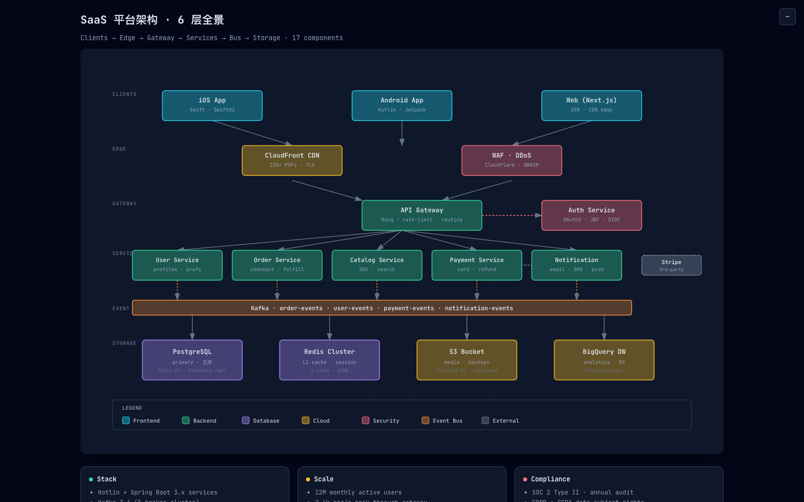 | 暗色技术风，slate-950 + 青/紫/翠 语义色，JetBrains Mono |
| `blueprint` | 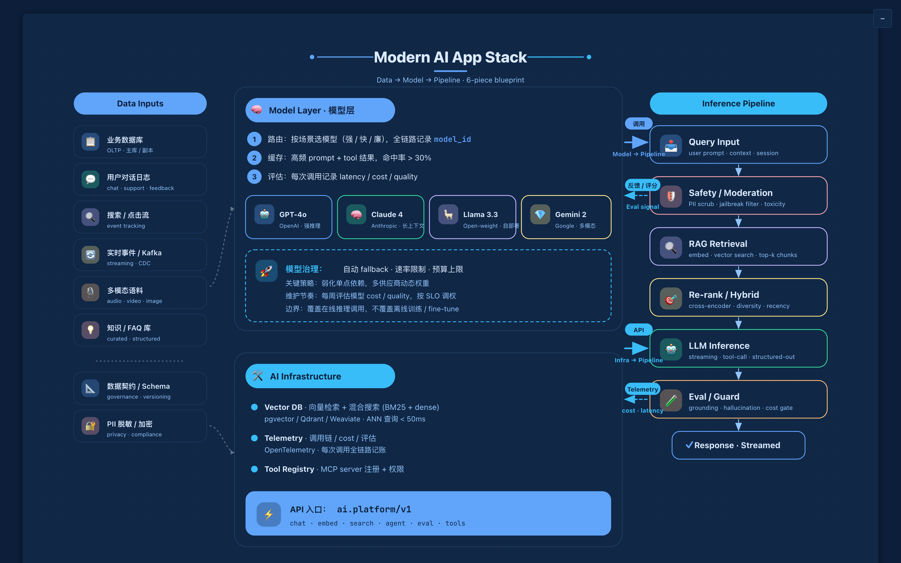 | 蓝图工程风，深蓝 + 白色细线 + 密网格 |
| `business-clean` | 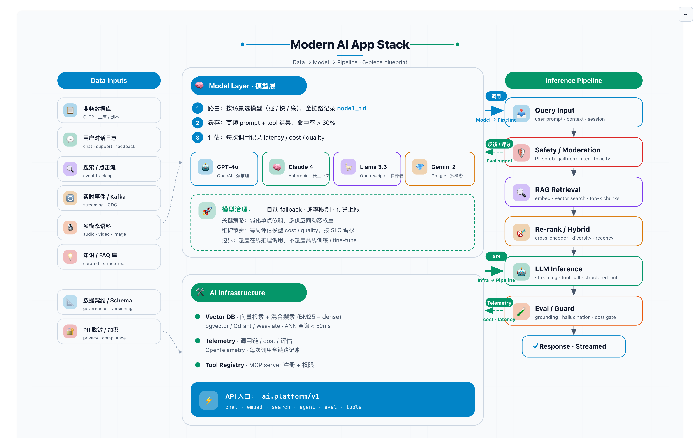 | 商务正式，米白 + 沉稳蓝/绿，Inter |
| `saas-modern` | 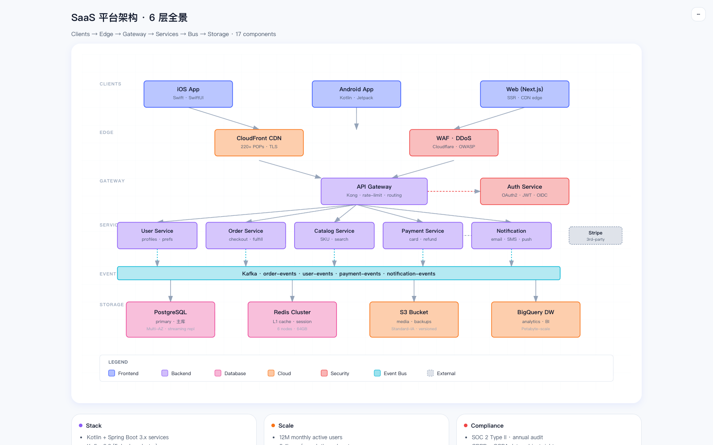 | 现代 SaaS 产品页，浅色 + 蓝/紫/橙渐变 + 大圆角 — **GPT Image 2.0 风** |
| `glassmorphism` | 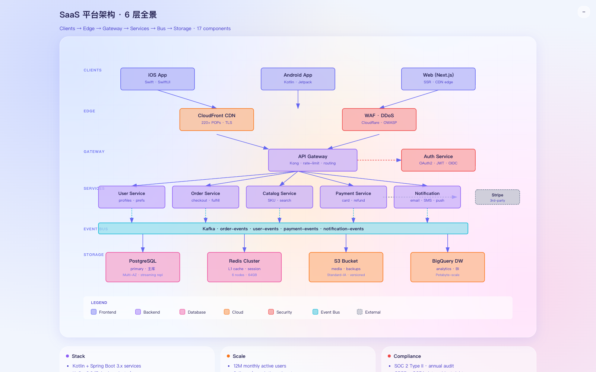 | Apple 毛玻璃，紫粉橙径向渐变背景 + 半透明卡片 + `backdrop-filter` blur — **iOS / 苹果发布会风** |
| `linear-mode` | 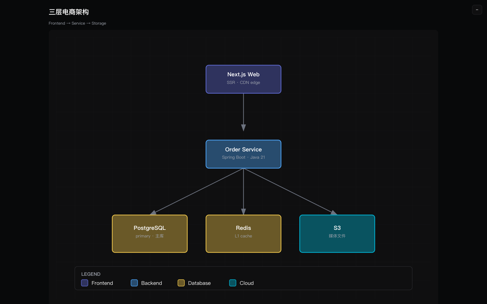 | Linear app 风，近黑底 + 电光靛蓝 accent + Inter — **现代产品 / 系统架构** |
| `neo-brutalism` | 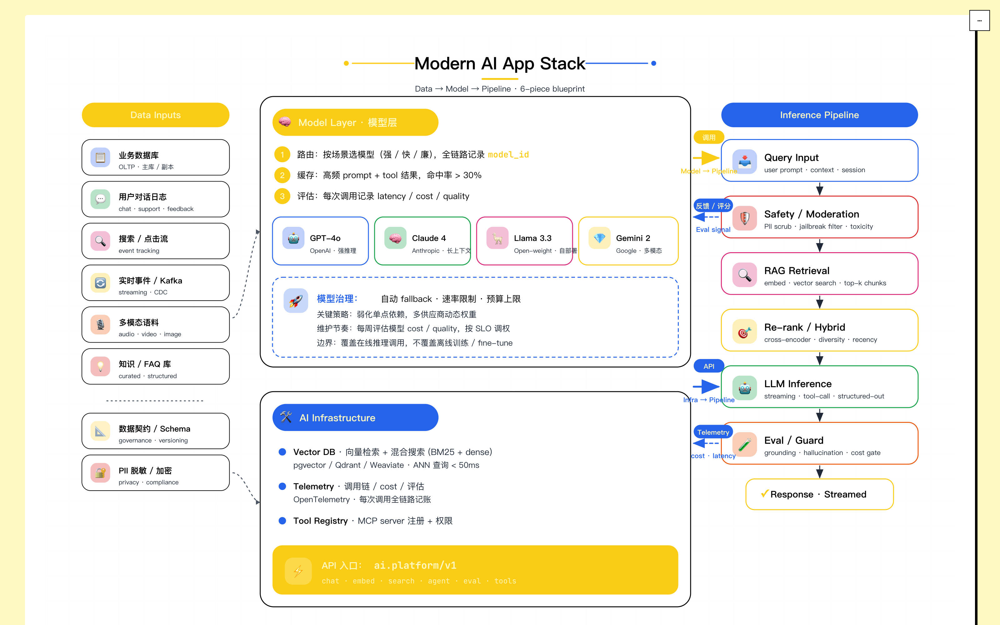 | 厚黑描边 + 硬偏移阴影（`4px 4px 0 #000`）+ 三原色 + Archivo Black — **创业路演 / 敢说敢做** |
| `xhs-soft` | 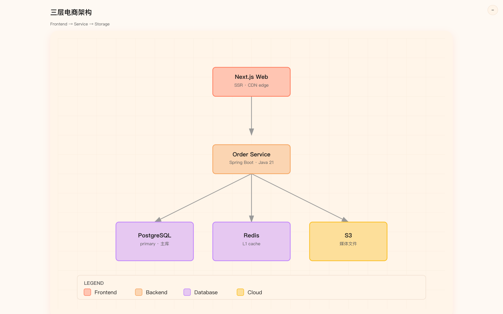 | 小红书柔色卡片，奶白 + 粉橙 + 大圆角 |
| `cyberpunk-neon` | 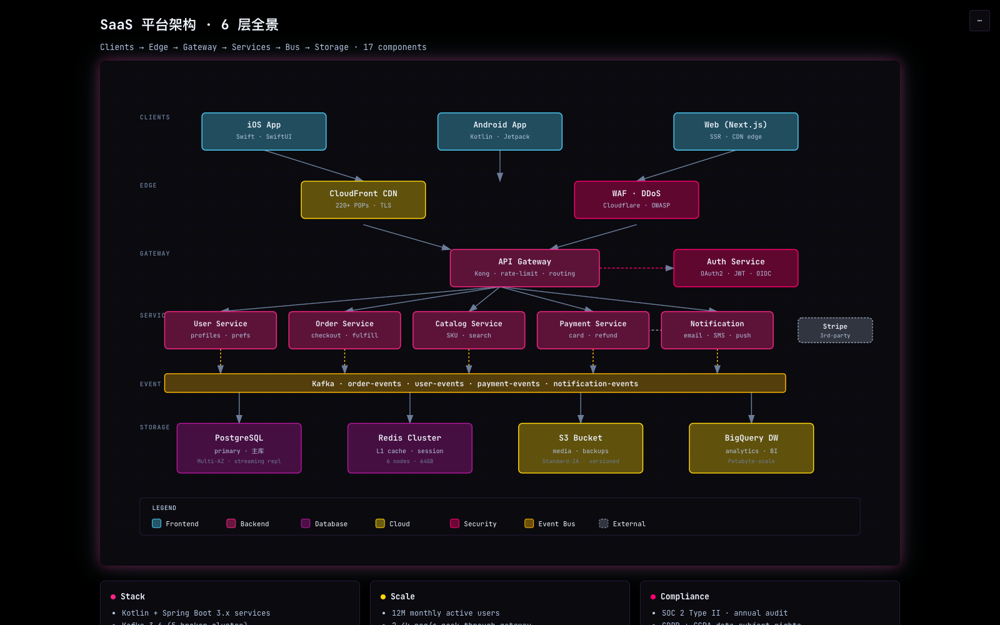 | 赛博朋克霓虹，纯黑 + 品红/青/黄发光 |
| `minimal-light` | 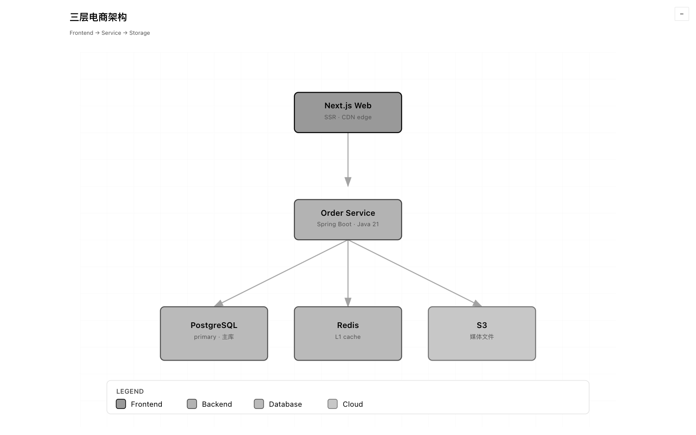 | 极简白纸，纯白 + 黑线，无强调色无阴影 |
| `academic-paper` | 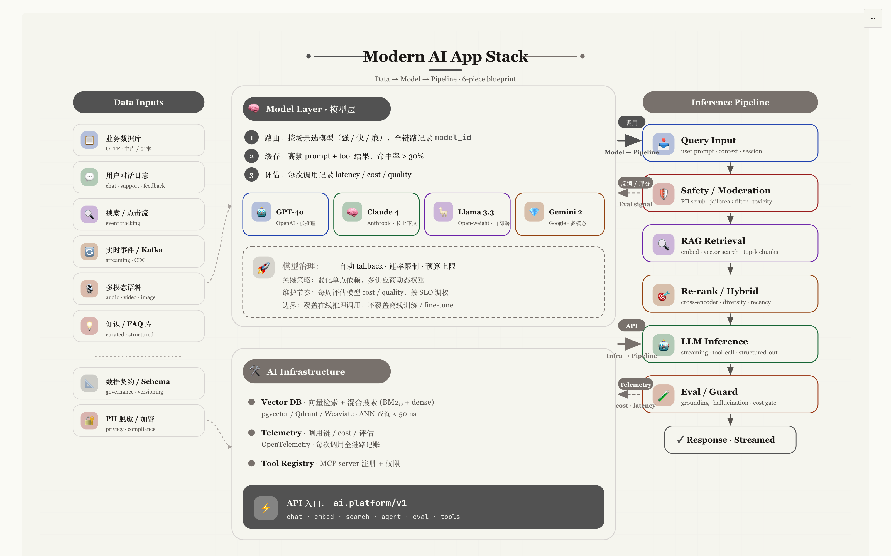 | 学术论文，象牙白 + Source Serif + 灰线条 |
| `hand-drawn` | 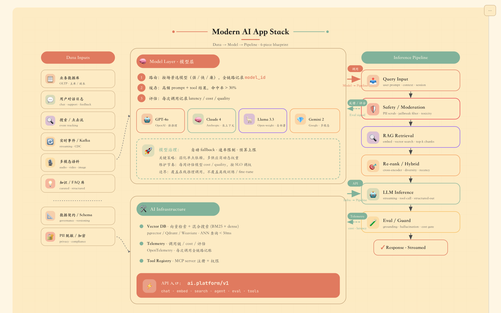 | 手绘草图，米黄 + Caveat 字体 + rough.js 抖动笔触 |

### PPT 模式 (36 themes-ppt)

按观众 / 场景分组（每组首项为默认 ⭐）：

| 分组 | ⭐ 默认 | 其他成员 |
|---|---|---|
| 商务 / 投资人 / 路演 | `pitch-deck-vc` | `corporate-clean` · `swiss-grid` · `editorial-serif` · `minimal-white` |
| 技术 / 工程 / 分享 | `tokyo-night` | `dracula` · `catppuccin-mocha` · `catppuccin-latte` · `terminal-green` · `blueprint` · `nord` · `gruvbox-dark` · `solarized-light` · `rose-pine` |
| 小红书 / 卡片 / 营销 | `xiaohongshu-white` | `soft-pastel` · `magazine-bold` · `rainbow-gradient` · `aurora` · `sunset-warm` · `arctic-cool` |
| 学术 / 报告 / 论文 | `academic-paper` | `editorial-serif` · `minimal-white` · `engineering-whiteprint` · `news-broadcast` |
| 赛博 / 强烈 / 发布会 | `cyberpunk-neon` | `vaporwave` · `y2k-chrome` · `neo-brutalism` · `retro-tv` |
| 极简 / 克制 | `minimal-white` | `swiss-grid` · `japanese-minimal` · `sharp-mono` |
| 设计师 / 创意 | `bauhaus` | `memphis-pop` · `midcentury` · `glassmorphism` |

Press `T` to cycle 3 recommended themes (`data-themes` attr); `Shift+T` to cycle all 12 / 36. Full recommendation rules, compatibility matrix, and override aliases live in [`references/themes.md`](references/themes.md).

Need a theme that's not here? Open an issue with a reference image — `saas-modern` / `glassmorphism` / `linear-mode` / `neo-brutalism` (May 2026) were all added this way.

---

## Powered by

- **CSS variable token system** (two parallel catalogs — `themes-diagram/` and `themes-ppt/` — kept separate so PPT decorative themes don't pollute architecture-diagram color semantics)
- **Mermaid v10** — flowchart / sequence / class / ER
- **D3 v7** — knowledge graphs (force-directed)
- **Markmap v0.17** — mindmaps (radial)
- **rough.js v4** — hand-drawn theme
- **html2canvas + jsPDF** — PNG / PDF export
- All loaded from public CDNs — no node_modules in your output

---

## Install

ai-draw is **runtime-agnostic** — designed primarily for Claude Code but works on any agent platform with file-IO + shell. Pick your runtime below.

### Claude Code (primary, fully tested)

```bash
git clone https://github.com/stone-yu/ai-draw-skill.git ~/.claude/skills/ai-draw
```

Restart Claude Code. `/ai-draw` is now available.

### GitHub Copilot CLI (best-effort)

```bash
git clone https://github.com/stone-yu/ai-draw-skill.git ~/.copilot/skills/ai-draw
```

See [`references/copilot-tools.md`](references/copilot-tools.md) for tool-name mapping.

### Google Gemini CLI (best-effort)

```bash
git clone https://github.com/stone-yu/ai-draw-skill.git <gemini-skills-dir>/ai-draw
```

`GEMINI.md` at the repo root auto-loads at session start.

### OpenAI Codex / GPT agents (manual install)

No native Skill loader. Concatenate `SKILL.md` into your agent's system prompt at session start. See [`references/codex-tools.md`](references/codex-tools.md) for tool-name mapping + the two integration patterns.

---

## Compatibility matrix

| Platform | Status | Tool adapter |
|---|---|---|
| **Claude Code** | ✅ Primary, fully tested | n/a — native |
| **Anthropic Claude API** (Agent SDK / Managed Skills) | ✅ Compatible by design | n/a — native |
| **GitHub Copilot CLI** | ⚠️ Best-effort, untested end-to-end | [`references/copilot-tools.md`](references/copilot-tools.md) |
| **Google Gemini CLI** | ⚠️ Best-effort, untested end-to-end | [`GEMINI.md`](GEMINI.md) (auto-loaded) |
| **OpenAI Codex / GPT** (function-calling) | ⚠️ Best-effort, manual setup | [`references/codex-tools.md`](references/codex-tools.md) |
| **Cursor / Cline / Aider / others** | ❓ Likely workable | Paste `SKILL.md` into persistent context |

**What "best-effort" means**: the skill's INSTRUCTIONS use generic verbs ("read the file" / "run the script"), so any agent with file-IO + shell tools should drive the workflow. Specific platform integrations haven't been exhaustively tested — if a step misbehaves, the issue is almost always in the platform's tool primitives, not in the skill. Please [open an issue](https://github.com/stone-yu/ai-draw-skill/issues) so the adapter docs can be tightened.

**Generated outputs are 100% portable** — pure static HTML + CSS + SVG, no platform lock-in. Anyone with a modern browser can open and re-theme them via the `T` key, regardless of which agent generated the file.

---

## Quick start

### A pure 画图 request

```
/ai-draw 帮我画一个三层电商架构（接入层/服务层/数据层），内部技术分享用
```

→ recommends 3 diagram themes, asks single vs site, produces `./ai-draw-out/三层电商架构-tech-dark/index.html` and auto-opens it.

### A PPT request

```
/ai-draw 做一份产品发布会 PPT，介绍我们的新功能
```

→ asks (1) audience + 页数, (2) recommends 3 PPT themes (e.g. `corporate-clean`, `pitch-deck-vc`, `magazine-bold`), (3) recommends `product-launch` full-deck template. Then scaffolds the deck, writes 逐字稿 in `<aside class="notes">`, auto-opens.

### A multi-page site

```
/ai-draw --mode site docs/system-overview.md
```

→ reads markdown heading tree, generates `index.html` (top architecture) + one subpage per H2 (recursively for deeper headings). Drillable components are linked with `↗`; breadcrumb at top of every subpage; theme syncs across all pages via localStorage.

### Forcing a mode

```
/ai-draw --mode ppt 我想做一份周报
/ai-draw --mode single 简单画一个时序图
/ai-draw --mode site docs/<file>.md
```

---

## Subcommands

| Command | Action |
|---|---|
| `/ai-draw <需求>` | New (auto-routed to PPT / single / site) |
| `/ai-draw --mode ppt <需求>` | Force PPT mode |
| `/ai-draw --mode single <需求>` | Force single-image diagram |
| `/ai-draw --mode site <md>` | Force multi-page architecture site |
| `/ai-draw redo --style <theme>` | Swap theme on most-recent output |
| `/ai-draw add <需求>` | PPT: append a slide; site: append a subpage |
| `/ai-draw add --to <ppt-name> <slide>` | Target a specific PPT |
| `/ai-draw add --to <site> --under <parent> <component>` | Append drill-down subpage |
| `/ai-draw export png` | Render most-recent output to PNG (per-page for sites) |
| `/ai-draw list` | Show all outputs in `./ai-draw-out/` |

**Auto-open by default.** Every generation, `add`, and `redo` opens the resulting file in your default browser via `scripts/open.sh` (macOS / Linux / WSL / Windows). To disable: `--no-open` per command, or `AI_DRAW_NO_OPEN=1` in your environment.

---

## Output

Generated under `<your-cwd>/ai-draw-out/<name>-<theme>/`:

```
ai-draw-out/
├── 产品发布-corporate-clean/        # PPT mode output
│   ├── index.html                  # auto-opened (15 slides, full-deck = product-launch)
│   ├── style.css                   # scoped CSS from full-deck template
│   └── README.md                   # keyboard / theming / export
├── 三层电商架构-tech-dark/           # 画图 single mode
│   ├── index.html
│   └── README.md
├── 微服务文档-blueprint/             # 画图 site mode
│   ├── index.html
│   ├── pages/
│   │   ├── user-service.html
│   │   └── ...
│   └── README.md
└── .ai-draw-state.json              # tracks `add` / `redo` / `export` targets
```

Add `.ai-draw-out/` to your `.gitignore` — we don't write any git config for you.

---

## Verification

```bash
./scripts/check-themes.sh    # confirm every diagram theme overrides every base.css token
./scripts/render-all.sh      # render every example × every theme to test-output/
```

---

## Related projects

ai-draw is built by absorbing ideas from:

- [fireworks-tech-graph](https://github.com/yizhiyanhua-ai/fireworks-tech-graph) — knowledge graph viz inspiration (D3 force-directed); ships a Python `graphifyy` package as its CLI tool
- [architecture-diagram-generator](https://github.com/Cocoon-AI/architecture-diagram-generator) — SVG arch diagram template + dark color system + export toolbar
- [html-ppt-skill](https://github.com/lewislulu/html-ppt-skill) — entire PPT mode (36 themes / 31 layouts / 27 anim / 20 FX / 15 full-decks / speaker window / runtime) ported wholesale into ai-draw v0.3 with namespace adjustments

If you need a feature ai-draw doesn't have (e.g. fireworks-tech-graph's full Python extraction pipeline via `graphifyy`), use the upstream project directly.

---

## Versions

- **v0.1** — diagram-first design with optional PPT deck wrapper (deprecated; outputs of this era are tagged `type: "deck-legacy"` in state)
- **v0.2** — added `--mode site` (multi-page architecture sites from markdown)
- **v0.3** *(current)* — positioning shift to two equal modes: full PPT alongside 画图; ports html-ppt assets wholesale; `--mode ppt` is the new front door

## License

MIT.
