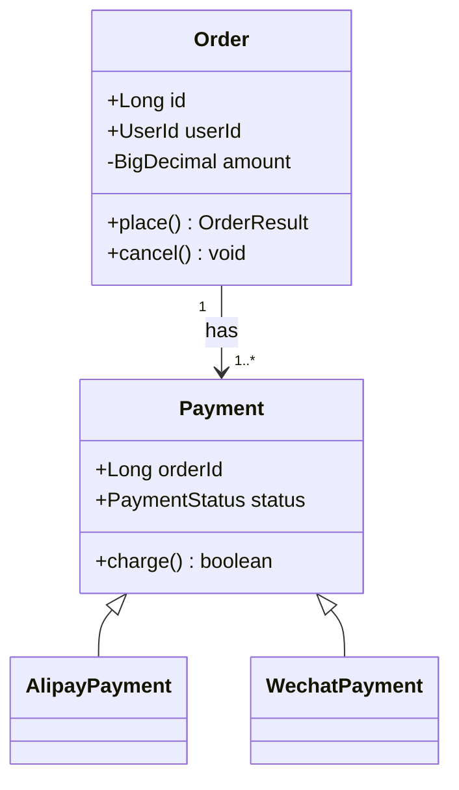

# diagrams/class/ — INSTRUCTIONS

Replace `{{MERMAID_SOURCE}}` (twice) with a Mermaid `classDiagram`.

## Cheat sheet

- Visibility: `+` public, `-` private, `#` protected, `~` package
- Arrows: `<|--` inheritance, `*--` composition, `o--` aggregation, `-->` association
- Cardinality: `"1"` `"0..*"` etc.
