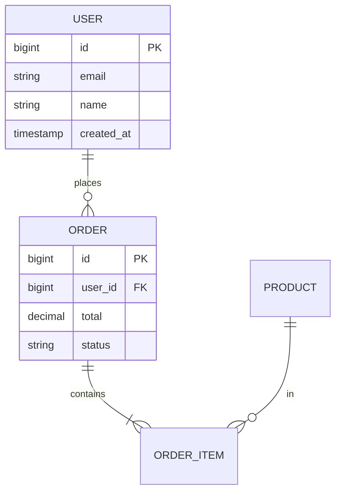

# diagrams/er/ — INSTRUCTIONS

Replace `{{MERMAID_SOURCE}}` (twice) with a Mermaid `erDiagram`.

## Cheat sheet

- Cardinality:
  - `||--||` exactly one to exactly one
  - `||--o{` one to zero-or-many
  - `}|--|{` many-to-many (mandatory)
  - `}o--o{` many-to-many (optional)
- Inside `{ }`: `type name PK|FK|UK` (one per line)
