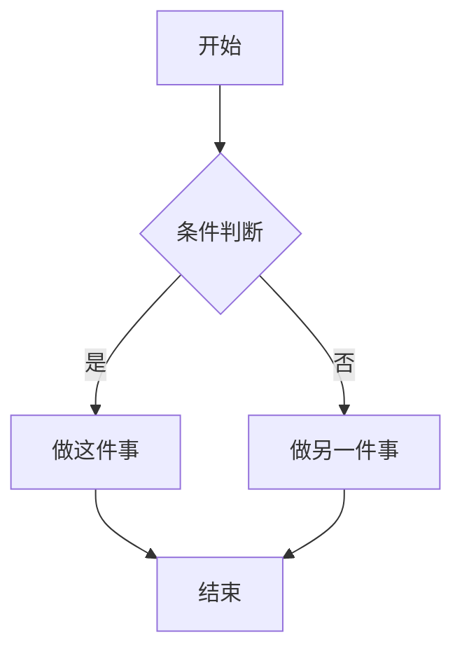
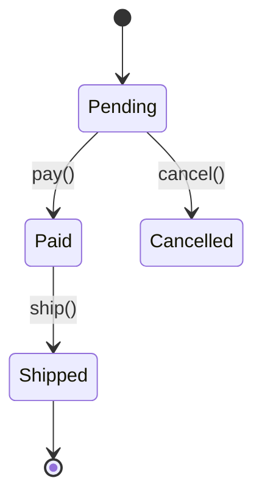

# diagrams/flowchart/ — INSTRUCTIONS

Replace `{{MERMAID_SOURCE}}` (twice — once in the `<pre class="mermaid">`, once in the `
`) with a Mermaid `graph` definition.

## Cheat sheet

- `graph TD` = top-down; `graph LR` = left-right; `graph BT` / `RL` also valid
- `A[文本]` = rectangle; `A(文本)` = rounded; `A{文本}` = diamond (decision); `A((文本))` = circle
- `-->` = arrow; `-.->` = dashed; `==>` = thick; `-->|label|` = labeled
- `subgraph 名称 ... end` to group nodes

## Layout direction

- Default to `TD` for short flows (≤ 8 steps)
- Use `LR` for longer chains or many parallel branches
- For a state machine, use `stateDiagram-v2` instead — it's a different Mermaid keyword:

## Limits

- ≤ 50 nodes works well; 100+ may render slowly
- Prefer multiple small flowcharts (and a deck) over one huge one
