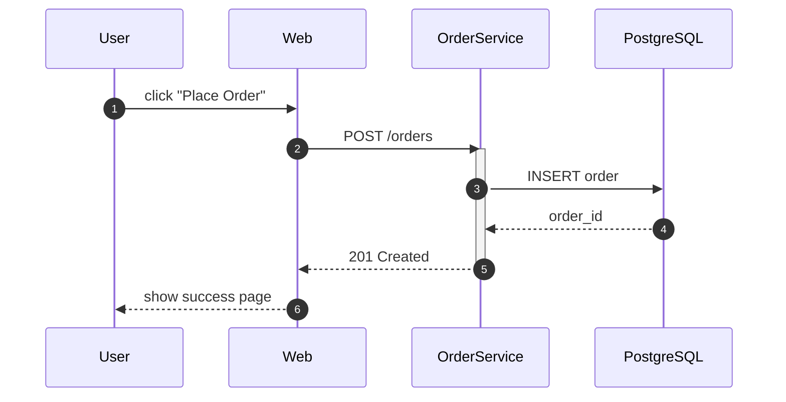

# diagrams/sequence/ — INSTRUCTIONS

Replace `{{MERMAID_SOURCE}}` (twice) with a Mermaid `sequenceDiagram`.

## Cheat sheet

- `participant X as Label` declares (left to right)
- `->>`  = solid arrow with arrowhead; `-->>`  = dashed
- `activate` / `deactivate` show lifecycle bars
- `Note over A,B: text` for annotations
- `loop`, `alt`/`else`, `par`/`and` for control flow

## Limits

- 3-7 participants works best; 10+ becomes hard to read — split into multiple sequence diagrams (and a deck)
