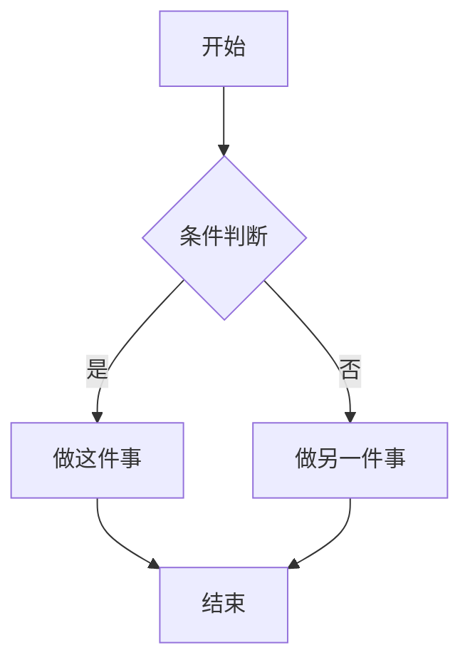
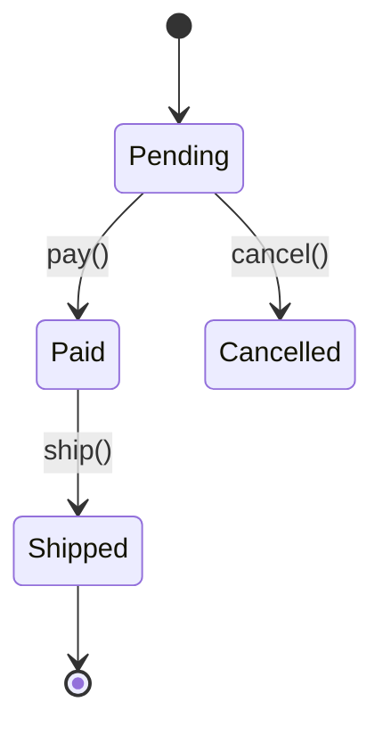
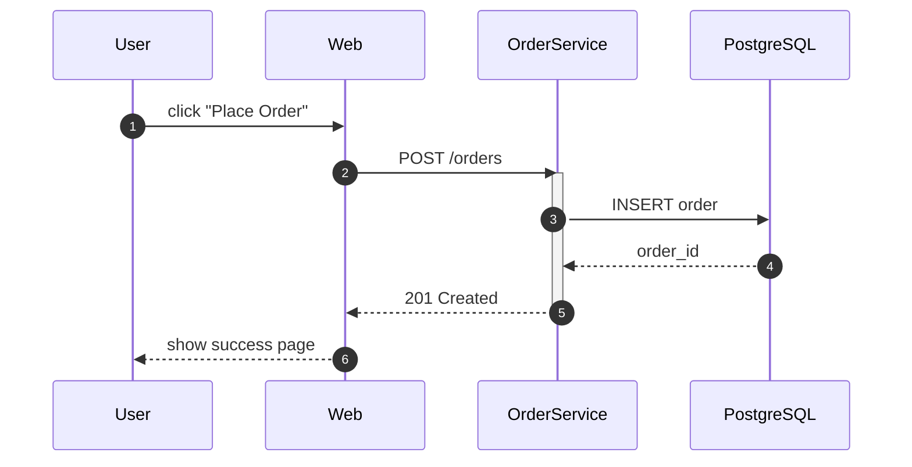
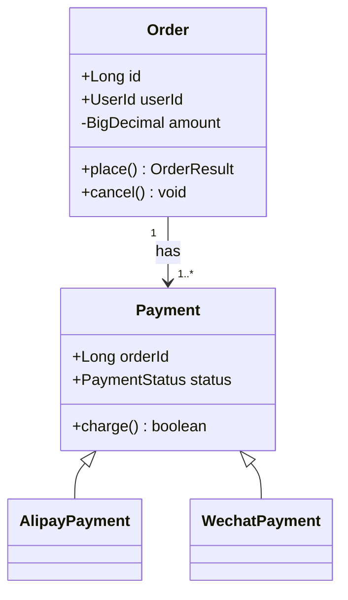
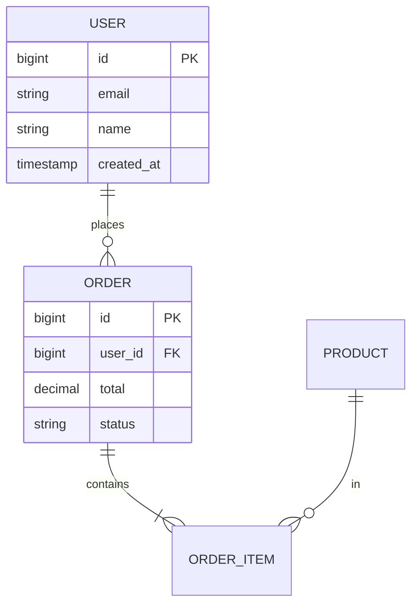

# ai-draw-skill Implementation Plan

> **For agentic workers:** REQUIRED SUB-SKILL: Use superpowers:subagent-driven-development (recommended) or superpowers:executing-plans to implement this plan task-by-task. Steps use checkbox (`- [ ]`) syntax for tracking.

**Goal:** Build a single Claude Skill `/ai-draw <需求>` that consolidates the画图 + 美术 + 演讲能力 of graphify, architecture-diagram, and html-ppt — supporting 7 diagram types × 8 curated themes, with optional PPT deck mode (presenter window + speaker notes).

**Architecture:** Single Skill repo (`stone-yu/ai-draw-skill`). User outputs land in `<cwd>/ai-draw-out/<name>/`. Generated HTML pulls CSS/JS from jsdelivr-served Skill assets and from public CDNs (Mermaid/D3/Markmap/rough.js/jsPDF). 7 diagram types live under `diagrams/<type>/` with their own INSTRUCTIONS.md + template.html. Theme system is CSS variable overrides; runtime cycles themes via `T` key.

**Tech Stack:** HTML / CSS variables / vanilla JS (runtime + presenter + exporter), Mermaid v10 (flow/sequence/class/er), D3 v7 (knowledge graph), Markmap v0.17 (mindmap), rough.js v4 (hand-drawn theme only), html2canvas v1.4.1 + jsPDF v2.5.2 (export), ELK v0.9 (architecture auto-layout fallback). Bash scripts for scaffolding/rendering. No npm/node dependencies in the Skill repo itself.

**Spec:** `docs/superpowers/specs/2026-05-13-ai-draw-skill-design.md` — read first if you have not.

**Test posture:** Per spec §7.3, no automated unit tests in v0.1. Verification = `scripts/check-themes.sh` (token coverage scan) + `scripts/render-all.sh` (headless Chrome screenshots of 7×8=56 combos for human eyeball) + manual scenario smoke tests. Each task ends with running the affected file in headless Chrome / opening in browser, then committing.

---

## File Structure

Files will be created/modified in this order across the phases below:

| Path | Responsibility | Phase |
|---|---|---|
| `assets/base.css` | CSS token definitions (single source of truth) | 1 |
| `assets/themes/<8 files>.css` | Token overrides per theme | 1 |
| `assets/runtime.js` | Keyboard, theme cycling, slide nav, deep-link, mode detection | 1 |
| `assets/exporter.js` | PNG / PDF / clipboard export toolbar | 1 |
| `assets/presenter.js` | Speaker mode popup + iframe previews + BroadcastChannel | 1 |
| `diagrams/architecture/{template.html, INSTRUCTIONS.md, examples/}` | Architecture diagram type | 2 |
| `diagrams/knowledge-graph/{template.html, INSTRUCTIONS.md, examples/}` | Knowledge graph (D3) | 3 |
| `diagrams/{flowchart, sequence, class, er}/` | Mermaid family — share a base mermaid template | 3 |
| `diagrams/mindmap/{template.html, INSTRUCTIONS.md}` | Mindmap (Markmap) | 3 |
| `ppt/{deck-template.html, INSTRUCTIONS.md, README-template.md}` | Deck wrapper + speaker-notes rules | 4 |
| `SKILL.md` | Skill entry — intent recognition, dispatch, interaction flow | 5 |
| `INTERACTION.md` | Theme-recommendation SOP + single-vs-deck decision rules | 5 |
| `references/{themes.md, diagram-types.md}` | Decision tables Claude consults | 5 |
| `scripts/{new.sh, render.sh, render-all.sh, check-themes.sh}` | Scaffold / PNG / verification | 6 |
| `README.md` | Repo top-level — what the Skill is, how to install | 7 |

---

## Phase 1: Foundation (CSS tokens + runtime)

### Task 1: Define CSS token system in `assets/base.css`

**Files:**
- Create: `assets/base.css`

- [ ] **Step 1: Write the file**

```css
/* assets/base.css — CSS token system. All visual properties resolve through these vars.
   Theme files in assets/themes/ override these values; nothing else should. */

:root {
  /* Backgrounds */
  --bg:           #0a0e1a;
  --bg-2:         #131826;
  --bg-3:         #1c2333;

  /* Text */
  --text-1:       #e2e8f0;
  --text-2:       #94a3b8;
  --text-3:       #64748b;

  /* Accents and borders */
  --accent:       #22d3ee;
  --accent-2:     #a78bfa;
  --border:       #334155;
  --grid:         #1e293b;

  /* Semantic colors (architecture/flowchart shared) */
  --sem-frontend: #22d3ee;
  --sem-backend:  #34d399;
  --sem-db:       #a78bfa;
  --sem-cloud:    #fbbf24;
  --sem-security: #fb7185;
  --sem-bus:      #fb923c;
  --sem-generic:  #94a3b8;

  /* Typography */
  --font-display: 'JetBrains Mono', ui-monospace, monospace;
  --font-body:    system-ui, -apple-system, sans-serif;
  --font-mono:    'JetBrains Mono', ui-monospace, monospace;

  /* Shape */
  --radius:       6px;
  --radius-lg:    12px;
  --stroke:       1.5px;
  --shadow:       0 4px 24px rgba(0, 0, 0, 0.4);

  /* Knowledge-graph specific */
  --node-fill:    var(--bg-3);
  --node-stroke:  var(--accent);
  --edge-stroke:  var(--text-3);

  /* Community palette (8 colors; v0.1 uses index 0 only since we are not auto-grouping) */
  --community-0: #22d3ee;
  --community-1: #34d399;
  --community-2: #a78bfa;
  --community-3: #fbbf24;
  --community-4: #fb7185;
  --community-5: #fb923c;
  --community-6: #94a3b8;
  --community-7: #f472b6;

  /* Mermaid bridge — runtime.js reads this to decide built-in dark vs neutral */
  --mermaid-flavor: 'dark';
}

/* Page primitives shared by every output */
html, body {
  margin: 0; padding: 0;
  background: var(--bg);
  color: var(--text-1);
  font-family: var(--font-body);
  -webkit-font-smoothing: antialiased;
}

.container        { max-width: 1280px; margin: 0 auto; padding: 24px; }
header h1         { font-family: var(--font-display); font-size: 22px; margin: 0 0 4px; }
header .subtitle  { color: var(--text-2); font-size: 13px; }

/* Slide chrome (deck mode) — runtime.js manages .is-active */
.slide            { display: none; min-height: 100vh; padding: 48px; box-sizing: border-box; }
.slide.is-active  { display: block; }
body[data-mode="deck"] .deck-progress {
  position: fixed; top: 0; left: 0; height: 3px; background: var(--accent);
  width: var(--progress, 0%); transition: width .2s ease;
}
.notes            { display: none; }  /* speaker-only; presenter.js reads it */

/* Diagram wrapper */
.diagram-wrapper  { background: var(--bg-2); border-radius: var(--radius-lg);
                    padding: 24px; box-shadow: var(--shadow); }
```

- [ ] **Step 2: Open in browser to confirm no syntax errors**

Run: `open assets/base.css` (or `cat assets/base.css | head -5`)
Expected: file opens, no errors. (CSS without HTML is plain text — this just verifies the file exists.)

- [ ] **Step 3: Commit**

```bash
git add assets/base.css
git commit -m "feat(assets): add base CSS token system"
```

---

### Task 2: Implement first theme `tech-dark` to validate the token contract

**Files:**
- Create: `assets/themes/tech-dark.css`
- Create: `tmp/theme-preview.html` (throwaway, will be deleted in Step 4)

- [ ] **Step 1: Write the theme file**

```css
/* assets/themes/tech-dark.css — slate-950 base, cyan accent, JetBrains Mono.
   Inspired by the original architecture-diagram skill palette. */

:root {
  --bg:           #020617;
  --bg-2:         #0f172a;
  --bg-3:         #1e293b;

  --text-1:       #e2e8f0;
  --text-2:       #94a3b8;
  --text-3:       #64748b;

  --accent:       #22d3ee;
  --accent-2:     #a78bfa;
  --border:       #334155;
  --grid:         #1e293b;

  --sem-frontend: #22d3ee;
  --sem-backend:  #34d399;
  --sem-db:       #a78bfa;
  --sem-cloud:    #fbbf24;
  --sem-security: #fb7185;
  --sem-bus:      #fb923c;
  --sem-generic:  #94a3b8;

  --font-display: 'JetBrains Mono', ui-monospace, monospace;
  --font-body:    'JetBrains Mono', ui-monospace, monospace;
  --font-mono:    'JetBrains Mono', ui-monospace, monospace;

  --radius:       6px;
  --radius-lg:    12px;
  --stroke:       1.5px;
  --shadow:       0 4px 24px rgba(0, 0, 0, 0.6);

  --community-0: #22d3ee;
  --community-1: #34d399;
  --community-2: #a78bfa;
  --community-3: #fbbf24;
  --community-4: #fb7185;
  --community-5: #fb923c;
  --community-6: #94a3b8;
  --community-7: #f472b6;

  --mermaid-flavor: 'dark';
}
```

- [ ] **Step 2: Write a preview HTML to verify both files load together**

Create `tmp/theme-preview.html`:

```html
<!DOCTYPE html>
<html>
<head>
  <link rel="stylesheet" href="../assets/base.css">
  <link rel="stylesheet" href="../assets/themes/tech-dark.css">
  <link href="https://fonts.googleapis.com/css2?family=JetBrains+Mono:wght@400;500;600;700&display=swap" rel="stylesheet">
</head>
<body>
  <div class="container">
    <header>
      <h1>tech-dark theme preview</h1>
      <p class="subtitle">If background is near-black and text is light slate, base + theme are wired correctly.</p>
    </header>
    <div class="diagram-wrapper" style="margin-top: 24px;">
      <p style="color: var(--sem-frontend);">--sem-frontend (cyan)</p>
      <p style="color: var(--sem-backend);">--sem-backend (emerald)</p>
      <p style="color: var(--sem-db);">--sem-db (violet)</p>
      <p style="color: var(--sem-cloud);">--sem-cloud (amber)</p>
      <p style="color: var(--sem-security);">--sem-security (rose)</p>
    </div>
  </div>
</body>
</html>
```

- [ ] **Step 3: Open in browser and eyeball**

Run: `open tmp/theme-preview.html`
Expected: dark background, light text, 5 colored lines. Take a 2-second look — if obviously wrong (white background, missing colors), token contract is broken.

- [ ] **Step 4: Delete the preview file (it was only for verification)**

```bash
rm -rf tmp/
```

- [ ] **Step 5: Commit**

```bash
git add assets/themes/tech-dark.css
git commit -m "feat(themes): add tech-dark theme"
```

---

### Task 3: Add the remaining 7 themes

**Files:**
- Create: `assets/themes/blueprint.css`
- Create: `assets/themes/business-clean.css`
- Create: `assets/themes/xhs-soft.css`
- Create: `assets/themes/cyberpunk-neon.css`
- Create: `assets/themes/minimal-light.css`
- Create: `assets/themes/academic-paper.css`
- Create: `assets/themes/hand-drawn.css`

Each file follows the same shape as Task 2's `tech-dark.css` — a `:root { ... }` block overriding every variable from `base.css`. Below are the **complete contents** for each file.

- [ ] **Step 1: Write `assets/themes/blueprint.css`**

```css
/* Deep blue technical-blueprint look. Dense grid, white hairlines. */
:root {
  --bg: #0c1e3a; --bg-2: #102746; --bg-3: #163358;
  --text-1: #dbeafe; --text-2: #93c5fd; --text-3: #64748b;
  --accent: #60a5fa; --accent-2: #38bdf8; --border: #1e3a5f; --grid: #1e3a5f;
  --sem-frontend: #60a5fa; --sem-backend: #34d399; --sem-db: #c4b5fd;
  --sem-cloud: #fde68a; --sem-security: #fda4af; --sem-bus: #fdba74; --sem-generic: #cbd5e1;
  --font-display: 'JetBrains Mono', ui-monospace, monospace;
  --font-body: system-ui, -apple-system, sans-serif;
  --font-mono: 'JetBrains Mono', ui-monospace, monospace;
  --radius: 4px; --radius-lg: 8px; --stroke: 1px; --shadow: 0 2px 12px rgba(0,0,0,0.5);
  --community-0:#60a5fa; --community-1:#34d399; --community-2:#c4b5fd; --community-3:#fde68a;
  --community-4:#fda4af; --community-5:#fdba74; --community-6:#cbd5e1; --community-7:#f0abfc;
  --mermaid-flavor: 'dark';
}
```

- [ ] **Step 2: Write `assets/themes/business-clean.css`**

```css
/* Off-white business / formal — sober blues and greys. */
:root {
  --bg: #ffffff; --bg-2: #f8fafc; --bg-3: #e2e8f0;
  --text-1: #0f172a; --text-2: #475569; --text-3: #94a3b8;
  --accent: #0284c7; --accent-2: #059669; --border: #cbd5e1; --grid: #e2e8f0;
  --sem-frontend: #0284c7; --sem-backend: #059669; --sem-db: #7c3aed;
  --sem-cloud: #d97706; --sem-security: #dc2626; --sem-bus: #ea580c; --sem-generic: #64748b;
  --font-display: 'Inter', system-ui, sans-serif;
  --font-body: 'Inter', system-ui, sans-serif;
  --font-mono: 'JetBrains Mono', ui-monospace, monospace;
  --radius: 6px; --radius-lg: 12px; --stroke: 1.5px; --shadow: 0 1px 3px rgba(0,0,0,0.08);
  --community-0:#0284c7; --community-1:#059669; --community-2:#7c3aed; --community-3:#d97706;
  --community-4:#dc2626; --community-5:#ea580c; --community-6:#64748b; --community-7:#db2777;
  --mermaid-flavor: 'neutral';
}
```

- [ ] **Step 3: Write `assets/themes/xhs-soft.css`**

```css
/* 小红书 soft-card look — cream + warm pinks/oranges, big rounding. */
:root {
  --bg: #fef9f3; --bg-2: #fff5e9; --bg-3: #fde6d2;
  --text-1: #1a1a1a; --text-2: #5b5b5b; --text-3: #999;
  --accent: #ff7e5f; --accent-2: #feb47b; --border: #f0e0d0; --grid: #f5e8d8;
  --sem-frontend: #ff7e5f; --sem-backend: #f6a560; --sem-db: #c084fc;
  --sem-cloud: #fbbf24; --sem-security: #f87171; --sem-bus: #fb923c; --sem-generic: #94a3b8;
  --font-display: 'PingFang SC', 'Noto Sans CJK SC', system-ui, sans-serif;
  --font-body: 'PingFang SC', 'Noto Sans CJK SC', system-ui, sans-serif;
  --font-mono: 'JetBrains Mono', ui-monospace, monospace;
  --radius: 16px; --radius-lg: 24px; --stroke: 2px; --shadow: 0 8px 24px rgba(255, 126, 95, 0.15);
  --community-0:#ff7e5f; --community-1:#f6a560; --community-2:#c084fc; --community-3:#fbbf24;
  --community-4:#f87171; --community-5:#fb923c; --community-6:#94a3b8; --community-7:#f472b6;
  --mermaid-flavor: 'neutral';
}
```

- [ ] **Step 4: Write `assets/themes/cyberpunk-neon.css`**

```css
/* Pitch black + magenta/cyan/yellow neon — glow shadows. */
:root {
  --bg: #000000; --bg-2: #0a0a0f; --bg-3: #14141f;
  --text-1: #f0f6ff; --text-2: #b3c5e0; --text-3: #6b7d99;
  --accent: #f72585; --accent-2: #4cc9f0; --border: #2a1a3a; --grid: #1a0d2a;
  --sem-frontend: #4cc9f0; --sem-backend: #f72585; --sem-db: #b5179e;
  --sem-cloud: #ffd60a; --sem-security: #ff006e; --sem-bus: #ffb700; --sem-generic: #8d99ae;
  --font-display: 'Orbitron', 'JetBrains Mono', ui-monospace, monospace;
  --font-body: 'JetBrains Mono', ui-monospace, monospace;
  --font-mono: 'JetBrains Mono', ui-monospace, monospace;
  --radius: 4px; --radius-lg: 8px; --stroke: 2px;
  --shadow: 0 0 20px rgba(247, 37, 133, 0.4), 0 0 40px rgba(76, 201, 240, 0.2);
  --community-0:#4cc9f0; --community-1:#f72585; --community-2:#b5179e; --community-3:#ffd60a;
  --community-4:#ff006e; --community-5:#ffb700; --community-6:#8d99ae; --community-7:#7209b7;
  --mermaid-flavor: 'dark';
}
```

- [ ] **Step 5: Write `assets/themes/minimal-light.css`**

```css
/* Pure white, black hairlines, no shadows, no accent color. */
:root {
  --bg: #ffffff; --bg-2: #ffffff; --bg-3: #fafafa;
  --text-1: #000000; --text-2: #525252; --text-3: #a3a3a3;
  --accent: #000000; --accent-2: #525252; --border: #e5e5e5; --grid: #f5f5f5;
  --sem-frontend: #000000; --sem-backend: #404040; --sem-db: #525252;
  --sem-cloud: #737373; --sem-security: #000000; --sem-bus: #525252; --sem-generic: #a3a3a3;
  --font-display: 'Inter', system-ui, sans-serif;
  --font-body: 'Inter', system-ui, sans-serif;
  --font-mono: 'JetBrains Mono', ui-monospace, monospace;
  --radius: 2px; --radius-lg: 4px; --stroke: 1px; --shadow: none;
  --community-0:#000; --community-1:#404040; --community-2:#525252; --community-3:#737373;
  --community-4:#a3a3a3; --community-5:#525252; --community-6:#404040; --community-7:#000;
  --mermaid-flavor: 'neutral';
}
```

- [ ] **Step 6: Write `assets/themes/academic-paper.css`**

```css
/* Ivory paper, serif body, grey lines. */
:root {
  --bg: #fafaf5; --bg-2: #f5f5ee; --bg-3: #ebebe2;
  --text-1: #1c1917; --text-2: #57534e; --text-3: #a8a29e;
  --accent: #525252; --accent-2: #78716c; --border: #d6d3d1; --grid: #e7e5e4;
  --sem-frontend: #1e40af; --sem-backend: #166534; --sem-db: #6b21a8;
  --sem-cloud: #92400e; --sem-security: #991b1b; --sem-bus: #9a3412; --sem-generic: #57534e;
  --font-display: 'Source Serif Pro', 'Noto Serif', Georgia, serif;
  --font-body: 'Source Serif Pro', 'Noto Serif', Georgia, serif;
  --font-mono: 'JetBrains Mono', ui-monospace, monospace;
  --radius: 2px; --radius-lg: 4px; --stroke: 1px; --shadow: none;
  --community-0:#1e40af; --community-1:#166534; --community-2:#6b21a8; --community-3:#92400e;
  --community-4:#991b1b; --community-5:#9a3412; --community-6:#57534e; --community-7:#831843;
  --mermaid-flavor: 'neutral';
}
```

- [ ] **Step 7: Write `assets/themes/hand-drawn.css`**

```css
/* Sketch / whiteboard look — cream paper + handwriting font. Used with rough.js
   in templates that opt in (see diagrams/architecture/INSTRUCTIONS.md). */
:root {
  --bg: #fef6e4; --bg-2: #fdebc4; --bg-3: #f9d8a3;
  --text-1: #1a1a1a; --text-2: #4a4a4a; --text-3: #777;
  --accent: #e07a5f; --accent-2: #81b29a; --border: #c4a57b; --grid: #e8d5a8;
  --sem-frontend: #e07a5f; --sem-backend: #81b29a; --sem-db: #8b5cf6;
  --sem-cloud: #f4a261; --sem-security: #e63946; --sem-bus: #f6bd60; --sem-generic: #6b705c;
  --font-display: 'Caveat', 'Kalam', cursive;
  --font-body: 'Caveat', 'Kalam', cursive;
  --font-mono: 'Caveat', 'Kalam', cursive;
  --radius: 8px; --radius-lg: 16px; --stroke: 2px; --shadow: 2px 4px 0 rgba(0,0,0,0.1);
  --community-0:#e07a5f; --community-1:#81b29a; --community-2:#8b5cf6; --community-3:#f4a261;
  --community-4:#e63946; --community-5:#f6bd60; --community-6:#6b705c; --community-7:#d4a373;
  --mermaid-flavor: 'neutral';
}
```

- [ ] **Step 8: Sanity-check all 8 themes resolve every base token**

Run:
```bash
BASE_VARS=$(grep -oE -- '--[a-z0-9-]+' assets/base.css | sort -u)
for theme in assets/themes/*.css; do
  MISSING=""
  for v in $BASE_VARS; do
    grep -q -- "$v" "$theme" || MISSING="$MISSING $v"
  done
  if [ -n "$MISSING" ]; then
    echo "❌ $theme missing:$MISSING"
  else
    echo "✅ $theme covers all tokens"
  fi
done
```

Expected: 8 lines all starting with `✅`. If any `❌` lines appear, add the missing vars to that theme file before continuing.

- [ ] **Step 9: Commit**

```bash
git add assets/themes/
git commit -m "feat(themes): add 7 remaining themes (blueprint, business-clean, xhs-soft, cyberpunk-neon, minimal-light, academic-paper, hand-drawn)"
```

---

### Task 4: Build `assets/runtime.js` — keyboard, theme cycling, mode detection

**Files:**
- Create: `assets/runtime.js`

The runtime is loaded by every output (single image AND deck). It reads `body[data-mode]` to know what features to enable.

- [ ] **Step 1: Write the file**

```javascript
/* assets/runtime.js — single + deck mode runtime.
 *
 * Responsibilities:
 *   - keyboard nav (← → / Space / PgUp / PgDn / Home / End / digits / Esc)
 *   - T = cycle 3 recommended themes; Shift+T = cycle all 8
 *   - F = fullscreen
 *   - O = slide overview (deck only)
 *   - S = open speaker window (deck only; presenter.js handles the popup)
 *   - N = bottom notes drawer (deck only)
 *   - hash deep-link #/N (deck only)
 *   - URL ?preview=N forces preview-only mode (used by presenter iframes)
 *   - Mermaid re-render on theme change
 *
 * Reads:
 *   - <html data-themes="a,b,c">       — comma list of T-cycle themes
 *   - <body data-mode="single|deck">  — feature gating
 *
 * Public API on window.AiDraw:
 *   applyTheme(name), nextSlide(), prevSlide(), gotoSlide(idx), toggleSpeaker(),
 *   toggleOverview(), toggleNotes()
 */
(function () {
  const ALL_THEMES = [
    'tech-dark', 'blueprint', 'business-clean', 'xhs-soft',
    'cyberpunk-neon', 'minimal-light', 'academic-paper', 'hand-drawn'
  ];
  const MERMAID_DARK   = ['tech-dark', 'blueprint', 'cyberpunk-neon'];
  const docEl          = document.documentElement;
  const recommended    = (docEl.dataset.themes || '').split(',').map(s => s.trim()).filter(Boolean);
  const isDeck         = document.body.dataset.mode === 'deck';

  // ---- Theme system ---------------------------------------------------------
  let currentTheme = (document.getElementById('theme-link')?.href.match(/themes\/([^.]+)\.css/) || [])[1]
                  || recommended[0] || 'tech-dark';

  function applyTheme(name) {
    if (!ALL_THEMES.includes(name)) return;
    const link = document.getElementById('theme-link');
    if (!link) return;
    const base = link.href.replace(/themes\/[^.]+\.css.*$/, 'themes/');
    link.href = base + name + '.css';
    currentTheme = name;
    docEl.dataset.theme = name;
    rerunMermaid();
    refreshMarkmap();
  }

  function cycleTheme(useAll) {
    const list = useAll ? ALL_THEMES : (recommended.length ? recommended : ALL_THEMES);
    const i = list.indexOf(currentTheme);
    applyTheme(list[(i + 1) % list.length]);
  }

  function rerunMermaid() {
    if (!window.mermaid) return;
    const flavor = MERMAID_DARK.includes(currentTheme) ? 'dark' : 'neutral';
    document.querySelectorAll('pre.mermaid').forEach(el => {
      // Restore source from data-source if mermaid already replaced it with svg
      if (el.dataset.source) el.textContent = el.dataset.source;
      else el.dataset.source = el.textContent;
      el.removeAttribute('data-processed');
    });
    window.mermaid.initialize({ startOnLoad: false, theme: flavor });
    window.mermaid.run({ querySelector: 'pre.mermaid' });
  }

  function refreshMarkmap() {
    if (window.AiDrawMarkmap?.refresh) window.AiDrawMarkmap.refresh();
  }

  // ---- Slide nav (deck mode) ------------------------------------------------
  const slides = isDeck ? Array.from(document.querySelectorAll('.slide')) : [];
  let activeIdx = Math.max(0, slides.findIndex(s => s.classList.contains('is-active')));

  function gotoSlide(i) {
    if (!isDeck || slides.length === 0) return;
    i = Math.max(0, Math.min(slides.length - 1, i));
    slides[activeIdx]?.classList.remove('is-active');
    slides[i].classList.add('is-active');
    activeIdx = i;
    location.hash = '#/' + (i + 1);
    document.body.style.setProperty('--progress', ((i + 1) / slides.length * 100) + '%');
    broadcast({ type: 'slide-change', idx: i });
  }
  function nextSlide() { gotoSlide(activeIdx + 1); }
  function prevSlide() { gotoSlide(activeIdx - 1); }

  // ---- Preview-only mode (used by presenter.js iframes) --------------------
  const previewIdx = new URLSearchParams(location.search).get('preview');
  if (previewIdx !== null && isDeck) {
    document.body.classList.add('is-preview');
    document.documentElement.style.setProperty('--progress', '0%');
    const i = Math.max(0, Math.min(slides.length - 1, parseInt(previewIdx, 10) - 1));
    slides.forEach(s => s.classList.remove('is-active'));
    slides[i]?.classList.add('is-active');
    activeIdx = i;
    document.querySelectorAll('.deck-progress, .toolbar').forEach(el => el.style.display = 'none');
  }

  // ---- BroadcastChannel sync (deck only, between speaker + audience) -------
  let bc = null;
  if (isDeck && 'BroadcastChannel' in window) {
    const channel = 'ai-draw-' + (location.pathname);
    bc = new BroadcastChannel(channel);
    bc.onmessage = e => {
      const msg = e.data;
      if (msg.type === 'preview-goto' && typeof msg.idx === 'number') gotoSlide(msg.idx);
    };
  }
  function broadcast(msg) { bc?.postMessage(msg); }

  // ---- postMessage (presenter iframe) ---------------------------------------
  window.addEventListener('message', e => {
    const m = e.data;
    if (m && m.type === 'preview-goto' && typeof m.idx === 'number') gotoSlide(m.idx);
  });

  // ---- Keyboard -------------------------------------------------------------
  document.addEventListener('keydown', e => {
    if (e.target.matches('input, textarea, [contenteditable]')) return;
    const k = e.key;
    if (k === 'ArrowRight' || k === ' ' || k === 'PageDown') { e.preventDefault(); nextSlide(); }
    else if (k === 'ArrowLeft' || k === 'PageUp')           { e.preventDefault(); prevSlide(); }
    else if (k === 'Home') { gotoSlide(0); }
    else if (k === 'End')  { gotoSlide(slides.length - 1); }
    else if (k === 'T')    { e.shiftKey ? cycleTheme(true) : cycleTheme(false); }
    else if (k === 't')    { cycleTheme(false); }
    else if (k === 'F' || k === 'f') {
      document.fullscreenElement ? document.exitFullscreen() : document.documentElement.requestFullscreen();
    }
    else if ((k === 'S' || k === 's') && isDeck) { window.AiDrawPresenter?.toggle(); }
    else if ((k === 'O' || k === 'o') && isDeck) { window.AiDraw.toggleOverview(); }
    else if ((k === 'N' || k === 'n') && isDeck) { window.AiDraw.toggleNotes(); }
    else if (k === 'Escape') {
      document.querySelectorAll('.overlay').forEach(el => el.remove());
      if (document.fullscreenElement) document.exitFullscreen();
    }
  });

  // ---- Hash deep-link -------------------------------------------------------
  function readHash() {
    const m = location.hash.match(/^#\/(\d+)$/);
    if (m && isDeck) gotoSlide(parseInt(m[1], 10) - 1);
  }
  window.addEventListener('hashchange', readHash);
  if (location.hash) readHash();

  // ---- Overview grid (lazy DOM) ---------------------------------------------
  function toggleOverview() {
    let ov = document.querySelector('.overlay.overview');
    if (ov) { ov.remove(); return; }
    ov = document.createElement('div');
    ov.className = 'overlay overview';
    ov.style.cssText = 'position:fixed;inset:0;background:rgba(0,0,0,.85);z-index:9999;overflow:auto;padding:24px;';
    ov.innerHTML = '<div style="display:grid;grid-template-columns:repeat(4,1fr);gap:16px;">' +
      slides.map((s, i) =>
        `<div data-i="${i}" style="border:1px solid var(--border);border-radius:8px;padding:12px;cursor:pointer;background:var(--bg-2);min-height:120px;">
          <div style="font-size:10px;color:var(--text-3);">SLIDE ${i+1}</div>
          <div style="font-size:13px;color:var(--text-1);margin-top:4px;">${(s.querySelector('h1,h2,h3')?.textContent || '').slice(0, 40)}</div>
        </div>`
      ).join('') +
      '</div>';
    ov.addEventListener('click', e => {
      const i = e.target.closest('[data-i]')?.dataset.i;
      if (i !== undefined) { gotoSlide(parseInt(i, 10)); ov.remove(); }
    });
    document.body.appendChild(ov);
  }

  // ---- Notes drawer ---------------------------------------------------------
  function toggleNotes() {
    let dr = document.querySelector('.overlay.notes-drawer');
    if (dr) { dr.remove(); return; }
    dr = document.createElement('div');
    dr.className = 'overlay notes-drawer';
    dr.style.cssText = 'position:fixed;left:0;right:0;bottom:0;background:var(--bg-2);border-top:1px solid var(--border);padding:24px;max-height:40vh;overflow:auto;z-index:9998;';
    const notes = slides[activeIdx]?.querySelector('.notes')?.innerHTML || '<em>(no notes for this slide)</em>';
    dr.innerHTML = '<div style="font-size:11px;color:var(--text-3);margin-bottom:8px;">SPEAKER NOTES — slide ' + (activeIdx + 1) + '</div>' + notes;
    document.body.appendChild(dr);
  }

  // ---- Public API -----------------------------------------------------------
  window.AiDraw = {
    applyTheme, cycleTheme, gotoSlide, nextSlide, prevSlide,
    toggleOverview, toggleNotes,
    getActiveSlide: () => activeIdx,
    getSlideCount: () => slides.length,
    getCurrentTheme: () => currentTheme,
    getRecommendedThemes: () => recommended.slice(),
    getAllThemes: () => ALL_THEMES.slice(),
    isDeck: () => isDeck,
    broadcast,
  };

  // Init progress bar
  if (isDeck && slides.length) {
    document.body.style.setProperty('--progress', ((activeIdx + 1) / slides.length * 100) + '%');
    if (!document.querySelector('.deck-progress')) {
      const bar = document.createElement('div');
      bar.className = 'deck-progress';
      document.body.appendChild(bar);
    }
  }
})();
```

- [ ] **Step 2: Smoke-test by writing a 2-slide deck preview**

Create `tmp/runtime-test.html`:

```html
<!DOCTYPE html>
<html data-themes="tech-dark,blueprint,minimal-light">
<head>
  <link rel="stylesheet" href="../assets/base.css">
  <link rel="stylesheet" id="theme-link" href="../assets/themes/tech-dark.css">
</head>
<body data-mode="deck">
  <div class="deck">
    <section class="slide is-active"><h1>Slide One</h1><div class="notes">notes for slide one</div></section>
    <section class="slide"><h1>Slide Two</h1><div class="notes">notes for slide two</div></section>
    <section class="slide"><h1>Slide Three</h1><div class="notes">notes for slide three</div></section>
  </div>
  <script src="../assets/runtime.js"></script>
</body>
</html>
```

Run: `open tmp/runtime-test.html`

Verify by hand:
- ← → arrows navigate
- T cycles tech-dark → blueprint → minimal-light → back
- Shift+T cycles all 8
- O opens overview grid
- N opens notes drawer
- F goes full screen
- Esc closes overlays

If any keybind fails, fix the relevant section in `runtime.js` before committing.

- [ ] **Step 3: Delete the preview file**

```bash
rm -rf tmp/
```

- [ ] **Step 4: Commit**

```bash
git add assets/runtime.js
git commit -m "feat(runtime): add keyboard nav + theme cycling + slide management"
```

---

### Task 5: Build `assets/exporter.js` — PNG / PDF / clipboard toolbar

**Files:**
- Create: `assets/exporter.js`

Ported from `architecture-diagram` skill, adapted to use jsdelivr-served libs.

- [ ] **Step 1: Write the file**

```javascript
/* assets/exporter.js — collapsing ⋯ toolbar with PNG / PDF / clipboard.
 *
 * Auto-injects on load. Reads:
 *   - #report-container — the element to capture (falls back to document.body)
 *
 * Depends on (loaded by template):
 *   - https://cdn.jsdelivr.net/npm/html2canvas@1.4.1/dist/html2canvas.min.js
 *   - https://cdn.jsdelivr.net/npm/jspdf@2.5.2/dist/jspdf.umd.min.js
 */
(function () {
  function once() {
    if (document.querySelector('.toolbar')) return;
    const tb = document.createElement('div');
    tb.className = 'toolbar';
    tb.style.cssText = 'position:fixed;top:16px;right:16px;z-index:9000;display:flex;gap:6px;';
    tb.innerHTML = `
      <div class="toolbar-actions" style="display:none;gap:6px;">
        <button data-act="copy"  style="${btnStyle()}">📋 Copy</button>
        <button data-act="png"   style="${btnStyle()}">🖼️ PNG</button>
        <button data-act="pdf"   style="${btnStyle()}">📄 PDF</button>
      </div>
      <button class="toolbar-toggle" style="${btnStyle()}">⋯</button>
    `;
    document.body.appendChild(tb);

    const actions = tb.querySelector('.toolbar-actions');
    tb.querySelector('.toolbar-toggle').onclick = () => {
      actions.style.display = actions.style.display === 'none' ? 'flex' : 'none';
    };
    tb.querySelector('[data-act="copy"]').onclick = copyAsImage;
    tb.querySelector('[data-act="png"]').onclick  = downloadPNG;
    tb.querySelector('[data-act="pdf"]').onclick  = downloadPDF;

    // Hide toolbar from print + html2canvas captures
    const style = document.createElement('style');
    style.textContent = '@media print { .toolbar { display: none !important; } }';
    document.head.appendChild(style);
  }

  function btnStyle() {
    return 'padding:8px 12px;border:1px solid var(--border);background:var(--bg-2);color:var(--text-1);' +
           'border-radius:var(--radius);font-family:var(--font-mono);font-size:12px;cursor:pointer;';
  }

  function captureRect() {
    const target = document.getElementById('report-container') || document.body;
    const r = target.getBoundingClientRect();
    const pad = 32;
    return {
      x: Math.max(0, r.left + window.scrollX - pad),
      y: Math.max(0, r.top  + window.scrollY - pad),
      width:  r.width  + pad * 2,
      height: r.height + pad * 2,
    };
  }

  function snapshot() {
    if (!window.html2canvas) return Promise.reject(new Error('html2canvas not loaded'));
    const rect = captureRect();
    return window.html2canvas(document.body, {
      scale: 2,
      x: rect.x, y: rect.y, width: rect.width, height: rect.height,
      ignoreElements: el => el.classList?.contains('toolbar'),
      backgroundColor: getComputedStyle(document.body).backgroundColor,
    });
  }

  async function downloadPNG() {
    const canvas = await snapshot();
    const a = document.createElement('a');
    a.href = canvas.toDataURL('image/png');
    a.download = (document.title || 'ai-draw') + '.png';
    a.click();
  }

  async function copyAsImage() {
    const canvas = await snapshot();
    canvas.toBlob(async blob => {
      try {
        await navigator.clipboard.write([new ClipboardItem({ 'image/png': blob })]);
        flash('Copied to clipboard');
      } catch (e) {
        flash('Clipboard blocked — use PNG button instead');
      }
    });
  }

  async function downloadPDF() {
    if (!window.jspdf) return alert('jspdf not loaded');
    const canvas = await snapshot();
    const { jsPDF } = window.jspdf;
    const w = canvas.width / 2, h = canvas.height / 2;
    const orient = w > h ? 'landscape' : 'portrait';
    const pdf = new jsPDF({ orientation: orient, unit: 'pt', format: [w, h] });
    pdf.addImage(canvas.toDataURL('image/png'), 'PNG', 0, 0, w, h);
    pdf.save((document.title || 'ai-draw') + '.pdf');
  }

  function flash(msg) {
    const t = document.createElement('div');
    t.textContent = msg;
    t.style.cssText = 'position:fixed;bottom:24px;left:50%;transform:translateX(-50%);background:var(--bg-3);color:var(--text-1);padding:8px 16px;border-radius:var(--radius);z-index:9999;';
    document.body.appendChild(t);
    setTimeout(() => t.remove(), 1500);
  }

  if (document.readyState === 'loading') document.addEventListener('DOMContentLoaded', once);
  else once();
})();
```

- [ ] **Step 2: Smoke-test in browser**

Create `tmp/exporter-test.html`:

```html
<!DOCTYPE html>
<html data-themes="tech-dark">
<head>
  <link rel="stylesheet" href="../assets/base.css">
  <link rel="stylesheet" id="theme-link" href="../assets/themes/tech-dark.css">
</head>
<body data-mode="single">
  <div id="report-container" class="container">
    <header><h1>Exporter test</h1><p class="subtitle">Click ⋯ then PNG. Should download a PNG.</p></header>
    <div class="diagram-wrapper" style="height:400px;display:grid;place-items:center;">
      <p>SOMETHING WORTH CAPTURING</p>
    </div>
  </div>
  <script src="https://cdn.jsdelivr.net/npm/html2canvas@1.4.1/dist/html2canvas.min.js"></script>
  <script src="https://cdn.jsdelivr.net/npm/jspdf@2.5.2/dist/jspdf.umd.min.js"></script>
  <script src="../assets/exporter.js"></script>
</body>
</html>
```

Run: `open tmp/exporter-test.html`. In the browser:
- Click ⋯ → buttons appear
- Click PNG → file downloads
- Click PDF → file downloads (may take a few seconds)
- Click Copy → "Copied to clipboard" flashes (works on https/localhost/file://)

- [ ] **Step 3: Delete the preview file and commit**

```bash
rm -rf tmp/
git add assets/exporter.js
git commit -m "feat(exporter): add PNG/PDF/clipboard toolbar (ported from architecture-diagram)"
```

---

### Task 6: Build `assets/presenter.js` — speaker window

**Files:**
- Create: `assets/presenter.js`

Ported from html-ppt's presenter feature. Opens a popup with 4 magnetic cards (CURRENT / NEXT / SCRIPT / TIMER), kept in sync with the audience window via `BroadcastChannel`.

- [ ] **Step 1: Write the file**

```javascript
/* assets/presenter.js — speaker window with 4 draggable, resizable cards.
 *
 * Public API: window.AiDrawPresenter.toggle()
 *
 * Card positions/sizes persist to localStorage per deck.
 * Two windows sync via BroadcastChannel('ai-draw-' + pathname) AND postMessage.
 */
(function () {
  let win = null;

  function toggle() {
    if (win && !win.closed) { win.close(); win = null; return; }
    win = window.open('', 'ai-draw-presenter', 'width=1280,height=800,resizable=yes');
    if (!win) { alert('Popup blocked — please allow popups for this page'); return; }
    win.document.write(buildPresenterHTML());
    win.document.close();
    win.focus();
  }

  function buildPresenterHTML() {
    const channel = 'ai-draw-' + location.pathname;
    const deckURL = location.pathname;
    const total   = window.AiDraw?.getSlideCount() || 1;
    const startIdx = window.AiDraw?.getActiveSlide() || 0;
    const notes   = collectNotes();
    const storeKey = 'ai-draw-presenter-' + location.pathname;

    return `<!DOCTYPE html>
<html><head>
  <title>Presenter — ${document.title}</title>
  <style>
    body { margin:0; background:#0a0e1a; color:#e2e8f0; font-family:ui-monospace,monospace; height:100vh; overflow:hidden; }
    .card { position:absolute; background:#131826; border:1px solid #334155; border-radius:8px; min-width:200px; min-height:120px; display:flex; flex-direction:column; resize:both; overflow:hidden; }
    .card-header { background:#1c2333; padding:8px 12px; cursor:move; user-select:none; font-size:11px; letter-spacing:.05em; display:flex; justify-content:space-between; align-items:center; }
    .card-body { flex:1; overflow:auto; padding:12px; }
    .card.cur, .card.nxt { border-color:#22d3ee; } .card.cur .card-header { background:#0e7490; }
    .card.nxt .card-header { background:#7c3aed; } .card.scr { border-color:#fb923c; } .card.scr .card-header { background:#c2410c; }
    .card.tmr { border-color:#34d399; } .card.tmr .card-header { background:#15803d; }
    .card iframe { width:100%; height:100%; border:0; background:#000; }
    .script-text { font-size:18px; line-height:1.6; }
    .timer { font-size:48px; font-family:monospace; text-align:center; padding:16px 0; }
    .meta { font-size:13px; color:#94a3b8; text-align:center; }
    .btn-row { display:flex; gap:6px; justify-content:center; margin-top:12px; }
    .btn { padding:8px 14px; background:#1c2333; color:#e2e8f0; border:1px solid #334155; border-radius:4px; cursor:pointer; font-family:inherit; }
    .reset-layout { position:fixed; top:8px; right:8px; }
  </style>
</head><body>
  <button class="btn reset-layout" onclick="resetLayout()">Reset layout</button>

  <div class="card cur" data-id="cur" style="left:24px;top:24px;width:600px;height:340px;">
    <div class="card-header"><span>🔵 CURRENT</span><span class="cur-idx">1 / ${total}</span></div>
    <iframe class="cur-frame" src="${deckURL}?preview=${startIdx + 1}"></iframe>
  </div>

  <div class="card nxt" data-id="nxt" style="left:640px;top:24px;width:540px;height:340px;">
    <div class="card-header"><span>🟣 NEXT</span><span class="nxt-idx">${Math.min(startIdx + 2, total)} / ${total}</span></div>
    <iframe class="nxt-frame" src="${deckURL}?preview=${Math.min(startIdx + 2, total)}"></iframe>
  </div>

  <div class="card scr" data-id="scr" style="left:24px;top:380px;width:760px;height:380px;">
    <div class="card-header"><span>🟠 SPEAKER SCRIPT</span></div>
    <div class="card-body script-text" id="script">${(notes[startIdx] || '<em>(no notes)</em>')}</div>
  </div>

  <div class="card tmr" data-id="tmr" style="left:800px;top:380px;width:380px;height:380px;">
    <div class="card-header"><span>🟢 TIMER</span></div>
    <div class="card-body">
      <div class="timer" id="timer">00:00</div>
      <div class="meta"><span id="page">${startIdx + 1}</span> / ${total}</div>
      <div class="btn-row">
        <button class="btn" onclick="prev()">← Prev</button>
        <button class="btn" onclick="next()">Next →</button>
        <button class="btn" onclick="reset()">R Reset</button>
      </div>
    </div>
  </div>

<script>
  const NOTES = ${JSON.stringify(notes)};
  const TOTAL = ${total};
  let idx = ${startIdx};
  let started = Date.now();

  const bc = ('BroadcastChannel' in window) ? new BroadcastChannel('${channel}') : null;
  if (bc) bc.onmessage = e => { if (e.data?.type === 'slide-change') { idx = e.data.idx; render(); } };

  function tellAudience(i) {
    bc?.postMessage({ type: 'preview-goto', idx: i });
    if (window.opener && !window.opener.closed) window.opener.postMessage({ type: 'preview-goto', idx: i }, '*');
  }

  function render() {
    document.querySelector('.cur-idx').textContent = (idx + 1) + ' / ' + TOTAL;
    document.querySelector('.nxt-idx').textContent = (Math.min(idx + 2, TOTAL)) + ' / ' + TOTAL;
    document.querySelector('.cur-frame').contentWindow.postMessage({ type: 'preview-goto', idx }, '*');
    document.querySelector('.nxt-frame').contentWindow.postMessage({ type: 'preview-goto', idx: Math.min(idx + 1, TOTAL - 1) }, '*');
    document.getElementById('script').innerHTML = NOTES[idx] || '<em>(no notes)</em>';
    document.getElementById('page').textContent = idx + 1;
  }
  function next()  { if (idx < TOTAL - 1) { idx++; tellAudience(idx); render(); } }
  function prev()  { if (idx > 0) { idx--; tellAudience(idx); render(); } }
  function reset() { started = Date.now(); }

  setInterval(() => {
    const s = Math.floor((Date.now() - started) / 1000);
    document.getElementById('timer').textContent =
      String(Math.floor(s / 60)).padStart(2, '0') + ':' + String(s % 60).padStart(2, '0');
  }, 1000);

  document.addEventListener('keydown', e => {
    if (e.key === 'ArrowRight' || e.key === ' ') { e.preventDefault(); next(); }
    else if (e.key === 'ArrowLeft')              { e.preventDefault(); prev(); }
    else if (e.key === 'R' || e.key === 'r')     { reset(); }
    else if (e.key === 'Escape')                 { window.close(); }
  });

  // Drag
  document.querySelectorAll('.card').forEach(card => {
    const header = card.querySelector('.card-header');
    let sx, sy, sl, st;
    header.addEventListener('mousedown', e => {
      sx = e.clientX; sy = e.clientY;
      sl = card.offsetLeft; st = card.offsetTop;
      const move = ev => { card.style.left = (sl + ev.clientX - sx) + 'px'; card.style.top = (st + ev.clientY - sy) + 'px'; };
      const up   = () => { document.removeEventListener('mousemove', move); document.removeEventListener('mouseup', up); savePositions(); };
      document.addEventListener('mousemove', move); document.addEventListener('mouseup', up);
    });
  });

  function savePositions() {
    const out = {};
    document.querySelectorAll('.card').forEach(c => {
      out[c.dataset.id] = { left: c.style.left, top: c.style.top, width: c.style.width, height: c.style.height };
    });
    try { localStorage.setItem('${storeKey}', JSON.stringify(out)); } catch (_) {}
  }
  function restorePositions() {
    try {
      const saved = JSON.parse(localStorage.getItem('${storeKey}') || '{}');
      document.querySelectorAll('.card').forEach(c => {
        const s = saved[c.dataset.id];
        if (s) { Object.assign(c.style, s); }
      });
    } catch (_) {}
  }
  function resetLayout() { localStorage.removeItem('${storeKey}'); location.reload(); }
  window.resetLayout = resetLayout;

  restorePositions();
  setInterval(savePositions, 2000);
</script>
</body></html>`;
  }

  function collectNotes() {
    return Array.from(document.querySelectorAll('.slide')).map(s =>
      s.querySelector('.notes')?.innerHTML || ''
    );
  }

  window.AiDrawPresenter = { toggle };
})();
```

- [ ] **Step 2: Smoke-test with the deck preview from Task 4**

Re-create `tmp/runtime-test.html` (same as Task 4 step 2) but add `<script src="../assets/presenter.js"></script>` after `runtime.js`.

Run: `open tmp/runtime-test.html`. Press `S`:
- Popup window opens
- 4 cards visible (CURRENT iframe / NEXT iframe / SCRIPT / TIMER)
- Drag a card by its header — it moves
- Click Next button → audience window advances slide; CURRENT iframe updates
- Press R → timer resets to 00:00
- Press Esc → popup closes

- [ ] **Step 3: Cleanup and commit**

```bash
rm -rf tmp/
git add assets/presenter.js
git commit -m "feat(presenter): add speaker window with 4 magnetic cards (ported from html-ppt)"
```

---

### Task 7: Add `scripts/check-themes.sh` — token coverage verification

**Files:**
- Create: `scripts/check-themes.sh`

- [ ] **Step 1: Write the script**

```bash
#!/usr/bin/env bash
# scripts/check-themes.sh — confirm every theme overrides every base.css token.
# Exits non-zero if any theme is missing any token (CI gating).

set -euo pipefail
ROOT="$(cd "$(dirname "$0")/.." && pwd)"
BASE="$ROOT/assets/base.css"
THEMES_DIR="$ROOT/assets/themes"

[ -f "$BASE" ] || { echo "❌ $BASE not found"; exit 1; }
[ -d "$THEMES_DIR" ] || { echo "❌ $THEMES_DIR not found"; exit 1; }

# Extract token names from base.css declarations only (not from var() refs).
# A declaration looks like:  --foo-bar: value;
BASE_VARS=$(grep -oE -- '^[[:space:]]*--[a-z0-9-]+:' "$BASE" | sed 's/[[:space:]]//g; s/://g' | sort -u)

EXIT=0
for theme in "$THEMES_DIR"/*.css; do
  MISSING=""
  for v in $BASE_VARS; do
    grep -qE -- "^[[:space:]]*${v}:" "$theme" || MISSING="$MISSING $v"
  done
  if [ -n "$MISSING" ]; then
    printf "❌ %s missing:%s\n" "$(basename "$theme")" "$MISSING"
    EXIT=1
  else
    printf "✅ %s\n" "$(basename "$theme")"
  fi
done

exit $EXIT
```

- [ ] **Step 2: Make executable and run**

```bash
chmod +x scripts/check-themes.sh
./scripts/check-themes.sh
```

Expected: 8 ✅ lines, exit 0.

- [ ] **Step 3: Commit**

```bash
git add scripts/check-themes.sh
git commit -m "feat(scripts): add check-themes.sh token coverage verifier"
```

---

## Phase 2: First diagram type — architecture

### Task 8: Build `diagrams/architecture/template.html`

**Files:**
- Create: `diagrams/architecture/template.html`

The template ships with placeholders Claude fills in. It loads the Skill assets via jsdelivr, **but during local development the relative path `../../assets/...` is used so the template renders without needing a tagged release.**

The convention is: `template.html` uses `../../assets/...` and `scripts/new.sh` rewrites these to jsdelivr URLs when scaffolding into `./ai-draw-out/<name>/`.

- [ ] **Step 1: Write the file**

```html
<!DOCTYPE html>
<html lang="zh-CN" data-themes="tech-dark,blueprint,cyberpunk-neon">
<head>
  <meta charset="utf-8">
  <title>{{TITLE}}</title>
  <link href="https://fonts.googleapis.com/css2?family=JetBrains+Mono:wght@400;500;600;700&display=swap" rel="stylesheet">
  <link rel="stylesheet" href="../../assets/base.css">
  <link rel="stylesheet" id="theme-link" href="../../assets/themes/tech-dark.css">
</head>
<body data-mode="single">
  <div id="report-container" class="container">
    <header>
      <h1>{{TITLE}}</h1>
      <p class="subtitle">{{SUBTITLE}}</p>
    </header>

    <div class="diagram-wrapper">
      <svg viewBox="0 0 1000 680" style="width: 100%; height: auto;">
        <defs>
          <pattern id="grid" width="40" height="40" patternUnits="userSpaceOnUse">
            <path d="M 40 0 L 0 0 0 40" fill="none" stroke="var(--grid)" stroke-width="0.5"/>
          </pattern>
          <marker id="arrowhead" markerWidth="10" markerHeight="7" refX="9" refY="3.5" orient="auto">
            <polygon points="0 0, 10 3.5, 0 7" fill="var(--text-3)" />
          </marker>
        </defs>
        <rect width="100%" height="100%" fill="url(#grid)"/>

        <!-- ARROWS GO FIRST (so they render behind boxes) -->
        {{ARROWS}}

        <!-- COMPONENTS (each component = an opaque mask rect + a styled rect + label text) -->
        {{COMPONENTS}}

        <!-- LEGEND (place outside all boundary boxes; see INSTRUCTIONS.md §Legend Placement) -->
        {{LEGEND}}
      </svg>
    </div>

    <div class="cards" style="display:grid;grid-template-columns:repeat(3,1fr);gap:16px;margin-top:24px;">
      {{SUMMARY_CARDS}}
    </div>

    <footer style="margin-top:24px;color:var(--text-3);font-size:11px;text-align:center;">
      Generated by <a href="https://github.com/stone-yu/ai-draw-skill" style="color:var(--text-2);">ai-draw</a>
      · Press <kbd>T</kbd> to cycle theme · <kbd>F</kbd> fullscreen · <kbd>⋯</kbd> to export
    </footer>
  </div>

  <script src="https://cdn.jsdelivr.net/npm/html2canvas@1.4.1/dist/html2canvas.min.js"
          integrity="sha384-ZZ1pncU3bQe8y31yfZdMFdSpttDoPmOZg2wguVK9almUodir1PghgT0eY7Mrty8H" crossorigin="anonymous"></script>
  <script src="https://cdn.jsdelivr.net/npm/jspdf@2.5.2/dist/jspdf.umd.min.js"
          integrity="sha384-en/ztfPSRkGfME4KIm05joYXynqzUgbsG5nMrj/xEFAHXkeZfO3yMK8QQ+mP7p1/" crossorigin="anonymous"></script>
  <script src="../../assets/runtime.js"></script>
  <script src="../../assets/exporter.js"></script>
</body>
</html>
```

- [ ] **Step 2: Open in browser to verify it renders (with placeholders visible)**

Run: `open diagrams/architecture/template.html`

Expected: dark page, title "{{TITLE}}", subtitle "{{SUBTITLE}}", empty SVG with grid background, three placeholder summary cards, footer with key hints. Toolbar (`⋯`) appears top-right. Press T — theme cycles tech-dark → blueprint → cyberpunk-neon.

- [ ] **Step 3: Commit**

```bash
git add diagrams/architecture/template.html
git commit -m "feat(diagrams): add architecture template (ported from architecture-diagram skill)"
```

---

### Task 9: Write `diagrams/architecture/INSTRUCTIONS.md`

**Files:**
- Create: `diagrams/architecture/INSTRUCTIONS.md`

This is the file Claude reads when the user requests an architecture diagram. It must be self-contained — Claude should not need to read the original `architecture-diagram` skill.

- [ ] **Step 1: Write the file**

```markdown
# diagrams/architecture/ — INSTRUCTIONS

You are filling in `template.html` for an architecture diagram. Here are the rules.

## 1. Replace these placeholders

| Placeholder | What goes here |
|---|---|
| `{{TITLE}}` (twice) | Short diagram name, e.g. "三层电商架构" |
| `{{SUBTITLE}}` | One-line context, e.g. "2026 Q2 内部技术分享" |
| `{{ARROWS}}` | All connection `<line>` elements (see §3 below) |
| `{{COMPONENTS}}` | All component box pairs (mask + styled rect + labels; see §2 below) |
| `{{LEGEND}}` | Legend box (see §6) |
| `{{SUMMARY_CARDS}}` | 3 summary `<div class="card">` blocks (see §7) |

## 2. Component boxes (the unit of layout)

Every component is **two rects + two text elements**:

```html
<!-- 1. opaque background mask (prevents arrows from showing through) -->
<rect x="X" y="Y" width="W" height="H" rx="6" fill="var(--bg-2)"/>
<!-- 2. styled box on top (semi-transparent fill) -->
<rect x="X" y="Y" width="W" height="H" rx="6"
      fill="var(--sem-backend)" fill-opacity="0.4"
      stroke="var(--sem-backend)" stroke-width="1.5"/>
<!-- 3. main label -->
<text x="CENTER_X" y="Y+22" fill="var(--text-1)"
      font-size="12" font-weight="600" text-anchor="middle"
      font-family="var(--font-display)">UserService</text>
<!-- 4. sublabel (optional) -->
<text x="CENTER_X" y="Y+38" fill="var(--text-2)"
      font-size="9" text-anchor="middle">Spring Boot · Java 21</text>
```

Standard sizes:
- **Service / API box**: `width=160, height=60`
- **Database box**: `width=120, height=80` (taller, to feel "stacked")
- **External / generic**: `width=180, height=50`

## 3. Arrows

```html
<line x1="..." y1="..." x2="..." y2="..."
      stroke="var(--text-3)" stroke-width="1.5"
      marker-end="url(#arrowhead)"/>
```

For **dashed** auth/security flows:
```html
<line ... stroke="var(--sem-security)" stroke-dasharray="4,4" marker-end="url(#arrowhead)"/>
```

**CRITICAL:** put **all** `<line>` elements **before** the component rects in the SVG document, so they render behind boxes.

## 4. Semantic colors (always use these vars, never literals)

| Component type | CSS variable |
|---|---|
| Frontend / UI | `var(--sem-frontend)` |
| Backend / API service | `var(--sem-backend)` |
| Database / Cache / Storage | `var(--sem-db)` |
| Cloud / SaaS / Region | `var(--sem-cloud)` |
| Auth / Security | `var(--sem-security)` |
| Message bus / Kafka / MQ | `var(--sem-bus)` |
| Anything else | `var(--sem-generic)` |

## 5. Spacing (avoid overlaps)

- Min vertical gap between two stacked components: **40px**
- Inline message-bus connectors: place IN the gap, e.g. component A ends at y=130, bus at y=140 (height=20), component B starts at y=170
- Min horizontal gap: **48px**

Wrong: bus at y=160 when component B starts at y=170 (overlaps)
Right: bus at y=140, centered in the 130→170 gap

## 6. Legend placement

The legend MUST be **outside** all boundary boxes (region cluster, security group, etc.).

- Find the bottom edge of the lowest boundary
- Place the legend ≥ 20px below it
- Expand the SVG `viewBox` height if needed

```html
<g transform="translate(40, LEGEND_Y)">
  <rect width="280" height="80" rx="6" fill="var(--bg-2)" stroke="var(--border)"/>
  <text x="14" y="20" fill="var(--text-2)" font-size="10" font-weight="600">LEGEND</text>
  <rect x="14" y="32" width="14" height="14" rx="3" fill="var(--sem-frontend)" fill-opacity="0.4" stroke="var(--sem-frontend)"/>
  <text x="36" y="44" fill="var(--text-1)" font-size="11">Frontend</text>
  <!-- ... one row per used type ... -->
</g>
```

## 7. Summary cards

3 cards in a grid below the SVG. Use this structure:

```html
<div class="card" style="background:var(--bg-2);border-radius:var(--radius-lg);padding:16px;border:1px solid var(--border);">
  <div style="display:flex;align-items:center;gap:8px;margin-bottom:8px;">
    <div style="width:8px;height:8px;border-radius:50%;background:var(--sem-backend);"></div>
    <h3 style="margin:0;font-size:13px;color:var(--text-1);">Backend Stack</h3>
  </div>
  <ul style="margin:0;padding-left:18px;color:var(--text-2);font-size:12px;">
    <li>Spring Boot 3.x</li>
    <li>PostgreSQL primary</li>
    <li>Redis L1 cache</li>
  </ul>
</div>
```

## 8. Hard limits and the ELK fallback

- **Up to 12 components**: hand-place coordinates per the rules above.
- **More than 12 components**: do NOT try to hand-place. Output an ELK-friendly JSON instead and let the runtime layout it.
  - Replace `{{ARROWS}}` and `{{COMPONENTS}}` with a single `<g id="elk-target"></g>` and a `<script>` block:

  ```html
  <script src="https://cdn.jsdelivr.net/npm/elkjs@0.9/lib/elk.bundled.js"></script>
  <script>
    const elkData = {
      id: "root",
      layoutOptions: { 'elk.algorithm': 'layered', 'elk.direction': 'DOWN', 'elk.spacing.nodeNode': '40' },
      children: [
        { id: "user-svc", width: 160, height: 60, labels: [{ text: "UserService" }] },
        // ... one entry per component
      ],
      edges: [
        { id: "e1", sources: ["user-svc"], targets: ["order-svc"] },
        // ...
      ],
    };
    new ELK().layout(elkData).then(g => renderELK(g));
    // renderELK fn lives in this template — it walks `g.children` and `g.edges`
    // emitting the same mask+styled rect pattern as §2 and §3 above
  </script>
  ```

- **More than 25 components**: stop and tell the user "this diagram has too many components — consider splitting it into multiple diagrams (e.g. by layer or domain)".

## 9. Theme awareness

You do NOT need to know the user's theme — all colors come from CSS variables. The SAME SVG works for tech-dark / blueprint / xhs-soft / etc. Just stick to `var(--sem-*)`, `var(--bg-*)`, `var(--text-*)`.

## 10. Reference examples

See `examples/` for 2-3 worked architecture diagrams in this directory.
```

- [ ] **Step 2: Commit**

```bash
git add diagrams/architecture/INSTRUCTIONS.md
git commit -m "docs(diagrams): add architecture INSTRUCTIONS.md (rules ported from architecture-diagram)"
```

---

### Task 10: Add 2 architecture examples

**Files:**
- Create: `diagrams/architecture/examples/three-tier-ecommerce.html`
- Create: `diagrams/architecture/examples/microservices-with-bus.html`

These serve as **reference** for Claude when generating new diagrams. They must follow every rule from `INSTRUCTIONS.md`.

- [ ] **Step 1: Write `three-tier-ecommerce.html`**

```html
<!DOCTYPE html>
<html lang="zh-CN" data-themes="tech-dark,blueprint,cyberpunk-neon">
<head>
  <meta charset="utf-8">
  <title>三层电商架构</title>
  <link href="https://fonts.googleapis.com/css2?family=JetBrains+Mono:wght@400;500;600;700&display=swap" rel="stylesheet">
  <link rel="stylesheet" href="../../../assets/base.css">
  <link rel="stylesheet" id="theme-link" href="../../../assets/themes/tech-dark.css">
</head>
<body data-mode="single">
  <div id="report-container" class="container">
    <header>
      <h1>三层电商架构</h1>
      <p class="subtitle">Frontend → Service → Storage</p>
    </header>

    <div class="diagram-wrapper">
      <svg viewBox="0 0 800 560" style="width:100%;height:auto;">
        <defs>
          <pattern id="grid" width="40" height="40" patternUnits="userSpaceOnUse">
            <path d="M 40 0 L 0 0 0 40" fill="none" stroke="var(--grid)" stroke-width="0.5"/>
          </pattern>
          <marker id="arrowhead" markerWidth="10" markerHeight="7" refX="9" refY="3.5" orient="auto">
            <polygon points="0 0, 10 3.5, 0 7" fill="var(--text-3)"/>
          </marker>
        </defs>
        <rect width="100%" height="100%" fill="url(#grid)"/>

        <!-- Arrows first -->
        <line x1="400" y1="120" x2="400" y2="200" stroke="var(--text-3)" stroke-width="1.5" marker-end="url(#arrowhead)"/>
        <line x1="400" y1="280" x2="200" y2="380" stroke="var(--text-3)" stroke-width="1.5" marker-end="url(#arrowhead)"/>
        <line x1="400" y1="280" x2="400" y2="380" stroke="var(--text-3)" stroke-width="1.5" marker-end="url(#arrowhead)"/>
        <line x1="400" y1="280" x2="600" y2="380" stroke="var(--text-3)" stroke-width="1.5" marker-end="url(#arrowhead)"/>

        <!-- Tier 1: Web -->
        <rect x="320" y="60" width="160" height="60" rx="6" fill="var(--bg-2)"/>
        <rect x="320" y="60" width="160" height="60" rx="6" fill="var(--sem-frontend)" fill-opacity="0.4" stroke="var(--sem-frontend)" stroke-width="1.5"/>
        <text x="400" y="84" fill="var(--text-1)" font-size="12" font-weight="600" text-anchor="middle" font-family="var(--font-display)">Next.js Web</text>
        <text x="400" y="100" fill="var(--text-2)" font-size="9" text-anchor="middle">SSR · CDN edge</text>

        <!-- Tier 2: Service -->
        <rect x="320" y="220" width="160" height="60" rx="6" fill="var(--bg-2)"/>
        <rect x="320" y="220" width="160" height="60" rx="6" fill="var(--sem-backend)" fill-opacity="0.4" stroke="var(--sem-backend)" stroke-width="1.5"/>
        <text x="400" y="244" fill="var(--text-1)" font-size="12" font-weight="600" text-anchor="middle" font-family="var(--font-display)">Order Service</text>
        <text x="400" y="260" fill="var(--text-2)" font-size="9" text-anchor="middle">Spring Boot · Java 21</text>

        <!-- Tier 3: Storage -->
        <rect x="120" y="380" width="160" height="80" rx="6" fill="var(--bg-2)"/>
        <rect x="120" y="380" width="160" height="80" rx="6" fill="var(--sem-db)" fill-opacity="0.4" stroke="var(--sem-db)" stroke-width="1.5"/>
        <text x="200" y="412" fill="var(--text-1)" font-size="12" font-weight="600" text-anchor="middle" font-family="var(--font-display)">PostgreSQL</text>
        <text x="200" y="428" fill="var(--text-2)" font-size="9" text-anchor="middle">primary · 主库</text>

        <rect x="320" y="380" width="160" height="80" rx="6" fill="var(--bg-2)"/>
        <rect x="320" y="380" width="160" height="80" rx="6" fill="var(--sem-db)" fill-opacity="0.4" stroke="var(--sem-db)" stroke-width="1.5"/>
        <text x="400" y="412" fill="var(--text-1)" font-size="12" font-weight="600" text-anchor="middle" font-family="var(--font-display)">Redis</text>
        <text x="400" y="428" fill="var(--text-2)" font-size="9" text-anchor="middle">L1 cache</text>

        <rect x="520" y="380" width="160" height="80" rx="6" fill="var(--bg-2)"/>
        <rect x="520" y="380" width="160" height="80" rx="6" fill="var(--sem-cloud)" fill-opacity="0.4" stroke="var(--sem-cloud)" stroke-width="1.5"/>
        <text x="600" y="412" fill="var(--text-1)" font-size="12" font-weight="600" text-anchor="middle" font-family="var(--font-display)">S3</text>
        <text x="600" y="428" fill="var(--text-2)" font-size="9" text-anchor="middle">媒体文件</text>

        <!-- Legend -->
        <g transform="translate(40, 490)">
          <rect width="720" height="50" rx="6" fill="var(--bg-2)" stroke="var(--border)"/>
          <text x="14" y="20" fill="var(--text-2)" font-size="10" font-weight="600">LEGEND</text>
          <g transform="translate(14, 28)">
            <rect width="14" height="14" rx="3" fill="var(--sem-frontend)" fill-opacity="0.4" stroke="var(--sem-frontend)"/>
            <text x="22" y="11" fill="var(--text-1)" font-size="11">Frontend</text>
          </g>
          <g transform="translate(120, 28)">
            <rect width="14" height="14" rx="3" fill="var(--sem-backend)" fill-opacity="0.4" stroke="var(--sem-backend)"/>
            <text x="22" y="11" fill="var(--text-1)" font-size="11">Backend</text>
          </g>
          <g transform="translate(220, 28)">
            <rect width="14" height="14" rx="3" fill="var(--sem-db)" fill-opacity="0.4" stroke="var(--sem-db)"/>
            <text x="22" y="11" fill="var(--text-1)" font-size="11">Database</text>
          </g>
          <g transform="translate(330, 28)">
            <rect width="14" height="14" rx="3" fill="var(--sem-cloud)" fill-opacity="0.4" stroke="var(--sem-cloud)"/>
            <text x="22" y="11" fill="var(--text-1)" font-size="11">Cloud</text>
          </g>
        </g>
      </svg>
    </div>

    <div class="cards" style="display:grid;grid-template-columns:repeat(3,1fr);gap:16px;margin-top:24px;">
      <div class="card" style="background:var(--bg-2);border-radius:var(--radius-lg);padding:16px;border:1px solid var(--border);">
        <div style="display:flex;align-items:center;gap:8px;margin-bottom:8px;"><div style="width:8px;height:8px;border-radius:50%;background:var(--sem-frontend);"></div><h3 style="margin:0;font-size:13px;color:var(--text-1);">Frontend</h3></div>
        <ul style="margin:0;padding-left:18px;color:var(--text-2);font-size:12px;"><li>Next.js 14</li><li>SSR + CDN</li></ul>
      </div>
      <div class="card" style="background:var(--bg-2);border-radius:var(--radius-lg);padding:16px;border:1px solid var(--border);">
        <div style="display:flex;align-items:center;gap:8px;margin-bottom:8px;"><div style="width:8px;height:8px;border-radius:50%;background:var(--sem-backend);"></div><h3 style="margin:0;font-size:13px;color:var(--text-1);">Service Layer</h3></div>
        <ul style="margin:0;padding-left:18px;color:var(--text-2);font-size:12px;"><li>Spring Boot 3.x</li><li>10 instances behind LB</li></ul>
      </div>
      <div class="card" style="background:var(--bg-2);border-radius:var(--radius-lg);padding:16px;border:1px solid var(--border);">
        <div style="display:flex;align-items:center;gap:8px;margin-bottom:8px;"><div style="width:8px;height:8px;border-radius:50%;background:var(--sem-db);"></div><h3 style="margin:0;font-size:13px;color:var(--text-1);">Storage</h3></div>
        <ul style="margin:0;padding-left:18px;color:var(--text-2);font-size:12px;"><li>Postgres primary</li><li>Redis hot cache</li><li>S3 cold storage</li></ul>
      </div>
    </div>

    <footer style="margin-top:24px;color:var(--text-3);font-size:11px;text-align:center;">Generated by ai-draw · <kbd>T</kbd> theme · <kbd>F</kbd> fullscreen · <kbd>⋯</kbd> export</footer>
  </div>

  <script src="https://cdn.jsdelivr.net/npm/html2canvas@1.4.1/dist/html2canvas.min.js"></script>
  <script src="https://cdn.jsdelivr.net/npm/jspdf@2.5.2/dist/jspdf.umd.min.js"></script>
  <script src="../../../assets/runtime.js"></script>
  <script src="../../../assets/exporter.js"></script>
</body>
</html>
```

- [ ] **Step 2: Write `microservices-with-bus.html`**

Same shell as Step 1, but: 5 services arranged horizontally, a Kafka bus rectangle in the middle (using `var(--sem-bus)`), and dashed lines from each service to the bus. Use the example HTML in `architecture-diagram` skill repo as a layout reference if you have it; otherwise use this skeleton:

```html
<!-- (Same outer shell as three-tier-ecommerce.html, only the SVG content changes) -->
<svg viewBox="0 0 1000 480" ...>
  <defs>...</defs>
  <rect width="100%" height="100%" fill="url(#grid)"/>

  <!-- Dashed bus connector lines first -->
  <line x1="150" y1="160" x2="150" y2="220" stroke="var(--sem-bus)" stroke-width="1" stroke-dasharray="3,3" marker-end="url(#arrowhead)"/>
  <line x1="350" y1="160" x2="350" y2="220" stroke="var(--sem-bus)" stroke-width="1" stroke-dasharray="3,3" marker-end="url(#arrowhead)"/>
  <line x1="550" y1="160" x2="550" y2="220" stroke="var(--sem-bus)" stroke-width="1" stroke-dasharray="3,3" marker-end="url(#arrowhead)"/>
  <line x1="750" y1="160" x2="750" y2="220" stroke="var(--sem-bus)" stroke-width="1" stroke-dasharray="3,3" marker-end="url(#arrowhead)"/>
  <line x1="850" y1="220" x2="850" y2="320" stroke="var(--text-3)" stroke-width="1.5" marker-end="url(#arrowhead)"/>

  <!-- Top row: 4 producer services -->
  <!-- (UserService, OrderService, InventoryService, PaymentService — each 140 wide,
       starting at x=80, gap=60; use mask + styled rect + label pattern from §2) -->

  <!-- Middle: Kafka bus -->
  <rect x="80" y="220" width="840" height="40" rx="4" fill="var(--bg-2)"/>
  <rect x="80" y="220" width="840" height="40" rx="4" fill="var(--sem-bus)" fill-opacity="0.3" stroke="var(--sem-bus)" stroke-width="1.5"/>
  <text x="500" y="246" fill="var(--text-1)" font-size="13" font-weight="600" text-anchor="middle" font-family="var(--font-display)">Kafka — order-events / inventory-events</text>

  <!-- Bottom: 1 consumer + downstream warehouse -->
  <rect x="780" y="320" width="160" height="60" rx="6" fill="var(--bg-2)"/>
  <rect x="780" y="320" width="160" height="60" rx="6" fill="var(--sem-backend)" fill-opacity="0.4" stroke="var(--sem-backend)" stroke-width="1.5"/>
  <text x="860" y="344" fill="var(--text-1)" font-size="12" font-weight="600" text-anchor="middle" font-family="var(--font-display)">Analytics Worker</text>

  <!-- Legend (frontend/backend/bus) -->
</svg>
```

Fill in the 4 producer services and the legend following the same pattern as the first example. Total component count: 5 services + 1 bus + 1 worker = 7 — well under the 12-component manual-layout limit.

- [ ] **Step 3: Open both in browser to verify**

```bash
open diagrams/architecture/examples/three-tier-ecommerce.html
open diagrams/architecture/examples/microservices-with-bus.html
```

For each: confirm components are visible, arrows do NOT cut through component fills (this is what the mask rect prevents), legend is below the diagram, T cycles themes, and `⋯` export works.

- [ ] **Step 4: Commit**

```bash
git add diagrams/architecture/examples/
git commit -m "feat(examples): add 2 reference architecture diagrams"
```

---

## Phase 3: Remaining diagram types

### Task 11: Build `diagrams/knowledge-graph/`

**Files:**
- Create: `diagrams/knowledge-graph/template.html`
- Create: `diagrams/knowledge-graph/INSTRUCTIONS.md`
- Create: `diagrams/knowledge-graph/examples/microservices-deps.html`

- [ ] **Step 1: Write `template.html`**

```html
<!DOCTYPE html>
<html lang="zh-CN" data-themes="tech-dark,blueprint,minimal-light">
<head>
  <meta charset="utf-8">
  <title>{{TITLE}}</title>
  <link href="https://fonts.googleapis.com/css2?family=JetBrains+Mono:wght@400;500;600;700&display=swap" rel="stylesheet">
  <link rel="stylesheet" href="../../assets/base.css">
  <link rel="stylesheet" id="theme-link" href="../../assets/themes/tech-dark.css">
  <style>
    .kg-search { position:fixed; top:16px; left:16px; z-index:9000;
      padding:8px 12px; background:var(--bg-2); border:1px solid var(--border);
      border-radius:var(--radius); color:var(--text-1); font-family:var(--font-mono); font-size:12px; }
    .node text { font-family: var(--font-display); font-size:11px; pointer-events:none; fill: var(--text-1); }
    .node circle { cursor: pointer; }
    .link { stroke: var(--edge-stroke); stroke-opacity: 0.4; }
    .node.dim circle { opacity: 0.15; }
    .link.dim { opacity: 0.05; }
  </style>
</head>
<body data-mode="single">
  <input class="kg-search" type="search" placeholder="Search nodes..." id="kg-search">
  <div id="report-container" class="container" style="max-width:none;">
    <header>
      <h1>{{TITLE}}</h1>
      <p class="subtitle">{{SUBTITLE}}</p>
    </header>
    <svg id="kg-svg" viewBox="0 0 1400 800" style="width:100%;height:80vh;background:var(--bg);"></svg>
    <footer style="margin-top:12px;color:var(--text-3);font-size:11px;text-align:center;">
      Drag nodes · double-click to see neighbors · search top-left · <kbd>T</kbd> theme · <kbd>⋯</kbd> export
    </footer>
  </div>

  <script>
    /* Replace with actual nodes/edges. Schema:
       nodes: [{ id: string, label: string, community?: number }]
       edges: [{ source: id, target: id, relation?: string }]
       v0.1: community is ignored (all nodes use --node-fill / --node-stroke). */
    window.KG_DATA = {{KG_DATA_JSON}};
  </script>
  <script src="https://cdn.jsdelivr.net/npm/d3@7/dist/d3.min.js"></script>
  <script src="https://cdn.jsdelivr.net/npm/html2canvas@1.4.1/dist/html2canvas.min.js"></script>
  <script src="https://cdn.jsdelivr.net/npm/jspdf@2.5.2/dist/jspdf.umd.min.js"></script>
  <script>
    // Force-directed render (paraphrased from graphify HTML viz, ~80 lines)
    const svg = d3.select('#kg-svg');
    const W = 1400, H = 800;
    const data = window.KG_DATA;
    const nodes = data.nodes.map(d => ({ ...d }));
    const edges = data.edges.map(d => ({ ...d }));

    const sim = d3.forceSimulation(nodes)
      .force('link',   d3.forceLink(edges).id(d => d.id).distance(80))
      .force('charge', d3.forceManyBody().strength(-220))
      .force('center', d3.forceCenter(W / 2, H / 2))
      .force('collide', d3.forceCollide().radius(28));

    const link = svg.append('g').selectAll('line').data(edges).join('line').attr('class', 'link');
    const node = svg.append('g').selectAll('g.node').data(nodes).join('g').attr('class', 'node');

    node.append('circle')
      .attr('r', 12)
      .attr('fill', 'var(--node-fill)')
      .attr('stroke', 'var(--node-stroke)')
      .attr('stroke-width', 2);
    node.append('text').text(d => d.label).attr('dx', 16).attr('dy', 4);

    node.call(d3.drag()
      .on('start', (e, d) => { if (!e.active) sim.alphaTarget(0.3).restart(); d.fx = d.x; d.fy = d.y; })
      .on('drag',  (e, d) => { d.fx = e.x; d.fy = e.y; })
      .on('end',   (e, d) => { if (!e.active) sim.alphaTarget(0); d.fx = null; d.fy = null; }));

    sim.on('tick', () => {
      link.attr('x1', d => d.source.x).attr('y1', d => d.source.y)
          .attr('x2', d => d.target.x).attr('y2', d => d.target.y);
      node.attr('transform', d => `translate(${d.x},${d.y})`);
    });

    // hover highlight
    const adj = new Map(nodes.map(n => [n.id, new Set([n.id])]));
    edges.forEach(e => { adj.get(e.source.id || e.source)?.add(e.target.id || e.target);
                          adj.get(e.target.id || e.target)?.add(e.source.id || e.source); });
    node.on('mouseenter', (_, d) => {
      const keep = adj.get(d.id);
      node.classed('dim', n => !keep.has(n.id));
      link.classed('dim', l => !keep.has(l.source.id) || !keep.has(l.target.id));
    }).on('mouseleave', () => { node.classed('dim', false); link.classed('dim', false); })
      .on('dblclick', (_, d) => {
        const ns = [...adj.get(d.id)].filter(x => x !== d.id);
        alert(`${d.label} (${ns.length} neighbors):\n  ${ns.join(', ')}`);
      });

    // search
    document.getElementById('kg-search').addEventListener('input', e => {
      const q = e.target.value.toLowerCase();
      node.style('opacity', d => !q || d.label.toLowerCase().includes(q) ? 1 : 0.15);
    });
  </script>
  <script src="../../assets/runtime.js"></script>
  <script src="../../assets/exporter.js"></script>
</body>
</html>
```

- [ ] **Step 2: Write `INSTRUCTIONS.md`**

```markdown
# diagrams/knowledge-graph/ — INSTRUCTIONS

You are filling in `template.html` for a knowledge graph (force-directed, D3).

## 1. Replace placeholders

| Placeholder | What goes here |
|---|---|
| `{{TITLE}}` (twice) | Diagram name, e.g. "微服务依赖图谱" |
| `{{SUBTITLE}}` | One-line context |
| `{{KG_DATA_JSON}}` | JSON object with `{nodes, edges}` (see §2) |

## 2. Data shape

```json
{
  "nodes": [
    { "id": "user-svc",    "label": "UserService" },
    { "id": "order-svc",   "label": "OrderService" },
    { "id": "postgres",    "label": "PostgreSQL" }
  ],
  "edges": [
    { "source": "order-svc", "target": "user-svc",  "relation": "calls" },
    { "source": "order-svc", "target": "postgres",  "relation": "writes" }
  ]
}
```

Embed it directly:
```html
window.KG_DATA = { "nodes": [...], "edges": [...] };
```

- `id` must be unique per node, kebab-case
- `label` is what the user sees
- `relation` is optional metadata (currently shown only on dblclick), use a verb

## 3. Scale guidance

| Node count | Action |
|---|---|
| 1 – 19 | Fine, but the user might want a flowchart instead — confirm |
| 20 – 300 | Sweet spot |
| > 300 | Stop and say: "300+ nodes is past what this template handles. Run the original `graphifyy` Python tool to extract `graph.json`, then reuse our renderer by replacing the `KG_DATA` block with that JSON's `{nodes, links}` (rename `links` → `edges`)." |

## 4. v0.1 limitations (do NOT add these features yet)

- No community auto-grouping (`community` field is parsed but ignored — all nodes share `--node-fill` / `--node-stroke`)
- No edge labels rendered (only available on dblclick)
- No persistent layout (drag positions reset on reload)

If a user asks for any of these, tell them v0.1 doesn't support it and offer to do it manually for them in a single use of the tool.

## 5. Reference example

See `examples/microservices-deps.html`.
```

- [ ] **Step 3: Write the example `microservices-deps.html`**

Same template structure as Step 1 but with `{{TITLE}} = "微服务依赖图谱"`, `{{SUBTITLE}} = "10 services, 18 edges"`, and `{{KG_DATA_JSON}}` filled with realistic data:

```json
{
  "nodes": [
    {"id":"gateway","label":"API Gateway"},{"id":"user","label":"UserService"},
    {"id":"order","label":"OrderService"},{"id":"inv","label":"InventoryService"},
    {"id":"pay","label":"PaymentService"},{"id":"notif","label":"NotifyService"},
    {"id":"pg","label":"PostgreSQL"},{"id":"redis","label":"Redis"},
    {"id":"kafka","label":"Kafka"},{"id":"s3","label":"S3"}
  ],
  "edges": [
    {"source":"gateway","target":"user","relation":"routes"},
    {"source":"gateway","target":"order","relation":"routes"},
    {"source":"order","target":"user","relation":"calls"},
    {"source":"order","target":"inv","relation":"calls"},
    {"source":"order","target":"pay","relation":"calls"},
    {"source":"order","target":"kafka","relation":"emits"},
    {"source":"inv","target":"pg","relation":"writes"},
    {"source":"inv","target":"redis","relation":"caches"},
    {"source":"pay","target":"pg","relation":"writes"},
    {"source":"user","target":"pg","relation":"writes"},
    {"source":"user","target":"redis","relation":"caches"},
    {"source":"notif","target":"kafka","relation":"consumes"},
    {"source":"notif","target":"s3","relation":"writes"}
  ]
}
```

Use **3 levels of `../`** in the asset paths (`../../../assets/...`) since this is one level deeper than the template.

- [ ] **Step 4: Open the example, verify**

```bash
open diagrams/knowledge-graph/examples/microservices-deps.html
```

Verify: graph renders with ~10 connected nodes, drag works, hover highlights neighbors, search box filters, T cycles theme, double-click shows neighbor list.

- [ ] **Step 5: Commit**

```bash
git add diagrams/knowledge-graph/
git commit -m "feat(diagrams): add knowledge-graph type (D3 force-directed, ported from graphify viz)"
```

---

### Task 12: Build the Mermaid family — flowchart, sequence, class, er

**Files:**
- Create: `diagrams/_mermaid-base/template.html` (shared shell, referenced by 4 types below)
- Create: `diagrams/flowchart/{template.html, INSTRUCTIONS.md, examples/order-flow.html}`
- Create: `diagrams/sequence/{template.html, INSTRUCTIONS.md, examples/login-sequence.html}`
- Create: `diagrams/class/{template.html, INSTRUCTIONS.md, examples/payment-class.html}`
- Create: `diagrams/er/{template.html, INSTRUCTIONS.md, examples/blog-er.html}`

The 4 templates differ only in the placeholder mermaid syntax. Use a single base template (Step 1) and copy it to each subfolder (Step 2).

- [ ] **Step 1: Write `diagrams/_mermaid-base/template.html`**

```html
<!DOCTYPE html>
<html lang="zh-CN" data-themes="tech-dark,blueprint,business-clean">
<head>
  <meta charset="utf-8">
  <title>{{TITLE}}</title>
  <link href="https://fonts.googleapis.com/css2?family=JetBrains+Mono:wght@400;500;600;700&display=swap" rel="stylesheet">
  <link rel="stylesheet" href="../../assets/base.css">
  <link rel="stylesheet" id="theme-link" href="../../assets/themes/tech-dark.css">
</head>
<body data-mode="single">
  <div id="report-container" class="container">
    <header>
      <h1>{{TITLE}}</h1>
      <p class="subtitle">{{SUBTITLE}}</p>
    </header>
    <div class="diagram-wrapper" style="overflow-x:auto;">
      <pre class="mermaid">
{{MERMAID_SOURCE}}
      </pre>
    </div>
    <details style="margin-top:16px;color:var(--text-2);font-size:12px;">
      <summary style="cursor:pointer;">View Mermaid source</summary>
      <pre style="background:var(--bg-2);padding:12px;border-radius:var(--radius);overflow:auto;color:var(--text-2);"><code>{{MERMAID_SOURCE}}</code></pre>
    </details>
    <footer style="margin-top:24px;color:var(--text-3);font-size:11px;text-align:center;">
      Generated by ai-draw · <kbd>T</kbd> theme · <kbd>F</kbd> fullscreen · <kbd>⋯</kbd> export
    </footer>
  </div>

  <script src="https://cdn.jsdelivr.net/npm/mermaid@10/dist/mermaid.min.js"></script>
  <script>
    // Pick built-in dark/neutral based on current theme (see runtime.js MERMAID_DARK list)
    const dark = ['tech-dark', 'blueprint', 'cyberpunk-neon'].some(n =>
      document.getElementById('theme-link').href.includes('themes/' + n + '.'));
    mermaid.initialize({ startOnLoad: true, theme: dark ? 'dark' : 'neutral' });
  </script>
  <script src="https://cdn.jsdelivr.net/npm/html2canvas@1.4.1/dist/html2canvas.min.js"></script>
  <script src="https://cdn.jsdelivr.net/npm/jspdf@2.5.2/dist/jspdf.umd.min.js"></script>
  <script src="../../assets/runtime.js"></script>
  <script src="../../assets/exporter.js"></script>
</body>
</html>
```

- [ ] **Step 2: Copy to each of the 4 subfolders**

```bash
mkdir -p diagrams/flowchart diagrams/sequence diagrams/class diagrams/er
cp diagrams/_mermaid-base/template.html diagrams/flowchart/template.html
cp diagrams/_mermaid-base/template.html diagrams/sequence/template.html
cp diagrams/_mermaid-base/template.html diagrams/class/template.html
cp diagrams/_mermaid-base/template.html diagrams/er/template.html
```

- [ ] **Step 3: Write `diagrams/flowchart/INSTRUCTIONS.md`**

```markdown
# diagrams/flowchart/ — INSTRUCTIONS

Replace `{{MERMAID_SOURCE}}` (twice — once in the `<pre class="mermaid">`, once in the `<details>`) with a Mermaid `graph` definition.

## Cheat sheet



- `graph TD` = top-down; `graph LR` = left-right; `graph BT` / `RL` also valid
- `A[文本]` = rectangle; `A(文本)` = rounded; `A{文本}` = diamond (decision); `A((文本))` = circle
- `-->` = arrow; `-.->` = dashed; `==>` = thick; `-->|label|` = labeled
- `subgraph 名称 ... end` to group nodes

## Layout direction

- Default to `TD` for short flows (≤ 8 steps)
- Use `LR` for longer chains or many parallel branches
- For a state machine, use `stateDiagram-v2` instead — it's a different Mermaid keyword:



## Limits

- ≤ 50 nodes works well; 100+ may render slowly
- Prefer multiple small flowcharts (and a deck) over one huge one
```

- [ ] **Step 4: Write `diagrams/sequence/INSTRUCTIONS.md`**

```markdown
# diagrams/sequence/ — INSTRUCTIONS

Replace `{{MERMAID_SOURCE}}` (twice) with a Mermaid `sequenceDiagram`.

## Cheat sheet



- `participant X as Label` declares (left to right)
- `->>`  = solid arrow with arrowhead; `-->>`  = dashed
- `activate` / `deactivate` show lifecycle bars
- `Note over A,B: text` for annotations
- `loop`, `alt`/`else`, `par`/`and` for control flow

## Limits

- 3-7 participants works best; 10+ becomes hard to read — split into multiple sequence diagrams (and a deck)
```

- [ ] **Step 5: Write `diagrams/class/INSTRUCTIONS.md`**

```markdown
# diagrams/class/ — INSTRUCTIONS

Replace `{{MERMAID_SOURCE}}` (twice) with a Mermaid `classDiagram`.

## Cheat sheet



- Visibility: `+` public, `-` private, `#` protected, `~` package
- Arrows: `<|--` inheritance, `*--` composition, `o--` aggregation, `-->` association
- Cardinality: `"1"` `"0..*"` etc.
```

- [ ] **Step 6: Write `diagrams/er/INSTRUCTIONS.md`**

```markdown
# diagrams/er/ — INSTRUCTIONS

Replace `{{MERMAID_SOURCE}}` (twice) with a Mermaid `erDiagram`.

## Cheat sheet



- Cardinality:
  - `||--||` exactly one to exactly one
  - `||--o{` one to zero-or-many
  - `}|--|{` many-to-many (mandatory)
  - `}o--o{` many-to-many (optional)
- Inside `{ }`: `type name PK|FK|UK` (one per line)
```

- [ ] **Step 7: Write 4 example files (one per subtype)**

For brevity, the examples copy their respective template.html and replace placeholders. Below is `diagrams/flowchart/examples/order-flow.html` — repeat the pattern for the other 3 (sequence/class/er) using the cheat-sheet examples in their INSTRUCTIONS.md as the `{{MERMAID_SOURCE}}` content.

`diagrams/flowchart/examples/order-flow.html` (uses 3 levels of `../`):

```html
<!-- (Same shell as diagrams/flowchart/template.html, but with assets paths
     bumped to ../../../ and placeholders filled in.) -->
<!-- Title: "下单流程", Subtitle: "用户下单到完成支付的核心路径" -->
<!-- {{MERMAID_SOURCE}}:
graph TD
  A[用户点击下单] --> B{库存是否充足?}
  B -->|是| C[创建订单]
  B -->|否| Z[提示缺货]
  C --> D[扣减库存]
  D --> E{是否使用优惠券?}
  E -->|是| F[计算优惠]
  E -->|否| G[原价结算]
  F --> H[跳转支付]
  G --> H
  H --> I{支付结果}
  I -->|成功| J[订单完成]
  I -->|失败| K[订单待支付]
-->
```

Repeat for sequence (`login-sequence.html`), class (`payment-class.html`), er (`blog-er.html`) using their cheat-sheet examples.

- [ ] **Step 8: Open all 4 examples to verify**

```bash
open diagrams/flowchart/examples/order-flow.html
open diagrams/sequence/examples/login-sequence.html
open diagrams/class/examples/payment-class.html
open diagrams/er/examples/blog-er.html
```

For each: confirm the Mermaid figure renders, T cycles theme + the Mermaid SVG re-renders to match (dark vs neutral), `<details>` source view works, `⋯` export works.

- [ ] **Step 9: Commit**

```bash
git add diagrams/_mermaid-base/ diagrams/flowchart/ diagrams/sequence/ diagrams/class/ diagrams/er/
git commit -m "feat(diagrams): add Mermaid family (flowchart, sequence, class, er) sharing one template"
```

---

### Task 13: Build `diagrams/mindmap/` (Markmap)

**Files:**
- Create: `diagrams/mindmap/template.html`
- Create: `diagrams/mindmap/INSTRUCTIONS.md`
- Create: `diagrams/mindmap/examples/backend-evolution.html`

- [ ] **Step 1: Write `template.html`**

```html
<!DOCTYPE html>
<html lang="zh-CN" data-themes="hand-drawn,xhs-soft,minimal-light">
<head>
  <meta charset="utf-8">
  <title>{{TITLE}}</title>
  <link href="https://fonts.googleapis.com/css2?family=Caveat:wght@400;700&display=swap" rel="stylesheet">
  <link rel="stylesheet" href="../../assets/base.css">
  <link rel="stylesheet" id="theme-link" href="../../assets/themes/hand-drawn.css">
  <style>
    .markmap { width: 100%; height: 80vh; background: var(--bg); }
    .markmap text { fill: var(--text-1) !important; font-family: var(--font-display) !important; }
    .markmap path.markmap-link { stroke: var(--accent) !important; stroke-opacity: 0.5; }
    .markmap circle { fill: var(--accent); }
  </style>
</head>
<body data-mode="single">
  <div id="report-container" class="container" style="max-width:none;">
    <header>
      <h1>{{TITLE}}</h1>
      <p class="subtitle">{{SUBTITLE}}</p>
    </header>
    <svg id="mm" class="markmap"></svg>
    <footer style="margin-top:12px;color:var(--text-3);font-size:11px;text-align:center;">
      Click nodes to collapse · scroll to zoom · drag to pan · <kbd>T</kbd> theme · <kbd>⋯</kbd> export
    </footer>
  </div>

  <script>
    window.MM_MARKDOWN = `{{MARKDOWN_SOURCE}}`;
  </script>
  <script src="https://cdn.jsdelivr.net/npm/d3@7"></script>
  <script src="https://cdn.jsdelivr.net/npm/markmap-lib@0.17/dist/browser/index.js"></script>
  <script src="https://cdn.jsdelivr.net/npm/markmap-view@0.17"></script>
  <script>
    const { Transformer } = window.markmap;
    const tx = new Transformer();
    let mm = null;
    function render() {
      const { root } = tx.transform(window.MM_MARKDOWN);
      const svg = document.getElementById('mm');
      svg.innerHTML = '';
      mm = window.markmap.Markmap.create(svg, null, root);
    }
    render();
    // Expose so runtime.js can call refreshMarkmap() on theme change
    window.AiDrawMarkmap = { refresh: render };
  </script>
  <script src="https://cdn.jsdelivr.net/npm/html2canvas@1.4.1/dist/html2canvas.min.js"></script>
  <script src="https://cdn.jsdelivr.net/npm/jspdf@2.5.2/dist/jspdf.umd.min.js"></script>
  <script src="../../assets/runtime.js"></script>
  <script src="../../assets/exporter.js"></script>
</body>
</html>
```

- [ ] **Step 2: Write `INSTRUCTIONS.md`**

```markdown
# diagrams/mindmap/ — INSTRUCTIONS

Replace `{{MARKDOWN_SOURCE}}` with a nested Markdown outline. Markmap renders it as a radial mind map.

## Format

```markdown
# 中心主题
## 一级分支 A
- 二级要点
- 二级要点
  - 三级
## 一级分支 B
- 二级要点
## 一级分支 C
- 二级要点
- 二级要点
- 二级要点
```

- The `# H1` is the root (single)
- `## H2` are first-level branches
- `- bullets` go deeper
- Nesting matters — indent with 2 spaces

## Tips

- Aim for **3-7 H2 branches** per mind map (radial layout looks best with this fan-out)
- Each branch should have **2-5 leaves**
- For deeper trees (50+ nodes), consider splitting into multiple mind maps

## Recommended themes

`hand-drawn` is the default and looks best for mind maps. `xhs-soft` and `minimal-light` are good alternatives. Avoid `cyberpunk-neon` and `academic-paper` (compatibility matrix flags them).
```

- [ ] **Step 3: Write `examples/backend-evolution.html`**

Same template with `{{TITLE}} = "后端架构演进"`, paths bumped to `../../../`, `{{MARKDOWN_SOURCE}}`:

```
# 后端架构演进
## 单体阶段
- 一个 war 包
- 所有功能在一起
- 部署简单
- 扩展难
## SOA 阶段
- 拆服务
- ESB 总线
- 服务编排
## 微服务阶段
- 独立部署
- 服务网格
- 容器化
## 云原生阶段
- Serverless
- FaaS
- 函数粒度
```

- [ ] **Step 4: Open and verify**

```bash
open diagrams/mindmap/examples/backend-evolution.html
```

Verify: radial mind map renders with 4 branches, T cycles theme + mind map re-renders, click a node collapses subtree.

- [ ] **Step 5: Commit**

```bash
git add diagrams/mindmap/
git commit -m "feat(diagrams): add mindmap type (Markmap)"
```

---

## Phase 4: Deck mode (PPT wrapper)

### Task 14: Build `ppt/deck-template.html` and `ppt/INSTRUCTIONS.md`

**Files:**
- Create: `ppt/deck-template.html`
- Create: `ppt/INSTRUCTIONS.md`
- Create: `ppt/README-template.md`

- [ ] **Step 1: Write `ppt/deck-template.html`**

```html
<!DOCTYPE html>
<html lang="zh-CN" data-themes="{{THEMES_CSV}}">
<head>
  <meta charset="utf-8">
  <title>{{DECK_TITLE}}</title>
  <link href="https://fonts.googleapis.com/css2?family=JetBrains+Mono:wght@400;500;600;700&display=swap" rel="stylesheet">
  <link rel="stylesheet" href="../../assets/base.css">
  <link rel="stylesheet" id="theme-link" href="../../assets/themes/{{INITIAL_THEME}}.css">
  <style>
    /* Slide chrome */
    .slide h1 { font-size: 48px; margin-bottom: 16px; font-family: var(--font-display); }
    .slide h2 { font-size: 36px; margin-bottom: 12px; }
    .slide h3 { font-size: 24px; color: var(--text-2); margin-bottom: 24px; }
    .slide .subtitle { font-size: 18px; color: var(--text-2); }
    .slide.layout-title       { display: flex; flex-direction: column; justify-content: center; align-items: center; text-align: center; }
    .slide.layout-agenda ol   { font-size: 22px; line-height: 1.8; max-width: 600px; margin: auto; }
    .slide.layout-diagram svg { max-width: 100%; max-height: 70vh; display: block; margin: auto; }
    .slide.layout-diagram pre.mermaid { display: flex; justify-content: center; }
    .slide.layout-closing     { display: flex; flex-direction: column; justify-content: center; align-items: center; text-align: center; }
    .deck-page-num { position: fixed; bottom: 12px; right: 16px; color: var(--text-3); font-size: 11px; }
  </style>
</head>
<body data-mode="deck">
  <div class="deck">
    {{SLIDES}}
  </div>
  <div class="deck-page-num"></div>

  <!-- Diagram libs (loaded once for the whole deck — slide-level scripts can use them) -->
  <script src="https://cdn.jsdelivr.net/npm/mermaid@10/dist/mermaid.min.js"></script>
  <script src="https://cdn.jsdelivr.net/npm/d3@7/dist/d3.min.js"></script>
  <script src="https://cdn.jsdelivr.net/npm/markmap-lib@0.17/dist/browser/index.js"></script>
  <script src="https://cdn.jsdelivr.net/npm/markmap-view@0.17"></script>
  <script src="https://cdn.jsdelivr.net/npm/elkjs@0.9/lib/elk.bundled.js"></script>
  <script>
    // Mermaid init (theme selected by current theme)
    const dark = ['tech-dark', 'blueprint', 'cyberpunk-neon'].some(n =>
      document.getElementById('theme-link').href.includes('themes/' + n + '.'));
    mermaid.initialize({ startOnLoad: true, theme: dark ? 'dark' : 'neutral' });
  </script>
  <script src="https://cdn.jsdelivr.net/npm/html2canvas@1.4.1/dist/html2canvas.min.js"></script>
  <script src="https://cdn.jsdelivr.net/npm/jspdf@2.5.2/dist/jspdf.umd.min.js"></script>
  <script src="../../assets/runtime.js"></script>
  <script src="../../assets/presenter.js"></script>
  <script src="../../assets/exporter.js"></script>

  <script>
    // Update page number footer on slide change
    function updatePage() {
      document.querySelector('.deck-page-num').textContent =
        (window.AiDraw.getActiveSlide() + 1) + ' / ' + window.AiDraw.getSlideCount();
    }
    updatePage();
    new MutationObserver(updatePage).observe(document.querySelector('.deck'), { subtree: true, attributes: true, attributeFilter: ['class'] });
  </script>
</body>
</html>
```

- [ ] **Step 2: Write `ppt/INSTRUCTIONS.md`**

```markdown
# ppt/ — INSTRUCTIONS

You are building a deck (single HTML file with multiple `<section class="slide">`). Use `deck-template.html` as the shell.

## Replace placeholders

| Placeholder | What goes here |
|---|---|
| `{{DECK_TITLE}}` | Deck title (shows in browser tab) |
| `{{THEMES_CSV}}` | The 3 recommended themes, comma-separated, e.g. `tech-dark,blueprint,cyberpunk-neon` |
| `{{INITIAL_THEME}}` | The user's pick (the ⭐ recommended or whatever they chose) |
| `{{SLIDES}}` | All `<section class="slide">` blocks (see §2) |

## 1. Slide layout templates

### Title slide

```html
<section class="slide layout-title is-active">
  <h1>{{DECK_TITLE}}</h1>
  <p class="subtitle">{{ONELINE_CONTEXT}}</p>
  <aside class="notes">{{TITLE_SCRIPT}}</aside>
</section>
```

### Agenda slide (auto-generated when there are 2+ diagrams)

```html
<section class="slide layout-agenda">
  <h2>今天讲 {{N}} 件事</h2>
  <ol>
    <li>{{topic1}}</li>
    <li>{{topic2}}</li>
    <li>{{topic3}}</li>
  </ol>
  <aside class="notes">{{AGENDA_SCRIPT}}</aside>
</section>
```

### Diagram slide (one per diagram in the deck)

```html
<section class="slide layout-diagram" data-diagram-type="architecture">
  <h3>① {{DIAGRAM_TITLE}}</h3>
  <!-- Drop in the SVG / mermaid / Markmap container — same as you'd put in a single-image template -->
  <svg viewBox="..." style="max-height:70vh;">...</svg>
  <aside class="notes">{{DIAGRAM_SCRIPT}}</aside>
</section>
```

### Closing slide

```html
<section class="slide layout-closing">
  <h1>Q&A</h1>
  <p class="subtitle">谢谢</p>
  <aside class="notes">{{CLOSING_SCRIPT}}</aside>
</section>
```

## 2. Standard deck composition

| User scenario | Slides to generate |
|---|---|
| 1 diagram + user opted into deck | Title + Diagram + Closing-summary (3 slides) |
| 2+ diagrams (multi-diagram request) | Title + Agenda + N×Diagram + Closing (2+N+1 slides) |
| `--no-chrome` flag set | Title + N×Diagram (skip Agenda + Closing) |

## 3. Speaker-script rules (default ON; `--no-notes` skips)

Write 150-300 words of `<aside class="notes">` per slide. Three rules:

1. **Not a script — signals.** Bold the core word per beat. Each transition phrase on its own line.
2. **150-300 words per slide.** That's 2-3 minutes of speaking pace.
3. **Spoken Chinese, not written.** "因此" → "所以"; "该方案" → "这个方案"; "进行讨论" → "聊聊"

Notes are hidden by default (`.notes { display: none; }` in base.css). The `S` key opens the speaker window where they appear in the SCRIPT card.

## 4. The `add` command — appending a new slide

When the user runs `/ai-draw add <new diagram>`:

1. Read `./ai-draw-out/.ai-draw-state.json` to find the target deck (most-recent unless `--to <name>`)
2. Load that deck's `index.html`
3. Generate the new diagram slide (per §1 "Diagram slide" template)
4. Insert it **before** the closing slide (or at the end if no closing)
5. If an Agenda slide exists, append a new `<li>` to its `<ol>`
6. Update the `slides` array in `.ai-draw-state.json`
7. Save and tell the user the slide number assigned

## 5. Theme stays put

`add` operations preserve the deck's existing theme. The user can run `/ai-draw redo --style <name>` afterward if they want to switch.
```

- [ ] **Step 3: Write `ppt/README-template.md`**

```markdown
# {{DECK_TITLE}}

{{ONELINE_CONTEXT}}

Generated by [ai-draw](https://github.com/stone-yu/ai-draw-skill) on {{DATE}}.

## Open

```bash
open index.html
```

## Keyboard

| Key | Action |
|---|---|
| ← → / Space / PgUp / PgDn | Navigate slides |
| Home / End | First / last slide |
| `T` | Cycle 3 recommended themes ({{THEMES_CSV}}) |
| `Shift+T` | Cycle all 8 themes |
| `F` | Fullscreen |
| `S` | **Open speaker window** (4-card layout: current preview / next preview / script / timer) |
| `O` | Slide overview grid |
| `N` | Notes drawer (bottom) |
| `R` | Reset speaker timer (in speaker window) |
| `Esc` | Close any overlay |
| Click `⋯` | Export to PNG / PDF / clipboard |

## Customize the theme

Edit `index.html` and change the `id="theme-link"` href:

```html
<link rel="stylesheet" id="theme-link" href="https://cdn.jsdelivr.net/gh/stone-yu/ai-draw-skill@v0.1.0/assets/themes/blueprint.css">
```

Available themes: `tech-dark`, `blueprint`, `business-clean`, `xhs-soft`, `cyberpunk-neon`, `minimal-light`, `academic-paper`, `hand-drawn`.

## Add another slide

```bash
/ai-draw add <description>
```

By default this appends to **this deck** (it's the most recently created). To target a different deck:

```bash
/ai-draw add <description> --to <deck-name>
```

## Export to PNG (per slide)

The `⋯` button in-browser exports the **current** slide. To batch-export all slides:

```bash
/ai-draw export png
```

## Files

- `index.html` — the deck (open this)
- `README.md` — this file
```

- [ ] **Step 4: Smoke-test by writing a 4-slide deck preview**

Create `tmp/deck-preview.html` based on `ppt/deck-template.html`, hand-fill placeholders with: 1 title + 1 mermaid flow + 1 architecture SVG + 1 closing. Open it.

Run: `open tmp/deck-preview.html`

Verify:
- ← → navigate
- T cycles 3 themes (and Mermaid figure re-skins dark/neutral)
- S opens speaker window with 4 cards
- O opens overview grid
- Page number bottom-right updates
- Notes are hidden but appear in S window's SCRIPT card

- [ ] **Step 5: Cleanup and commit**

```bash
rm -rf tmp/
git add ppt/
git commit -m "feat(ppt): add deck template + INSTRUCTIONS + README template"
```

---

## Phase 5: Skill entry + interaction

### Task 15: Write `references/themes.md` (the decision table)

**Files:**
- Create: `references/themes.md`

- [ ] **Step 1: Write the file**

```markdown
# references/themes.md — theme picker decision table

When the user runs `/ai-draw <需求>`, you (Claude) recommend 3 themes from the 8-theme catalog. Use the table below: read the user's request, find the row whose keywords best match the **tone** of the ask (NOT the diagram type), and offer those 3 themes with the ⭐ first.

| User tone / keywords (中 + EN) | ① ⭐ | ② | ③ |
|---|---|---|---|
| 技术分享 / 内部分享 / 架构 / 微服务 / tech share / engineering | tech-dark | blueprint | cyberpunk-neon |
| 蓝图 / 工程图 / blueprint / CI/CD / pipeline | blueprint | tech-dark | minimal-light |
| 客户汇报 / 商务 / 对外 / formal / 董事会 / executive | business-clean | minimal-light | academic-paper |
| 小红书 / 分享卡片 / xhs / 卡片风 / soft / 温暖 | xhs-soft | hand-drawn | minimal-light |
| cyber / 赛博 / 霓虹 / futuristic / 产品发布 / launch | cyberpunk-neon | tech-dark | blueprint |
| 极简 / minimal / 白底 / 性冷淡 / clean | minimal-light | academic-paper | business-clean |
| 学术 / 论文 / 报告 / academic / paper / conference | academic-paper | minimal-light | business-clean |
| 草稿 / 手绘 / sketch / 白板 / wireframe / brainstorm | hand-drawn | minimal-light | xhs-soft |
| **None of the above (fallback)** | tech-dark | minimal-light | business-clean |

## Theme one-liners (for the recommendation prompt)

- **tech-dark** — 暗色技术风，slate-950 + 青/紫/翠语义色，JetBrains Mono
- **blueprint** — 蓝图工程风，深蓝 + 白色细线 + 密网格
- **business-clean** — 商务正式，米白 + 沉稳蓝/绿，Inter
- **xhs-soft** — 小红书柔色卡片，奶白 + 粉橙 + 大圆角
- **cyberpunk-neon** — 赛博朋克霓虹，纯黑 + 品红/青/黄发光
- **minimal-light** — 极简白纸，纯白 + 黑线，无强调色无阴影
- **academic-paper** — 学术论文，象牙白 + Source Serif + 灰线条
- **hand-drawn** — 手绘草图，米黄 + Caveat 字体 + rough.js 抖动笔触

## Compatibility hints (soft warning, don't block)

If the user combination falls into a ⚠️ cell below, mention it once before generating:

> "你选了 **cyberpunk-neon × 类图** — 霓虹风跟 OO 类图的严肃感不太搭，要不要换 **business-clean** 或 **minimal-light**？或者就这样？"

| Theme \ Type | arch | KG | flow | seq | mind | class | er |
|---|---|---|---|---|---|---|---|
| tech-dark | ✅ | ✅ | ✅ | ✅ | ✅ | ✅ | ✅ |
| blueprint | ✅ | ⚠️ | ✅ | ✅ | ✅ | ✅ | ✅ |
| business-clean | ✅ | ✅ | ✅ | ✅ | ✅ | ✅ | ✅ |
| xhs-soft | ⚠️ | ✅ | ✅ | ⚠️ | ✅ | ⚠️ | ⚠️ |
| cyberpunk-neon | ✅ | ✅ | ✅ | ✅ | ⚠️ | ⚠️ | ⚠️ |
| minimal-light | ✅ | ✅ | ✅ | ✅ | ✅ | ✅ | ✅ |
| academic-paper | ✅ | ✅ | ✅ | ✅ | ⚠️ | ✅ | ✅ |
| hand-drawn | ✅ | ✅ | ✅ | ✅ | ⭐ | ⚠️ | ⚠️ |

## Explicit override keywords

If the user's prompt contains an exact theme name (case-insensitive) or one of these aliases, **skip the recommendation** and lock that theme:

| Lock theme | Aliases |
|---|---|
| tech-dark | tech-dark, dark, 暗色, 黑色 |
| blueprint | blueprint, 蓝图, 工程 |
| business-clean | business-clean, 商务, 汇报 |
| xhs-soft | xhs-soft, xhs, 小红书 |
| cyberpunk-neon | cyberpunk-neon, cyber, 赛博, 霓虹 |
| minimal-light | minimal-light, minimal, 极简, 白底 |
| academic-paper | academic-paper, academic, 学术, 论文 |
| hand-drawn | hand-drawn, sketch, 手绘 |
```

- [ ] **Step 2: Commit**

```bash
git add references/themes.md
git commit -m "docs(refs): add theme decision table for SKILL.md to consult"
```

---

### Task 16: Write `references/diagram-types.md` (intent recognition)

**Files:**
- Create: `references/diagram-types.md`

- [ ] **Step 1: Write the file**

```markdown
# references/diagram-types.md — diagram-type intent recognition

When the user runs `/ai-draw <需求>`, you (Claude) decide which `diagrams/<type>/` to dispatch into. Use the keyword tables below.

## Type → keyword table

| Type | Trigger keywords (中 + EN) |
|---|---|
| **architecture** | 架构 / 系统架构 / 部署 / 微服务 / 模块图 / 三层 / 服务依赖 / architecture / system / topology / deployment / infrastructure / cloud diagram |
| **knowledge-graph** | 图谱 / 知识图谱 / 概念图 / 关系网 / 引用网 / 节点+边 / knowledge graph / concept map / network / ontology |
| **flowchart** | 流程 / 流程图 / 工作流 / flow / flowchart / workflow / 怎么做 / 步骤 / process / steps / pipeline (logic) / decision tree |
| **sequence** | 时序 / 时序图 / 调用链 / 谁调谁 / 交互过程 / sequence / interaction / call chain / message flow |
| **mindmap** | 思维导图 / mind map / mindmap / 大纲 / outline / 分类 / brainstorm tree |
| **class** | 类图 / class diagram / OO / 继承 / inheritance / UML class |
| **er** | ER / ER 图 / 实体关系 / 数据模型 / 表关系 / entity relationship / database schema / data model |

## Disambiguation triggers

If **multiple types match**, ask the user. Common ambiguities:

| Both match | Ask |
|---|---|
| flowchart + state | "你想要 ① 流程图（顺序流，强调"走到下一步"）还是 ② 状态图（圆圈+箭头，强调"在哪个状态、能去哪个状态"）？" — note: state diagram uses Mermaid `stateDiagram-v2` inside the **flowchart** type folder |
| flowchart + sequence | "你想要 ① 流程图（强调步骤分支）还是 ② 时序图（强调谁调谁、消息往返）？" |
| architecture + knowledge-graph | "你想要 ① 架构图（手动布局，组件+连线，强调系统结构）还是 ② 知识图谱（自动力导向，强调关系密度）？" |
| class + er | "你想要 ① 类图（OO 继承/方法/属性）还是 ② ER 图（数据库表关系）？" |

## Single-image vs deck

Detect "many diagrams" cues to default to **deck mode**:

- The user lists multiple diagrams in one request ("微服务架构、调用时序、数据流流程")
- Words like "PPT", "deck", "分享稿", "演讲", "slides", "presentation"
- The user enumerates topics with ①②③ or 1./2./3.

Default for **single-diagram requests**: single-image mode. Ask "单图 / Deck？" only if intent is unclear.

## Plurality cues that DON'T mean deck

These are common false positives for "many":

- "包含 N 个组件" / "with N components" → still one diagram (the diagram has N components)
- "我们有 5 个微服务" → still one architecture diagram

## "新画图" vs "add to deck" vs "redo theme"

The trigger is the **command keyword**, not the request body:

- `/ai-draw <需求>` → new (creates a new dir)
- `/ai-draw add <需求>` → append to most-recent deck (`.ai-draw-state.json` lookup)
- `/ai-draw redo --style <theme>` → only swap the `theme-link` href in the most-recent output, no regeneration
- `/ai-draw export png` → run `scripts/render.sh` against most-recent output
- `/ai-draw list` → show contents of `./ai-draw-out/`
```

- [ ] **Step 2: Commit**

```bash
git add references/diagram-types.md
git commit -m "docs(refs): add diagram-type intent recognition table"
```

---

### Task 17: Write `INTERACTION.md` (theme + mode SOP)

**Files:**
- Create: `INTERACTION.md`

- [ ] **Step 1: Write the file**

```markdown
# INTERACTION.md — `/ai-draw` user interaction SOP

This file documents the conversational flow that `SKILL.md` follows. SKILL.md keeps the high-level outline; load this file when you need the full template wording.

## Standard new-diagram flow

### Step 1 — Acknowledge + identify (no question yet)

State what you parsed in **one short paragraph**:

```
识别为「<diagram-type>」。
{{TYPE_REASON}} <! e.g. "命中关键词「时序」+「调用链」" or "未命中类型关键词，按通用画法走 flowchart" -->
```

### Step 2 — Theme recommendation (only if user did NOT specify)

Offer exactly 3 themes from `references/themes.md`, the first marked ⭐:

```
{{TONE_LABEL}}语气，推荐 3 个主题：
   ① <theme-name> ⭐    — <one-liner from references/themes.md>
   ② <theme-name>       — <one-liner>
   ③ <theme-name>       — <one-liner>
```

Then immediately the next question (don't wait for them to answer theme separately):

### Step 3 — Mode confirm (only if not derivable)

Append in the SAME message:

```
生成「单图」还是「PPT deck」？{{MODE_HINT}}
   ⓐ 单图  ⓑ PPT deck
```

`MODE_HINT`:
- `(多图建议 deck)` if request has multiple diagrams
- `("做 PPT" 推 deck)` if user used PPT keywords
- nothing otherwise

### Step 4 — Wait for user

Acceptable user inputs:
- `① ⓐ` (theme + mode)
- `1 a`
- `tech-dark deck`
- `第一个 单图`
- Just `①` → assume single image (most common); confirm: "默认单图，要 deck 加一句 deck"

### Step 5 — Generate

1. Run `./scripts/new.sh <safe-name>-<theme>` (creates `./ai-draw-out/<dir>/`)
2. Pick the right `diagrams/<type>/template.html` (or `ppt/deck-template.html` for deck mode)
3. Read `diagrams/<type>/INSTRUCTIONS.md`
4. Fill in placeholders with content derived from the user's request
5. Write `index.html` and `README.md`
6. Update `./ai-draw-out/.ai-draw-state.json`

### Step 6 — Confirm with helpful next steps

```
✓ ./ai-draw-out/<dir>/
  ├ index.html       打开看：open ai-draw-out/<dir>/index.html
  ├ README.md        含按键说明 + 改主题命令
  └ (无 assets，全走 CDN)

小贴士：
· T 键   在 <theme1>/<theme2>/<theme3> 之间循环
· F 键   全屏
· S 键   演讲者模式 (deck only)
· 点击右上 ⋯ → 导出 PNG/PDF
· 不喜欢？/ai-draw redo --style <theme-name>
· 加一张？/ai-draw add <新图描述>
```

## Disambiguation flow

If the user's request matches **multiple diagram types** per `references/diagram-types.md`, ask first (before theme):

```
这个有两种常见画法：
   ① <type-A>  — <distinction A>
   ② <type-B>  — <distinction B>

（选完后我会推 3 个主题）
```

Wait for the answer, then resume from Step 2.

## Compatibility warning flow

If the user's chosen theme × type is in the ⚠️ cell of the compatibility matrix, ask once:

```
你选了 <theme> × <type>。提醒一下：<theme> 跟 <type> 的<reason>不太搭。
要不要换成 <alt1> / <alt2>？或者你坚持就这样？
```

If they say "就这样" / "yes" / silence ≥ 1 turn → proceed. Don't repeat the warning.

## `add` flow

```
👤 /ai-draw add 数据库 ER 图

1. Read .ai-draw-state.json → find lastUpdated entry
2. If type === "single":
     ask: "最近的产出是单图。要 ① 升级为 deck 再加 / ② 新建一份 deck？"
3. If type === "deck":
     - Generate new diagram slide (per ppt/INSTRUCTIONS.md §1)
     - Insert before closing slide (or at end if no closing)
     - Update agenda <ol> if exists
     - Update state.slides[]
     - Confirm: "✓ 已加为第 N 张，open <path> 查看"
```

## `redo` flow

```
👤 /ai-draw redo --style minimal-light

1. Read .ai-draw-state.json → find lastUpdated entry
2. Open its index.html
3. Find <link id="theme-link" href="...themes/<old>.css"> and replace with new theme
4. Update data-themes attr on <html> if user passed all 3 (e.g. --themes tech-dark,minimal-light,blueprint)
5. Save
6. Confirm: "✓ <name> 主题已切换为 minimal-light，open 查看"

NEVER regenerate the diagram content — only the theme link is touched.
```

## `export png` flow

```
1. Read .ai-draw-state.json → lastUpdated entry
2. Run: ./scripts/render.sh <path-to-index.html> <slide-count>
3. Show user the output dir
```

## `list` flow

Read `./ai-draw-out/.ai-draw-state.json`, list each entry as:
```
<name>     <type>    <theme>    <created-date>    <slide-count>
```
```

- [ ] **Step 2: Commit**

```bash
git add INTERACTION.md
git commit -m "docs: add INTERACTION.md SOP for /ai-draw conversational flow"
```

---

### Task 18: Write `SKILL.md` (the entry point)

**Files:**
- Create: `SKILL.md`

This is what Claude reads when `/ai-draw` is invoked. Keep it tight — defer details to `INTERACTION.md` / `references/` / `diagrams/<type>/INSTRUCTIONS.md`.

- [ ] **Step 1: Write the file**

```markdown
---
name: ai-draw
description: 单一 Skill 整合 graphify / architecture-diagram / html-ppt 三个项目的画图能力。`/ai-draw <需求>` 一句话生成"自带主题 + 可选 PPT 模式"的可分享 HTML。支持 7 种画图类型（架构图 / 知识图谱 / 流程图 / 时序图 / 思维导图 / 类图 / ER 图）× 8 个精选主题。Trigger keywords (中+EN)：画 / 画图 / 画一个 / 给我画 / 帮我画 / draw / diagram / chart / 架构图 / 流程图 / 时序图 / 知识图谱 / 思维导图 / 类图 / ER 图 / 做一份 PPT / 做一份 deck / 做一份分享稿 / make a slide deck.
trigger: /ai-draw
---

# /ai-draw

`/ai-draw <需求>` — 一句话生成自带主题 + 可选 PPT 模式的可分享 HTML 画图。

## Subcommands

| Command | Action |
|---|---|
| `/ai-draw <需求>` | 新建：单图或 deck |
| `/ai-draw redo --style <theme>` | 仅修改最近产出的 theme-link |
| `/ai-draw add <需求>` | 追加新 slide 到最近的 deck |
| `/ai-draw add <需求> --to <name>` | 显式指定 deck |
| `/ai-draw export png` | 调用 scripts/render.sh 生成 PNG |
| `/ai-draw list` | 列出 `./ai-draw-out/` 下所有产出 |

### Flags

| Flag | Default | Action |
|---|---|---|
| `--style <theme>` | auto-recommend | Lock theme, skip recommendation |
| `--type <kind>` | auto-detect | Lock diagram type, skip disambiguation |
| `--mode single` / `--mode deck` | auto | Skip mode confirmation |
| `--no-chrome` | off | (deck only) skip Agenda + Closing slides |
| `--no-notes` | off | Skip writing `<aside class="notes">` |
| `--to <name>` | most-recent deck | (add only) target a specific deck |

## What you must do when invoked

### Step 1 — Parse the user's request

Read it for:
- **Diagram type** (use `references/diagram-types.md` to match keywords)
- **Number of diagrams** (1 vs many → influences single vs deck)
- **Explicit theme keyword** (`references/themes.md` "Explicit override keywords" section)
- **Explicit deck keyword** ("PPT", "deck", "分享稿", "演讲")
- **Subcommand** (add / redo / export / list — see table above)

### Step 2 — If multiple diagram types match → disambiguate

Ask the user per `INTERACTION.md` "Disambiguation flow". Wait for the answer before continuing.

### Step 3 — Theme recommendation

Unless the user already locked a theme via keyword or `--style`:

1. Look up the user's tone in `references/themes.md`
2. Offer 3 themes (one ⭐) per `INTERACTION.md` Step 2

### Step 4 — Mode confirmation (single vs deck)

Unless already derivable:

- Multiple diagrams in request → default deck, just say "→ deck（多图）" and proceed
- Explicit "PPT/deck" keyword → default deck, proceed
- Otherwise ask per `INTERACTION.md` Step 3

### Step 5 — Generate

1. Read the right `diagrams/<type>/INSTRUCTIONS.md` (only the type the user picked)
2. For deck mode also read `ppt/INSTRUCTIONS.md`
3. Run `./scripts/new.sh <safe-name>-<theme>` to scaffold `./ai-draw-out/<dir>/`
4. Fill in template placeholders following INSTRUCTIONS.md
5. Write `<dir>/index.html` and `<dir>/README.md` (use `ppt/README-template.md` as base, replace `{{...}}`)
6. Update `./ai-draw-out/.ai-draw-state.json` (see schema below)

### Step 6 — Confirm

Tell the user the output path + 5 helpful tips per `INTERACTION.md` Step 6.

## Compatibility warnings

If chosen theme × type lands in ⚠️ of `references/themes.md` matrix, mention it ONCE before generating. Don't repeat.

## State schema (`./ai-draw-out/.ai-draw-state.json`)

```json
{
  "lastUpdated": "ISO-8601",
  "decks": [
    {
      "name": "技术分享-blueprint",
      "path": "./ai-draw-out/技术分享-blueprint",
      "type": "deck",
      "theme": "blueprint",
      "themeRecommendations": ["blueprint", "tech-dark", "cyberpunk-neon"],
      "diagramType": "architecture",     // for type:"single"; omitted for type:"deck"
      "slides": [                         // for type:"deck"
        { "layout": "title", "id": "title" },
        { "layout": "agenda", "id": "agenda" },
        { "layout": "diagram", "diagramType": "architecture", "id": "arch-1" },
        { "layout": "closing", "id": "closing" }
      ],
      "createdAt": "ISO-8601",
      "createdFrom": "<original /ai-draw command>"
    }
  ]
}
```

The order of `decks[]` is **most-recent first**. `add` / `redo` / `export` operations look at `decks[0]` unless `--to <name>` is given.

## Subcommand details

### `redo`

Per `INTERACTION.md` "redo flow". Just `sed`-style replace on the `theme-link` href; never regenerate content.

### `add`

Per `INTERACTION.md` "add flow". Reads state, opens deck index.html, splices in new `<section class="slide">` before closing.

### `export png`

```bash
./scripts/render.sh <state.decks[0].path>/index.html <slide-count>
```

### `list`

Read state, format as table with name / type / theme / created / slides.

## Files in this skill

- `SKILL.md` — this file
- `INTERACTION.md` — full conversational SOP (load when generating)
- `references/themes.md` — theme decision + override keywords + compatibility matrix
- `references/diagram-types.md` — diagram-type intent recognition
- `diagrams/<type>/INSTRUCTIONS.md` — per-type rules (load only the one you need)
- `diagrams/<type>/template.html` — per-type starting template
- `diagrams/<type>/examples/*.html` — reference outputs
- `ppt/{deck-template.html, INSTRUCTIONS.md, README-template.md}` — deck wrapper
- `assets/{base.css, themes/, runtime.js, exporter.js, presenter.js}` — runtime served via jsdelivr
- `scripts/{new.sh, render.sh, check-themes.sh, render-all.sh}` — bash helpers

## Asset URLs

The Skill repo is `stone-yu/ai-draw-skill`. Generated HTML references assets via jsdelivr at the repo's current git tag:

```html
https://cdn.jsdelivr.net/gh/stone-yu/ai-draw-skill@<TAG>/assets/...
```

`scripts/new.sh` reads the current git tag (or falls back to `main`) and substitutes it into the template.

## Honesty rules

- Never fabricate that an output exists — always confirm by reading the file you wrote
- Never report "added a slide" without having written the new `<section>` to disk
- If `redo` finds the theme-link line is already the requested theme, say so and skip the write
```

- [ ] **Step 2: Commit**

```bash
git add SKILL.md
git commit -m "feat: add SKILL.md entry point for /ai-draw"
```

---

## Phase 6: Scripts

### Task 19: Write `scripts/new.sh` — scaffold a new output dir

**Files:**
- Create: `scripts/new.sh`

- [ ] **Step 1: Write the script**

```bash
#!/usr/bin/env bash
# scripts/new.sh — scaffold ./ai-draw-out/<name>/ in the user's CWD.
#
# Usage:
#   ./scripts/new.sh <safe-name-with-theme>
#
# Effect:
#   - mkdir ./ai-draw-out/<name>/
#   - touch ./ai-draw-out/<name>/{index.html,README.md}  (empty stubs; Claude fills them)
#   - print a JSON summary the caller (Claude) can parse:
#       {"path": "./ai-draw-out/<name>", "tag": "<git-tag-or-main>"}

set -euo pipefail

NAME="${1:-}"
if [ -z "$NAME" ]; then
  echo "Usage: $0 <name>" >&2
  exit 1
fi

# Sanitize name: keep CJK, alphanumerics, dash, underscore, dot
SAFE_NAME=$(echo "$NAME" | tr -d '/\\:*?"<>|')

OUT_DIR="./ai-draw-out/$SAFE_NAME"
mkdir -p "$OUT_DIR"
[ -f "$OUT_DIR/index.html" ] || : > "$OUT_DIR/index.html"
[ -f "$OUT_DIR/README.md"  ] || : > "$OUT_DIR/README.md"

# Detect Skill repo's current git tag (for jsdelivr URL substitution)
SKILL_DIR="$(cd "$(dirname "$0")/.." && pwd)"
if TAG=$(git -C "$SKILL_DIR" describe --tags --abbrev=0 2>/dev/null); then :; else TAG="main"; fi

printf '{"path": "%s", "tag": "%s"}\n' "$OUT_DIR" "$TAG"
```

- [ ] **Step 2: Make executable + smoke-test**

```bash
chmod +x scripts/new.sh
mkdir -p /tmp/ai-draw-test && cd /tmp/ai-draw-test
/Users/yulixing/workspace/myprojects/ai-draw-skill/scripts/new.sh test-arch-tech-dark
ls ai-draw-out/test-arch-tech-dark/
cd - && rm -rf /tmp/ai-draw-test
```

Expected:
- JSON line printed: `{"path": "./ai-draw-out/test-arch-tech-dark", "tag": "main"}` (or actual tag if any exists)
- Two empty files created

- [ ] **Step 3: Commit**

```bash
git add scripts/new.sh
git commit -m "feat(scripts): add new.sh scaffolder"
```

---

### Task 20: Write `scripts/render.sh` — headless Chrome → PNG

**Files:**
- Create: `scripts/render.sh`

- [ ] **Step 1: Write the script**

```bash
#!/usr/bin/env bash
# scripts/render.sh — render an HTML file (or each slide of a deck) to PNG via headless Chrome.
#
# Usage:
#   ./scripts/render.sh <path-to-index.html> [slide-count] [out-dir]
#
# If slide-count > 1, calls Chrome N times with #/1, #/2, ... appended to the URL.
# Output: <out-dir>/slide-1.png ... slide-N.png  (or single.png if slide-count=1)

set -euo pipefail

INPUT="${1:?Usage: $0 <html> [slide-count] [out-dir]}"
COUNT="${2:-1}"
OUT_DIR="${3:-$(dirname "$INPUT")/png}"

# Find Chrome binary
CHROME=""
for candidate in \
  "/Applications/Google Chrome.app/Contents/MacOS/Google Chrome" \
  "/Applications/Chromium.app/Contents/MacOS/Chromium" \
  "$(command -v google-chrome 2>/dev/null)" \
  "$(command -v chromium 2>/dev/null)" \
  "$(command -v chrome 2>/dev/null)"
do
  if [ -n "$candidate" ] && [ -x "$candidate" ]; then CHROME="$candidate"; break; fi
done
[ -n "$CHROME" ] || { echo "❌ Chrome / Chromium not found" >&2; exit 1; }

mkdir -p "$OUT_DIR"
ABS_INPUT="$(cd "$(dirname "$INPUT")" && pwd)/$(basename "$INPUT")"

if [ "$COUNT" -le 1 ]; then
  "$CHROME" --headless --no-sandbox --hide-scrollbars --window-size=1600,1000 \
    --screenshot="$OUT_DIR/single.png" "file://$ABS_INPUT"
  echo "→ $OUT_DIR/single.png"
else
  for i in $(seq 1 "$COUNT"); do
    "$CHROME" --headless --no-sandbox --hide-scrollbars --window-size=1600,1000 \
      --screenshot="$OUT_DIR/slide-$i.png" "file://$ABS_INPUT#/$i"
    echo "→ $OUT_DIR/slide-$i.png"
  done
fi
```

- [ ] **Step 2: Make executable + smoke-test against the architecture example**

```bash
chmod +x scripts/render.sh
./scripts/render.sh diagrams/architecture/examples/three-tier-ecommerce.html
ls diagrams/architecture/examples/png/
```

Expected: `single.png` exists in `diagrams/architecture/examples/png/`. Open it — should look like the rendered diagram.

- [ ] **Step 3: Cleanup test output and commit**

```bash
rm -rf diagrams/architecture/examples/png/
git add scripts/render.sh
git commit -m "feat(scripts): add render.sh headless-Chrome PNG export"
```

---

### Task 21: Write `scripts/render-all.sh` — 7×8 verification matrix

**Files:**
- Create: `scripts/render-all.sh`

- [ ] **Step 1: Write the script**

```bash
#!/usr/bin/env bash
# scripts/render-all.sh — render every example × every theme to PNG.
# Intended for a human eyeball pass before tagging a release.
#
# Output: test-output/<example-name>/<theme-name>.png

set -euo pipefail
ROOT="$(cd "$(dirname "$0")/.." && pwd)"
OUT="$ROOT/test-output"
THEMES=(tech-dark blueprint business-clean xhs-soft cyberpunk-neon minimal-light academic-paper hand-drawn)

mkdir -p "$OUT"
EXAMPLES=$(find "$ROOT/diagrams" -name '*.html' -path '*/examples/*')

for example in $EXAMPLES; do
  name=$(basename "$example" .html)
  echo "=== $name ==="
  for theme in "${THEMES[@]}"; do
    # Make a copy with the theme link rewritten
    work_dir="$OUT/$name"
    mkdir -p "$work_dir"
    work_html="$work_dir/_${theme}.html"
    sed "s|themes/[a-z-]*\.css|themes/${theme}.css|g" "$example" > "$work_html"
    # Render
    "$ROOT/scripts/render.sh" "$work_html" 1 "$work_dir" >/dev/null 2>&1 || { echo "  ✗ $theme"; continue; }
    mv "$work_dir/single.png" "$work_dir/${theme}.png"
    rm "$work_html"
    echo "  ✓ $theme"
  done
done

echo
echo "Done. Eyeball pass: open test-output/<name>/<theme>.png and look for visual breaks."
```

- [ ] **Step 2: Make executable + run**

```bash
chmod +x scripts/render-all.sh
./scripts/render-all.sh
```

Expected: rolling output, each example rendered against each of the 8 themes. Final `test-output/` dir contains one folder per example, each with 8 PNGs.

Manually open a few:
```bash
open test-output/three-tier-ecommerce/tech-dark.png
open test-output/three-tier-ecommerce/xhs-soft.png
open test-output/microservices-deps/blueprint.png
```

For each: confirm it doesn't look broken (no missing colors, no text overflow, no white-on-white). If any combination is unreadable, decide whether to:
- Mark that combo as ⚠️ in `references/themes.md` matrix
- Adjust the theme's CSS variable values
- Adjust the example to use better placement

- [ ] **Step 3: Add `test-output/` to `.gitignore` and commit script**

```bash
grep -q '^test-output/' .gitignore || printf '\n# Render verification output\ntest-output/\n' >> .gitignore
git add .gitignore scripts/render-all.sh
git commit -m "feat(scripts): add render-all.sh 7×8 matrix verifier"
```

---

## Phase 7: Final integration + release

### Task 22: Write top-level `README.md`

**Files:**
- Modify: `README.md` (currently `# ai-draw-skill\n`)

- [ ] **Step 1: Replace the file**

```markdown
# ai-draw-skill

A single Claude Skill that consolidates 3 open-source projects' diagramming + theming + presentation capabilities into one command:

```
/ai-draw <需求>
```

Trigger it inside Claude Code, answer 1-2 questions about style and mode, and get a self-contained HTML you can open in any browser, share, or present.

## What it makes

- **7 diagram types**: architecture / knowledge graph / flowchart / sequence / mindmap / class / ER
- **8 curated themes**: tech-dark, blueprint, business-clean, xhs-soft, cyberpunk-neon, minimal-light, academic-paper, hand-drawn
- **PPT deck mode**: multi-slide HTML with keyboard nav, presenter window (4-card layout: current preview / next preview / speaker script / timer), and PNG export

Powered by:
- **CSS variables** for the 8-theme system
- **Mermaid v10** for flowchart / sequence / class / ER
- **D3 v7** for knowledge graphs
- **Markmap v0.17** for mindmaps
- **rough.js v4** for the hand-drawn theme
- **html2canvas + jsPDF** for PNG / PDF export
- All loaded from public CDNs (no node_modules)

## Install

This is a Claude Skill. Drop the repo into a location Claude Code discovers (typically `~/.claude/skills/ai-draw/` or as a plugin):

```bash
git clone https://github.com/stone-yu/ai-draw-skill.git ~/.claude/skills/ai-draw
```

Restart Claude Code. The `/ai-draw` command should now be available.

## Quick start

```
/ai-draw 帮我画一个三层电商架构（接入层/服务层/数据层），内部技术分享用
```

→ recommends 3 themes, asks single vs deck, produces `./ai-draw-out/三层电商架构-tech-dark/index.html`.

```
/ai-draw 做一份技术分享 PPT：微服务架构图、调用时序图、核心数据流流程图
```

→ produces a 5-slide deck with title + agenda + 3 diagrams + closing, with speaker notes on each slide.

## Subcommands

| Command | Action |
|---|---|
| `/ai-draw <需求>` | New diagram or deck |
| `/ai-draw redo --style <theme>` | Swap theme on most-recent output |
| `/ai-draw add <需求>` | Append slide to most-recent deck |
| `/ai-draw export png` | Render most-recent output to PNG |
| `/ai-draw list` | Show all outputs in `./ai-draw-out/` |

## Output

Generated under `<your-cwd>/ai-draw-out/<name>-<theme>/`:

```
ai-draw-out/
├── 三层电商架构-tech-dark/
│   ├── index.html      # open this
│   └── README.md       # keyboard / theming / export instructions
└── .ai-draw-state.json # tracks recent outputs for `add` / `redo` / `export`
```

Add `.ai-draw-out/` to your `.gitignore` (we don't write any git config — this is on you).

## Verification

```bash
./scripts/check-themes.sh    # confirm every theme overrides every base.css token
./scripts/render-all.sh      # render every example × every theme to test-output/
```

## Related projects

ai-draw is built by absorbing ideas from:

- [graphify](https://github.com/yizhiyanhua-ai/fireworks-tech-graph) — knowledge graph viz inspiration (D3 force-directed)
- [architecture-diagram-generator](https://github.com/Cocoon-AI/architecture-diagram-generator) — SVG arch diagram template + dark color system + export toolbar
- [html-ppt-skill](https://github.com/lewislulu/html-ppt-skill) — slide runtime, presenter window, speaker-notes convention

If you need a feature ai-draw doesn't have (e.g. graphify's full Python extraction pipeline, or html-ppt's 36-theme catalog), use the upstream project directly.

## License

MIT.
```

- [ ] **Step 2: Commit**

```bash
git add README.md
git commit -m "docs: rewrite top-level README with usage, install, and project links"
```

---

### Task 23: Tag v0.1.0

- [ ] **Step 1: Push to origin first (so the tag points to a public commit)**

```bash
git push origin main
```

- [ ] **Step 2: Create and push the tag**

```bash
git tag -a v0.1.0 -m "v0.1.0 — first usable release of ai-draw

7 diagram types × 8 themes, single + deck modes, presenter window."
git push origin v0.1.0
```

- [ ] **Step 3: Verify jsdelivr serves the tag**

Wait ~2 minutes for jsdelivr's purge cycle, then:

```bash
curl -sI https://cdn.jsdelivr.net/gh/stone-yu/ai-draw-skill@v0.1.0/assets/base.css | head -5
```

Expected: `HTTP/2 200`, `content-type: text/css`. If 404, jsdelivr hasn't picked up the tag yet — wait 5 more minutes and retry.

- [ ] **Step 4: Smoke-test a real generation in a clean dir**

```bash
mkdir -p /tmp/ai-draw-smoke && cd /tmp/ai-draw-smoke
# Hand-simulate what Claude would do for a single-image flow:
/Users/yulixing/workspace/myprojects/ai-draw-skill/scripts/new.sh smoke-arch-tech-dark
# Copy the example as-is (real Claude would fill the template)
cp /Users/yulixing/workspace/myprojects/ai-draw-skill/diagrams/architecture/examples/three-tier-ecommerce.html ai-draw-out/smoke-arch-tech-dark/index.html
# Rewrite the asset paths from local to jsdelivr@v0.1.0
sed -i.bak 's|\.\./\.\./\.\./assets/|https://cdn.jsdelivr.net/gh/stone-yu/ai-draw-skill@v0.1.0/assets/|g' \
  ai-draw-out/smoke-arch-tech-dark/index.html
rm ai-draw-out/smoke-arch-tech-dark/index.html.bak
open ai-draw-out/smoke-arch-tech-dark/index.html
cd - && rm -rf /tmp/ai-draw-smoke
```

Expected: the diagram opens correctly using **only CDN assets** (no local files needed). T cycles theme. ⋯ exports PNG.

If jsdelivr URL fails, the spec is still good — fall back to relative paths until DNS / cache catches up.

- [ ] **Step 5: Update SKILL.md and templates with concrete tag**

Replace `<TAG>` placeholder occurrences with `v0.1.0`. Search:

```bash
grep -rn '<TAG>' SKILL.md ppt/ diagrams/ scripts/ 2>/dev/null
```

For each occurrence, replace with `v0.1.0`. Commit:

```bash
git add -u
git commit -m "chore: pin v0.1.0 in templates and SKILL.md"
git tag -f v0.1.0 -m "v0.1.0 — first usable release"  # re-tag to include the pin
git push origin main
git push --force origin v0.1.0
```

(Force-pushing a freshly-cut tag is acceptable; force-pushing established tags is not.)

---

## Self-review checklist

Run this after the plan executor completes Task 23:

1. **Spec coverage** — every section of `docs/superpowers/specs/2026-05-13-ai-draw-skill-design.md` should be addressed. Specifically:
   - §2 architecture B: all directories created (Tasks 1-21) ✓
   - §3 interaction flow: SKILL.md + INTERACTION.md + references/ (Tasks 15-18) ✓
   - §4 theme system: base.css + 8 themes + check-themes.sh (Tasks 1-3, 7) ✓
   - §5 7 diagram types: each has its own task (Tasks 8-13) ✓
   - §6 deck mode: ppt/ folder + presenter (Tasks 6, 14) ✓
   - §7 error handling / verification: render-all.sh (Task 21) ✓
   - §8 migration map: every source file landed in the right place ✓
   - §9 implementation constraints: tag-based versioning (Task 23) ✓

2. **Functional verification** — these should all pass at end of Task 23:
   - `./scripts/check-themes.sh` → 8 ✅ lines
   - `./scripts/render-all.sh` → all combinations render
   - All 11 example HTMLs open correctly in browser
   - `T` cycles themes in any output
   - `S` opens speaker window in any deck
   - `⋯` toolbar exports PNG / PDF / clipboard

3. **Smoke-test the 6 user scenarios from the spec appendix** — manually trigger `/ai-draw` for each scenario and confirm Claude's output matches the spec narrative.

If any check fails, file a follow-up task and address before considering v0.1 shipped.
